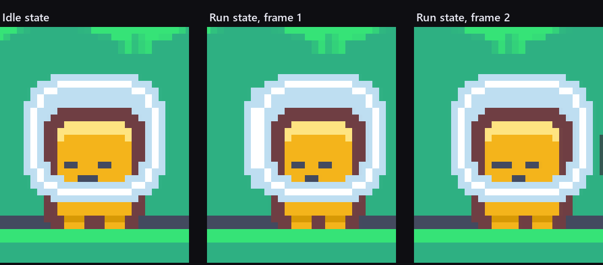
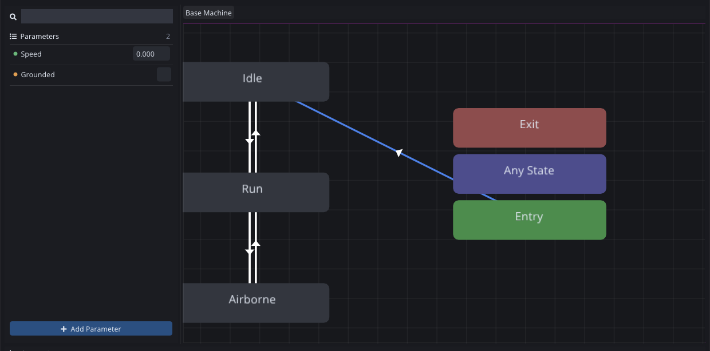
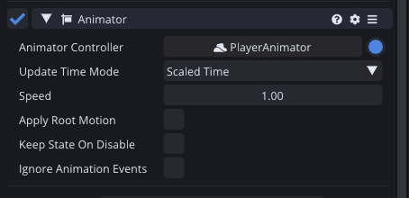

The fragment has been running across the level at seven units a second in a perfect, unblinking standstill. This week it gets legs.

There is a version of this week where I write `if (moving) SetSprite(runFrame)` in the movement script and go to bed an hour early. I have written that version of this week several times in my life, and it always ends the same way: three months later the character has a hurt state and a dash and a wall slide, and the movement script is a hundred lines of sprite bookkeeping with a bug in it.

So instead the script says what is true, and something else decides what that looks like.

## Two clips and a lie

The art gives me two frames per character. Feet together and feet apart. That is the entire walk cycle, and honestly at 24 pixels it is enough.



Three clips came out of those two frames:

**Idle** holds frame one for half a second and loops, which is a still image with extra steps but keeps the state machine uniform. **Run** swaps between the two frames every sixth of a second. **Jump** holds the feet-apart frame and does not loop, because a fragment in mid-air should look committed.

An animation clip in Comet is a list of properties, and each property is a track of keyframes on one field of one behaviour. The Run clip has exactly one property: the Sprite Renderer's sprite, with two keyframes.

The same machinery animates a position or a colour, and sprite swapping gets no special treatment: it is a keyframed reference that happens to change what is drawn.

## The graph

The controller has three states and two parameters.



**Speed** is a float, **Grounded** is a bool, and every transition is a comparison on one or both of them. Idle goes to Run when Speed passes 0.1 and comes back when it drops under it. Either of them goes to Airborne when Grounded turns false. Airborne comes back to whichever of the two matches the speed when the feet touch down.

Six transitions, nine conditions, and no code involved in any of it.

The threshold matters more than it looks. 0.1 units per second is slow enough that the run animation starts the instant you press a direction, and fast enough that the fragment does not jog on the spot while it decelerates through a hundredth of a unit per second. Getting that number wrong gives you a character that twitches between two states, which is the animation equivalent of a rattling door.

## What the script says now

The whole of the animation code in the movement script is this, at the end of the physics step:

```angelscript
// The animator gets told what is true, not which animation to play. Which state that
// means is the controller's business, and it stays out of this script entirely.
if (animator !is null)
{
    animator.SetFloat("Speed", Math::Abs(v.x));
    animator.SetBool("Grounded", grounded);
}
```

Two lines. The script already knows both of those things, because it computed them a few lines earlier to do the movement. It hands them over and stops caring.

The line count is not the point. The point is that adding a hurt state next month means one state and two transitions in a window, with no change to the movement script at all.




The behaviour itself is almost nothing: point it at a controller and it runs. Update Time Mode is on Scaled Time, which means the animation slows down when the game does, and that will matter in week nine when I start stopping time for a tenth of a second every time something gets hit.

## Proving it moves

Screenshots of animation are a problem. Two frames a sixth of a second apart is faster than the editor can be asked for a picture, so my first attempt at capturing the run cycle produced eight identical frames of an empty patch of grass, because the fragment had run out of the crop between asking where it was and taking the picture.

The fix was to slow the game to eight percent and take eight pictures. The animation still advances, the fragment barely moves, and the two run frames fall out cleanly. The comparison at the top of this post came out of that, and each of those is a real frame from the running game rather than the source sprites pasted next to each other.

## Where it is

The fragment runs, idles and holds a pose in the air, and the movement script does not know the name of a single animation.

Total so far: five evenings.

The game is now a small platformer with nothing in it, which brings us to the obvious problem.

---

Next Wednesday: things that want to stop you. Three enemies, a patrol that turns around at edges instead of walking off them, and my first honest look at whether the navigation module was worth writing.

*Comments and questions welcome ;)*
