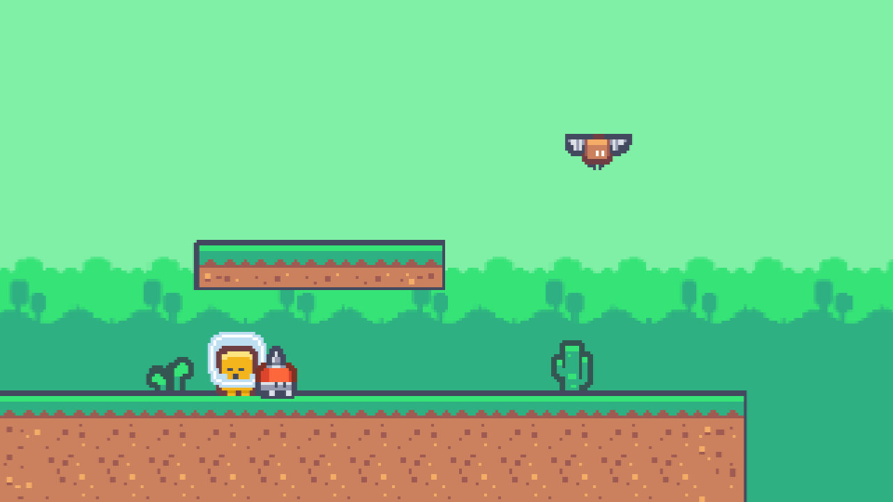
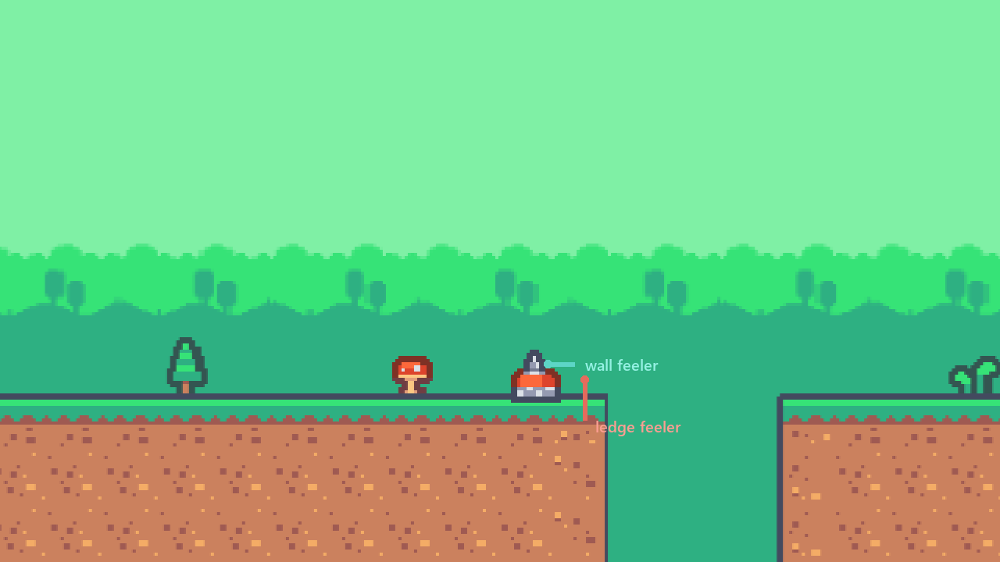
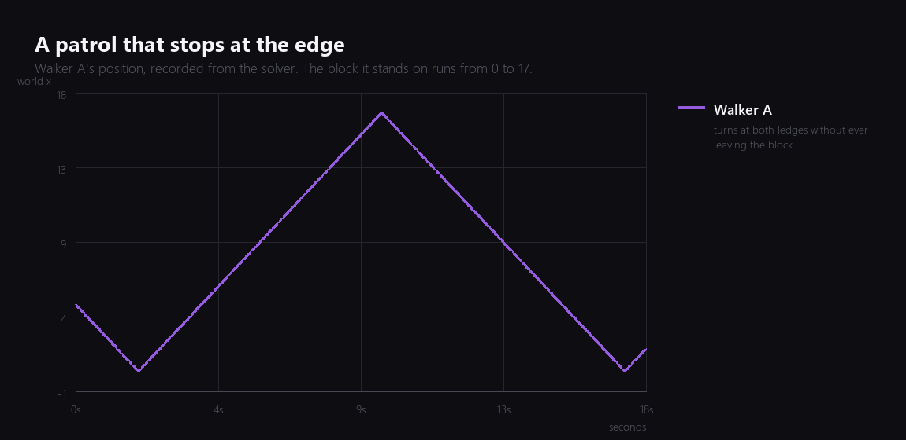

Halfway. The level is built, the fragment moves well, and absolutely nothing in the game is trying to stop it. This week it gets company.



Four walkers and two bats, which is not many, but it is the difference between a level and a corridor.

## The cheapest AI that is not embarrassing

I want to be honest about the ambition here. Neither of these enemies has a plan. They do not know where the player is, they do not chase, and they will happily walk past you.

That is deliberate. In a ten minute platformer, most enemies are moving terrain. Their job is to make a jump have a wrong moment as well as a wrong place. An enemy that hunts you is a different design with a different level built around it, and I do not have thirteen weeks for that.

So the walker does one thing: it walks, and it does not fall off the world.

## Two feelers

The part that is actually interesting is how it decides to turn around, because the naive version is wrong in a way that looks fine for about four seconds.

The naive version checks for a wall. Walk right, cast a ray forward, if it hits something turn around. This works perfectly on a level made of rooms, and on a level made of platforms it walks the enemy off the first ledge it meets.

So there are two rays.



The **wall feeler** goes straight ahead from the middle of the body. The **ledge feeler** goes down from just past the leading foot. Turn around if the first one hits something, or if the second one hits nothing.

```angelscript
if (WallAhead() || LedgeAhead())
{
    direction = -direction;
}
```

The ledge feeler is the one in the picture that is pointing into the gap. One frame later the walker turns around.

## Where the first version broke

The first version of that ledge check started its ray exactly at the walker's feet, which is the obvious place to start it.

The walker vibrated on the spot instead of walking. It flipped direction 212 times in sixteen seconds and travelled four centimetres.

The ray was starting on the surface it was trying to detect, and starting a ray inside a surface means the ray does not hit it. The floor was there and the feeler said it was not, every single frame, so the walker turned around every single frame.

Starting the ray twelve centimetres higher fixes it. Now it walks:



That triangle is the whole behaviour. It starts partway along the block, walks to one end, turns, crosses to the other, turns. The block runs from 0 to 17 and the walker turns at 0.7 and 16.3, one body width from each edge, because that is how far ahead the feeler looks.

I like this graph more than it deserves. It is the difference between "it seems to work" and knowing that in eighteen seconds it never once put a foot over.

## The bat

The second enemy is a different shape of problem, so it gets a different solution: no physics at all.

The bat is not a rigid body. It has a trigger collider and a script that writes its own position:

```angelscript
float sweep = Math::Sin(elapsed * (2.0F * Math::PI) / Math::Max(period, 0.01F));
float bob = Math::Sin(elapsed * (2.0F * Math::PI) / Math::Max(bobPeriod, 0.01F));

Vector3 position = entity.transform.position;
position.x = origin.x + sweep * range;
position.y = origin.y + bob * bobHeight;
entity.transform.position = position;
```

Two sine waves at different periods, one for the sweep and one for the bob. Because they do not divide evenly, the bat never quite retraces the same path, which makes a four second loop look less like a four second loop.

Measured over five seconds it covers seven units horizontally and bobs through nine tenths of a unit, which is what the numbers say it should.

A thing that only needs to be somewhere at a time does not need a solver, and giving it one buys you an object that can be pushed, that falls when something goes wrong, and that costs a body in the simulation. The sine wave is the right amount of machinery.

## Two hours of that was not the game

I should record where the evening actually went, because it was not the enemies.

Partway through, the editor stopped drawing. Not crashed: the simulation kept running, the enemies kept patrolling, I could read every position out of the running game, and the picture on screen was frozen solid. It stayed frozen through restarts, which is the detail that made it confusing.

The cause was a graphics setting I had turned off an hour earlier for an unrelated reason. With multi-threaded rendering disabled, this editor build stops presenting frames entirely. The setting is saved with the project, so every restart came back just as broken.

That is a real bug and it is now top of the list, above the tilemap one I fixed last week. It is also a good reminder that a settings toggle which silently breaks the editor is worse than one that refuses.

## Where it is

Six enemies, two kinds, neither of which falls off anything. The fragment can walk straight through all of them without consequence, which is next week.

Total so far: six evenings.

---

Next Wednesday: consequences. Hitboxes, taking damage, and enemies that can be removed from the level by landing on them.

*Comments and questions welcome ;)*
