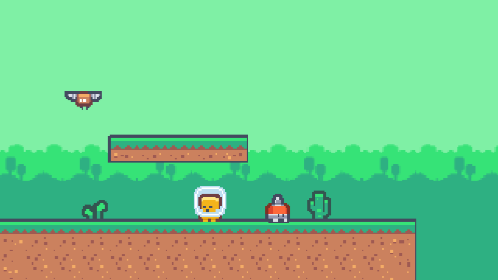
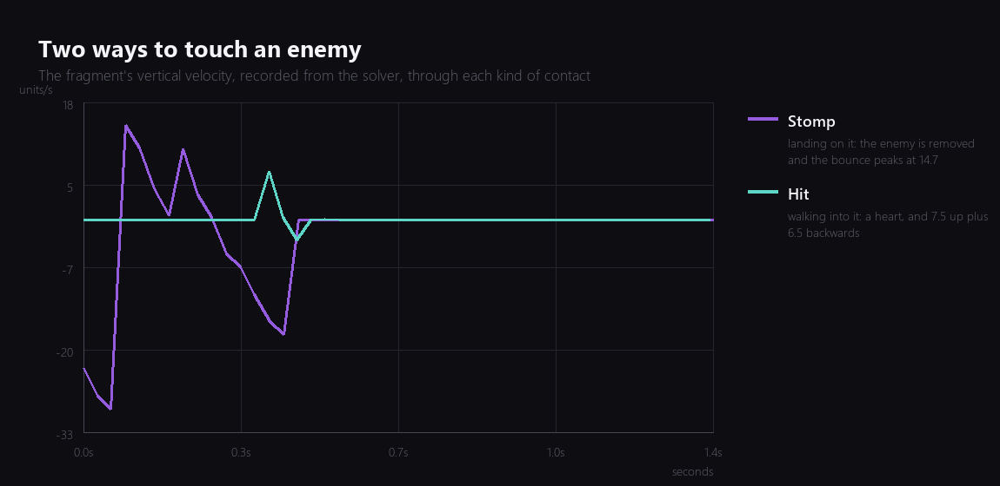
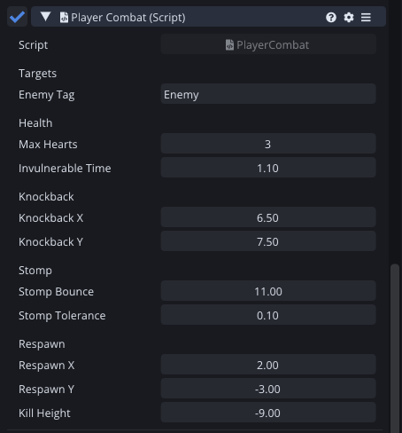

Last week the level filled up with enemies that could be walked straight through. This week touching one means something, and which something depends entirely on where you touch it from.



## One contact, two outcomes

The whole of the combat design is a single question asked at the moment of contact: were the feet above the middle of the enemy, and was the fragment on its way down?

```angelscript
// Coming down, with the feet clear of the enemy's middle: a stomp, not a hit.
if (body.velocity.y <= 0.0F && feet > enemy.y + stompTolerance)
{
    Stomp(other);
}
else
{
    TakeHit(enemy.x);
}
```

Both conditions matter. Without the velocity check you can kill an enemy by jumping into it from underneath, which reads as a bug even to a player who cannot say why. Without the height check, brushing the top corner while walking counts as a stomp.

The tolerance is a tenth of a unit, which is about two pixels of the enemy. Small enough that a genuine landing always counts, large enough that a grazing contact does not.



Those are both recorded out of the running game. The purple line is a stomp: the fall, the contact, and a bounce that peaks at 14.7 units per second. The flat teal line is walking into the same enemy on the ground, and the spike is the knockback, exactly the 7.5 the inspector asks for.

The stomp bounce being higher than the number I set is not a mistake. The script adds its bounce and the solver adds its own collision response on top, because the enemy is a solid body rather than a sensor. It feels better than the number alone, so it stays.

## Invulnerability, and making it visible

Taking a hit costs a heart, throws the fragment up and away from whatever hit it, and starts a one point one second window where nothing can hurt it again.

That window has to be visible or it feels like the game is randomly ignoring enemies:

```angelscript
// Blink while invulnerable so the state is visible rather than merely true.
if (renderer !is null)
{
    bool hide = invulnerableLeft > 0.0F && (int(invulnerableLeft * 12.0F) % 2) == 0;
    renderer.enabled = !hide;
}
```

Six flashes a second, which is the traditional rate for a reason: fast enough to read as "invulnerable", slow enough that you can still see where you are.



Knockback gets its own two numbers because up and away are different feelings. The upward part is what buys you the moment to recover; the sideways part is what stops you landing straight back on the thing that just hit you.

## Falling is also a hit

A pit was, until this evening, an infinite fall.

```angelscript
// A pit is just another way to take a hit, and without this the fragment falls for ever.
if (world.y < killHeight)
{
    hearts -= 1;
    Respawn();
    return;
}
```

Treating a pit as a hit rather than as a death is a small design decision that I like. It means the pits in this level are a cost rather than a wall, and a player who is bad at the third gap can still finish.

## Two dead ends, honestly

I did not get here in a straight line.

My first version used a box overlap query filtered to an Enemies layer, which returned nothing at all. The query itself was fine: asked without a layer filter it happily reported five or six colliders around the fragment. It is the layer mask argument that dropped them, and that is now on my engine list to look into properly rather than guess at.

The second version used the collision callback, which is the right answer and worked immediately. Except it did not, for twenty minutes, because I had tagged the enemies and then reloaded the scene without saving it, so every enemy came back as Untagged and the tag check quietly rejected all of them. The engine was right and I was wrong, which is the usual ratio.

There was also a good bug in the enemies. Box2D puts bodies to sleep when they stop moving, and writing a velocity to a sleeping body does not wake it, so any walker that got wedged for a moment stayed frozen for the rest of the session. Setting the enemies to never sleep fixes it, and it is the kind of thing that would have been maddening to find later, from a bug report saying "sometimes an enemy just stops".

## Where it is

The fragment has three hearts, can be hurt, can hurt back by landing on things, blinks while it recovers, and reappears at the start when it runs out or falls in a hole.

It is, as of this evening, a game you can lose.

Total so far: seven evenings.

---

Next Wednesday is the fun one: juice. Screen shake, hit stop, particles, and all the other things that cost an evening and make a prototype feel like a product.

*Comments and questions welcome ;)*
