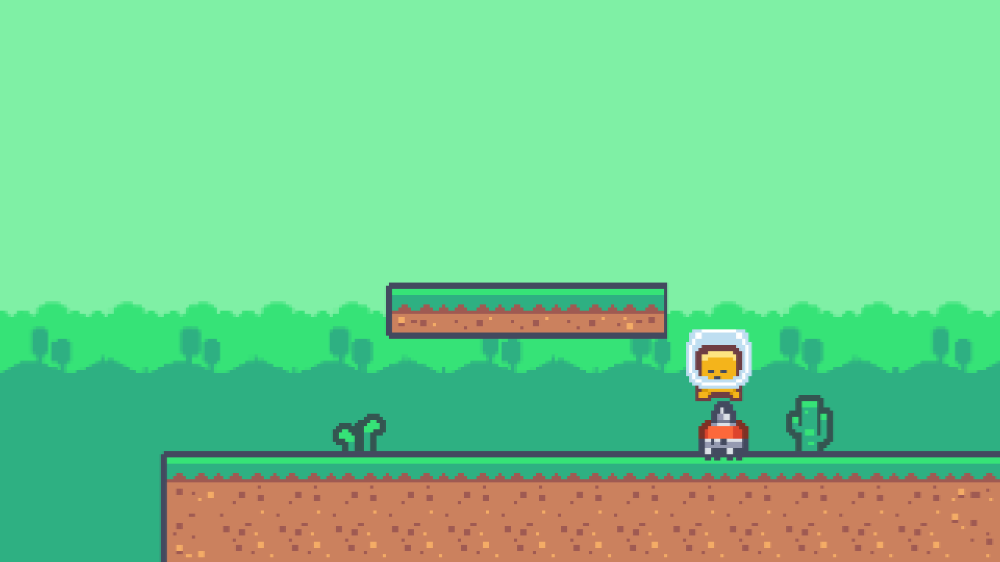
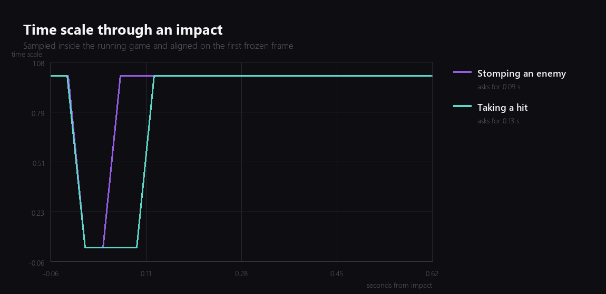
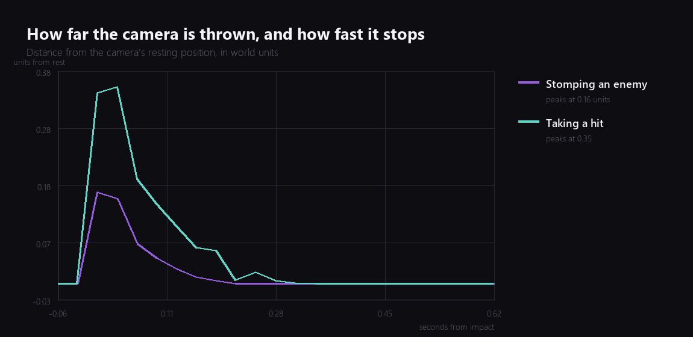
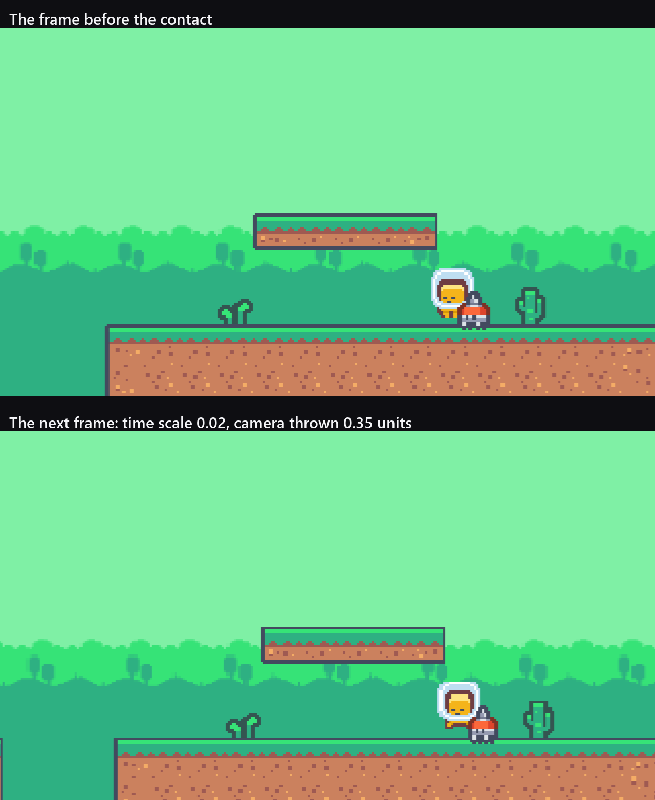
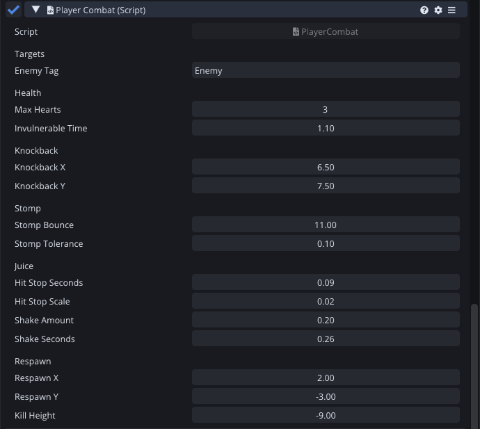

Last week the game got consequences. Landing on an enemy removed it, walking into one cost a heart. Both of those worked, and both of them felt like a spreadsheet updating.

This week is the one where that changes.



## Two effects, ninety milliseconds

Everything in this post comes from two ideas that together are about forty lines of script.

The first is **hit stop**: when something lands, the whole game slows almost to a halt for a moment, then resumes. It sounds like it should read as a hitch, and it reads instead as weight.

```angelscript
if (stopLeft > 0.0F)
{
    stopLeft -= dt;
    Time::SetTimeScale(stopLeft > 0.0F ? hitStopScale : 1.0F);
}
```

The scale it drops to is 0.02 rather than 0. A true zero looks like the game has crashed for a frame. Two percent still moves, just barely, and the eye reads it as slow rather than broken.

The second is **screen shake**, which is the camera being thrown off its resting position and finding its way back:

```angelscript
float strength = Math::Max(shakeLeft, 0.0F) / Math::Max(shakeSeconds, 0.01F);
// Squared falloff, so the shake dies away instead of stopping dead.
strength *= strength;
position.x += Noise() * shakeAmount * strength;
position.y += Noise() * shakeAmount * strength;
```

The squaring is the part worth keeping. With a linear falloff the shake is still visibly wobbling right up to the moment it stops, and then it stops, and you notice the stopping. Squared, most of the movement happens in the first third and the tail is small enough that nobody sees it end.

Both of them run on unscaled time, which they have to, because the point of hit stop is that scaled time has been turned nearly off.

## Measuring it instead of squinting at it

I could not tell by eye whether the numbers I typed were the numbers the game was using, so I wrote a small recorder that samples the time scale and the camera position every frame into a string. It is short, it is throwaway, and it is the reason the rest of this post has graphs in it.



A stomp asks for nine hundredths of a second and a hit asks for a bit over a tenth, because a hit calls the same code with a strength of 1.4 and everything scales from there. The recorder can only sample once a frame, so what those traces actually prove is that the freeze happens, that it is short, and that the hit's is the longer of the two. That difference is deliberate: getting hurt should be the bigger event.



Same story for the camera. A stomp throws it 0.16 units, a hit throws it 0.35, and both are back at rest inside a third of a second. You can see the squared falloff in the shape of those curves, and you can see that neither of them lingers.

Here are two real frames, one step apart, from a hit:



The fragment barely moves between them. Everything else in the world does.



## The bug this uncovered

Now the part I did not expect.

While recording those traces I kept getting two freezes out of one stomp, so I put a log line in and found something worse than a double freeze. Dropping the fragment onto a walker was producing a hit first and a stomp second. The player was losing a heart for landing on an enemy correctly.

The log had the answer in it:

```
HIT fromX=34.39 t=10.924 vy=10.70
STOMP Walker B t=11.143
```

Vertical velocity of positive 10.7 at the moment of a hit, on a fragment that was falling. Last week's classifier asks whether the fragment is on its way down:

```angelscript
if (body.velocity.y <= 0.0F && feet > enemy.y + stompTolerance)
```

By the time a collision callback runs, the solver has already answered the collision. It has seen the fragment land on something solid and it has bounced it upward. The velocity I was reading was the result of the impact, not the approach to it, and whether it came out positive or negative depended on where in the step the callback happened to run.

The fix is to keep the velocity from before the step:

```angelscript
// Sampled before the step, so a collision callback later in the frame can ask what the
// fragment was doing on the way in rather than what the solver did to it.
approachVelocityY = body.velocity.y;
```

and classify on that. Four drops onto four walkers after the change: four stomps, no hits, one freeze each.

I want to be clear about how close this came to shipping. It did not crash, it did not log anything, and it happened often enough to be annoying and rarely enough to look like bad luck. If I had not been building a graph for a blog post I would have found it in week thirteen as "sometimes stomping hurts you", with no idea why.

## The particles that did not make it

The plan for this evening included a burst of specks on every stomp. I built it, and it emitted large white untextured squares. I set the start size to 0.16, the lifetime to 0.45 seconds and a warm colour, confirmed all three had been written, restarted the game, and got large white untextured squares.

So I cut it. Two effects that work are worth more than three where one of them looks like a bug, and I would rather spend an evening on the camera next week than on chasing this now. It goes on the list.

**Added in week fifteen.** I found it. The Particle System's Texture Animation module is off by default and it is the only place a particle gets a texture at all, so the frame texture handle stayed empty and `Renderer2D` substituted a white one by one pixel. The size was the same cause: a quad is Start Size times frame size, and with no texture the frame size stays one by one, so the 0.16 I had picked by eye was 0.16 of nothing useful. There is a whole post about it in [week fifteen](), including the fault reproduced on purpose next to the fix.

## The scene had been quietly rotting

One more thing worth recording, because it is a tooling lesson rather than a game one.

Halfway through the evening a measurement came back saying the enemy was already dead at the start of play. It was, and so were four of the other five, and the fragment's spawn point had moved to the middle of the third block.

None of that was a bug in the game. It was me. All week I have been teleporting things around inside the running game to set up measurements, and somewhere along the way I saved the scene while it was in that state. Every enemy I had killed in a test stayed killed. The level I would have handed to a player had one enemy in it.

The lesson is not "be careful". The lesson is that a save that captures runtime state is a save that will eventually capture the wrong runtime state, and my habit of saving after every change was actively working against me. From now on the scene gets saved from a stopped editor or not at all.

## Where it is

Impacts have weight, the camera reacts, damage and kills feel like different events, and landing on an enemy reliably kills the enemy rather than occasionally costing a heart.

Total so far: eight evenings.

---

Next Wednesday: the camera. It has been sitting in exactly one place for nine weeks, which is fine for a screenshot and useless for a game.

*Comments and questions welcome ;)*
