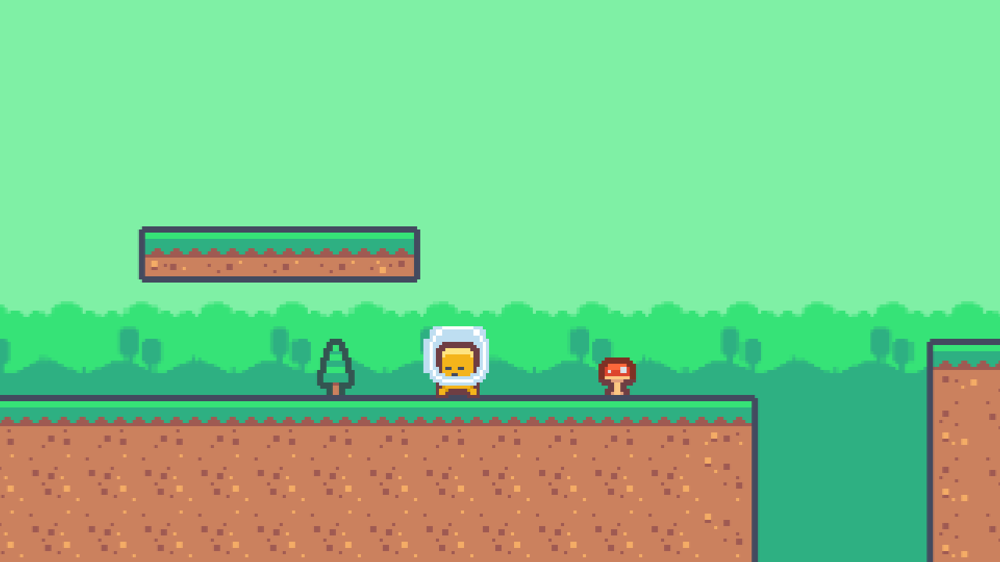
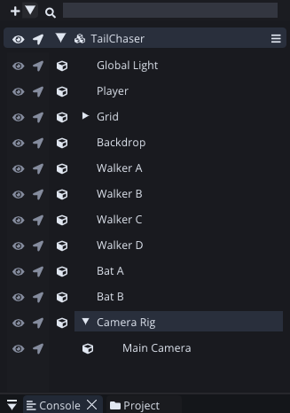
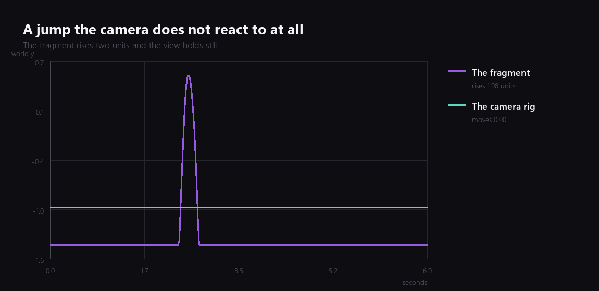
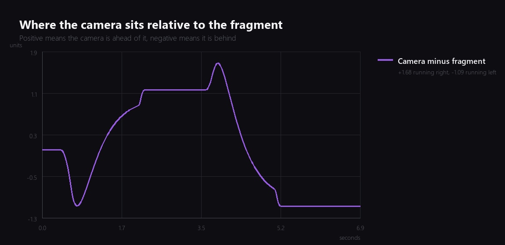
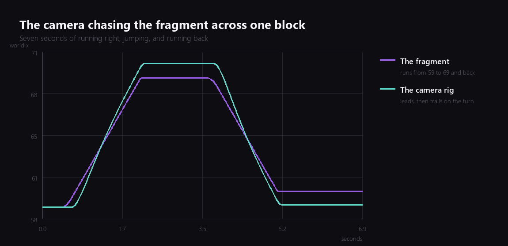
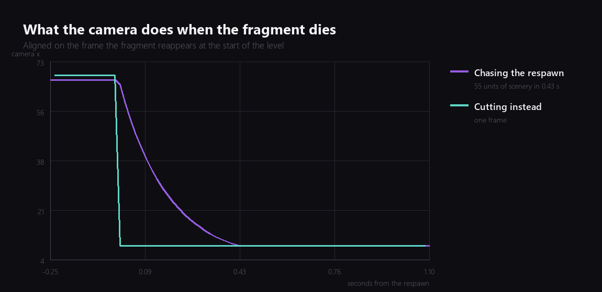
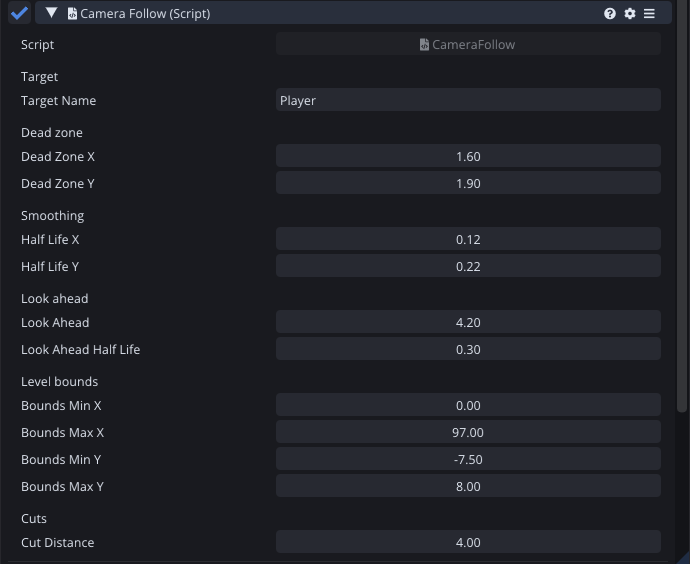

For nine weeks the camera has been an entity sitting at world position 26, minus 1, not moving. Every screenshot in this series so far was taken by putting the action in front of it. That was fine while the game was a test bed. It is not fine now.



## Two things wanted the same transform

The first problem was structural rather than mathematical.

Last week's screen shake works by writing a position to the camera every frame. A follow camera also works by writing a position to the camera every frame. Put both on the same entity and they take it in turns, and the one that runs second wins.

The usual fix is to make one of them read the other's output and add to it, which means one script has to know the other exists. Comet has a cheaper answer that I like more: parent them.



`Camera Rig` decides where to look and writes a world position. `Main Camera` holds the shake and writes a local offset. The transform hierarchy adds them together, and neither script has ever heard of the other:

```angelscript
// The camera is a child of the rig that follows the fragment, so the shake is written as a
// local offset. The rig decides where to look and this decides how hard to hit it, and
// neither of them has to know what the other one is doing.
cameraEntity.transform.localPosition = offset;
```

This is the sort of thing a scene graph is for and I do not use it often enough.

## The dead zone

A camera locked to the player is the wrong default, because a platformer player is never still. Every small hop, every landing, every step moves the whole screen, and after a minute of that you feel it in your neck.

So the rig only chases the part of the distance that falls outside a box:

```angelscript
// How much of a distance falls outside the dead zone. Zero while the target is inside it.
private float Outside(float distance, float half)
{
    if (distance > half)  { return distance - half; }
    if (distance < -half) { return distance + half; }
    return 0.0F;
}
```

The box is 1.6 units either side and 1.9 above and below. Taller than it is wide on purpose, because horizontal movement is where you are going and vertical movement is usually a jump that is about to undo itself.



That is a real jump, recorded frame by frame. The fragment rises 1.98 units and the view does not move. Without the vertical dead zone the whole screen would have followed it up and back down, twice a second, for the entire game.

## The look ahead, and why my first value did nothing

The camera should also be biased towards where you are going, so that running right shows you more of what is to the right. That part is easy:

```angelscript
float speed = targetBody.velocity.x;
if (Math::Abs(speed) > 0.4F)
{
    wanted = (speed > 0.0F ? 1.0F : -1.0F) * lookAhead *
             Math::Min(Math::Abs(speed) / 7.0F, 1.0F);
}
aheadCurrent += (wanted - aheadCurrent) * Damping(lookAheadHalfLife, dt);
```

Scaled by speed, so it centres when you stand still, and eased, so turning around swings the view instead of snapping it.

I set the look ahead to 2.2 units, ran the game, and the camera was still behind the fragment. Not slightly behind. Measurably, consistently behind, by nine tenths of a unit at full running speed.

The reason took a paragraph of algebra rather than a debugger. Two things eat into the look ahead before it can do anything:

- The **dead zone** absorbs the first 1.6 units of it.
- The **smoothing** never fully catches up while the target keeps moving. At a constant speed the gap settles at roughly `speed * halfLife / ln 2`, which for 6.16 units per second and a 0.12 second half life is about 1.07 units.

So a look ahead of 2.2 was spending 1.6 on the dead zone and 1.07 on the lag, and finishing half a unit in debt. Anything under about 2.7 could not have worked, and no amount of squinting at the screen would have told me the number I needed.

I set it to 4.2, which leaves the camera about seven tenths of a unit ahead at full speed.



The dip at the start is the camera falling behind while the fragment accelerates. The plateau is the steady state. The spike at three and a half seconds is the turn, where the fragment reverses and the camera is briefly a long way in front of it, and the tail is the leftward run settling into its mirror image.



## Level bounds

The camera also has to not show the outside of the level. That is a clamp on the rig, and the only interesting part is what to do when the level is narrower than the view:

```angelscript
float minX = boundsMinX + halfWidth;
float maxX = boundsMaxX - halfWidth;
position.x = minX > maxX ? (boundsMinX + boundsMaxX) * 0.5F : Math::Clamp(position.x, minX, maxX);
```

If the two limits cross, centre on the level instead of clamping. Without that branch `Clamp` gets a minimum above its maximum and picks whichever the implementation happens to prefer, and the camera snaps to one edge. It costs one line and it means I can build a narrow room later without remembering this.

## The one that was actually embarrassing

With all of that working I went looking for what else the camera does badly, and found something I would never have noticed by playing, because I was too busy being annoyed about dying.

When the fragment falls in a pit it reappears at the start of the level. The camera, being a smoothly damped follow camera, smoothly damped its way there:



Fifty five units of level, scrolling past at speed, for four tenths of a second, every single death. It is not even slow enough to look deliberate. It looks like the game lost track of where it was.

The fix does not need to know about respawning at all:

```angelscript
// Nothing in this game can cross four units in one frame under its own power, so a jump that
// big is a respawn. Chasing it drags the whole level past the screen for half a second,
// which reads as a mistake rather than as a camera move. Cut instead.
if (haveLastTarget)
{
    float moved = Math::Abs(there.x - lastTarget.x) + Math::Abs(there.y - lastTarget.y);
    if (moved > cutDistance) { ... }
}
```

Watch how far the target moved. If it moved further than anything in the game can move under its own power, it was teleported, so cut. The teal line on that graph is the whole fix: one frame instead of four hundred milliseconds.

I like this shape of solution. The camera does not need to be told about deaths, checkpoints, doors, or anything else I add later. It just needs to notice that the world stopped being continuous.



## Where it is

The camera follows, leads, ignores jumps, refuses to show the edges of the level, cuts on a respawn, and still gets shaken by every impact without either script knowing about the other.

Total so far: nine evenings.

---

Next Wednesday: lighting. The level is lit by nothing at all right now, which is a look, but it is not the look.

*Comments and questions welcome ;)*
