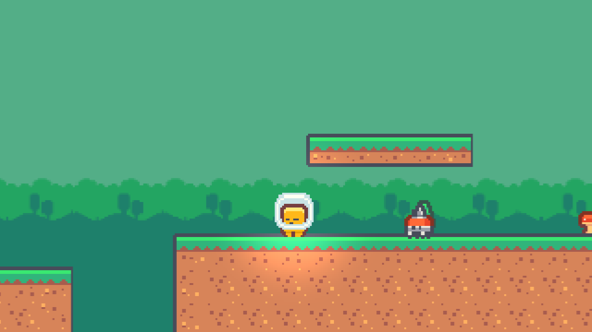
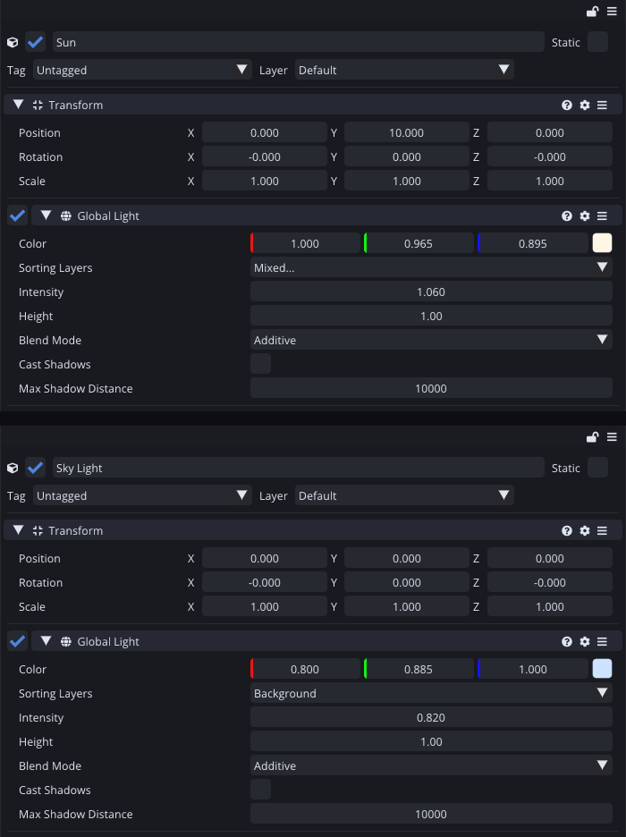
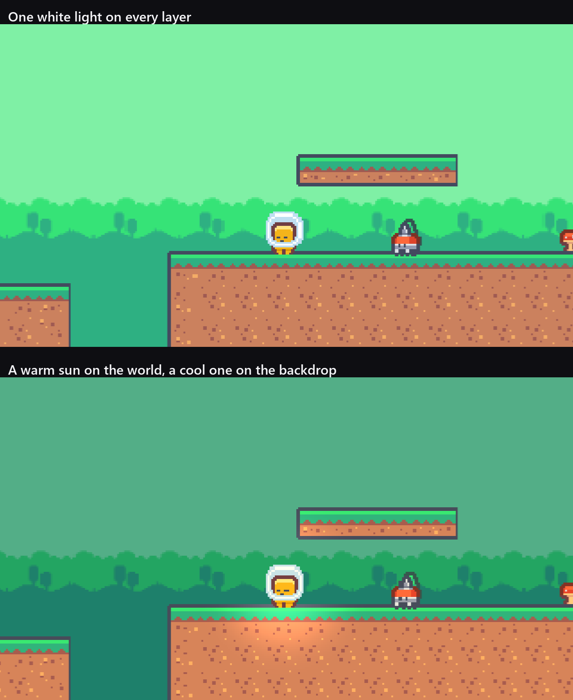
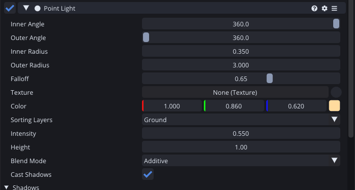
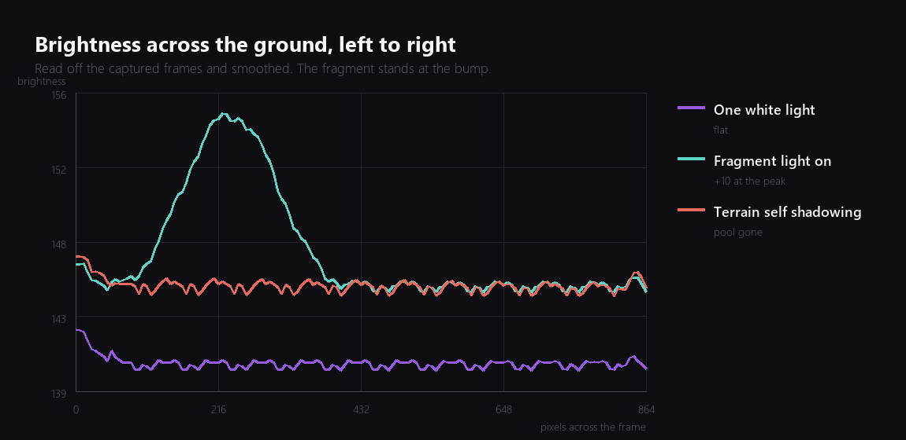

Tail Chaser has had a Global Light in it since week five. It is white, its intensity is 1, and it covers every sorting layer, which means it does exactly as much as no lighting at all while costing the same as lighting.

This week it earns its place.



## Two suns

The thing that makes this cheap in Comet is that a Global Light does not light the scene. It lights **sorting layers**:

```cpp
for (auto sort = sortingLayers.GetLayers().begin(); sort != sortingLayers.GetLayers().end(); ++sort) {
    Renderer::Get()->AddGlobalLightColor((*sort).GetIndex(), color * intensity);
}
```

That is one loop in `BehaviourGlobalLight::PreDraw`, and the important word is `Add`. Two global lights on the same layer sum. Two global lights on different layers are two independent suns.

So the level now has two.



The **Sun** is warm, slightly over full brightness, and covers Default, Ground, Characters and Foreground. The **Sky Light** is cool, at 0.82, and covers Background and nothing else.



Measured off those two captures:

| Region | One light | Two lights |
| --- | --- | --- |
| Sky | 209 | 151 |
| Treeline | 183 | 135 |
| Ground | 141 | 138 |

The backdrop lost 28 percent of its brightness and the ground lost 2. Nothing moved, no art changed, and the level suddenly has a foreground and a background instead of one flat plane of green.

I have used a lot of tricks over the years to get that separation. Repainting the backdrop darker, a tinted quad over it, a second camera. Two lights and a layer list is by far the cheapest of them.

## A light that follows the fragment

The second idea is a Point Light parented to the fragment, so there is always a warm pool where the player is looking.



My first attempt turned the fragment into a white rectangle. Not a bug, and not subtle either: the light was on the Characters layer, the fragment stands at the exact centre of it, and the centre of a light is where a light is brightest. It was adding 0.85 of warm light on top of a sun already slightly over 1, and everything it touched saturated. The walker standing a unit away had its lower half blown out too, which is what made it obvious.

The fix is the same idea as the two suns. The light only needs to cover **Ground**. The terrain gets the pool, the characters keep their own colours, and nothing saturates:



That teal curve is a real measurement off the frame, smoothed because the dirt tile is speckled and a single column reads the speckles rather than the light. The pool is worth about 10 brightness levels at its peak and it is roughly six units wide, which is small enough that you notice it without ever looking at it directly.

## The tool I had to write

I wanted the terrain to block that light, so the pool would stop at the edge of a platform rather than glowing through it.

Comet has a Tilemap Shadow Caster for exactly this, and adding it did nothing. The reason is in the engine: each tile contributes an occluder only if its sprite has a caster shape, and my terrain sprites had never been given one. That is a Sprite Editor job, done by hand, per sprite, and the tileset has 180 of them.

So the editor got a new tool this evening:

```
sprite_set_occluder(textureId, rectShape=true)
-> { "spritesChanged": 180, "occluderPoints": 4 }
```

It sets the shadow caster polygon of one sprite, or of every sprite on a texture, either from the sprite's physics shape or as the sprite's full rect. For a tileset of solid squares the full rect is exactly right, and 180 sprites got their occluder in one call.

I tried the physics shape variant first. It reported 180 sprites changed and zero occluder points, which is the tool telling me the truth in an unhelpful tone: these tiles get their collision from the Tilemap Collider and have no per sprite physics shape at all. The rect is the right flag for a tileset.

## Cast, but do not receive

Then the pool disappeared.

The measurement, comparing the dirt directly under the fragment with the dirt at the far end of the same block:

| | Under the fragment | Far end | Difference |
| --- | --- | --- | --- |
| Terrain does not cast | 158.3 | 142.7 | +15.7 |
| Terrain casts | 142.6 | 142.8 | -0.1 |

Switching the caster on did not dim the pool. It removed it exactly.

The reason is obvious once the numbers say it out loud. The fragment stands **on** the terrain, so the light sits right at the surface, and the very first thing its shadow pass hits is the tile it is standing on. Every tile is an occluder now, including the one directly underneath, so the terrain shadows itself and the pool never lands.

The fix is a checkbox that already existed and that I had never had a reason to use. Every renderer in Comet has a `ReceivesShadows` flag, and turning it off means the renderer is still lit but samples the unshadowed light buffer:

```
Tilemap Shadow Caster : Cast Shadows  = on
Tilemap Renderer      : Receives Shadows = off
```

The terrain casts shadows onto everything else in the level and is immune to its own. The pool came back at +15.6, which is the same number as before within measurement noise.

I would not have found that by reading the field's name. "Receives Shadows" sounds like a quality setting. It is a way of saying which half of the shadow system an object takes part in.

## Where it is

Two suns, a light that follows the player, terrain that casts shadows, and a tileset that knows its own silhouette. The level is the same geometry it was last week and it looks like a different game.

**Corrected in week fourteen.** It does not, and the number in this post is the reason I did not notice. A pool of +15.6 out of 255 is a real difference in a chart and not a difference you see while jumping over a gap, and when I played the whole game three weeks later I could not tell the lighting was on at all. The problem was the sun: at 1.06 with a 0.82 fill there is nothing left for a point light to add. Dropping those to 0.86 and 0.66 and restricting the fragment's own light to the Ground layer takes the pool to +55.6. There is a before and after in [week fourteen](), and the left panel of it is the screenshot at the top of this post.

Total so far: ten evenings.

---

Next Wednesday: the boss. One enemy that is not moving terrain, at the end of the level, with a pattern you have to learn.

*Comments and questions welcome ;)*
