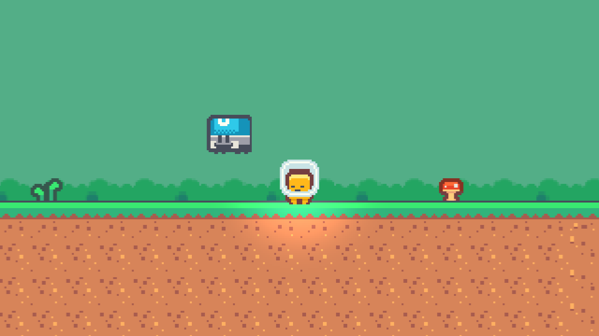
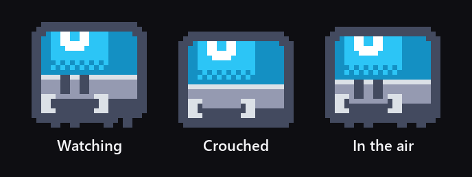
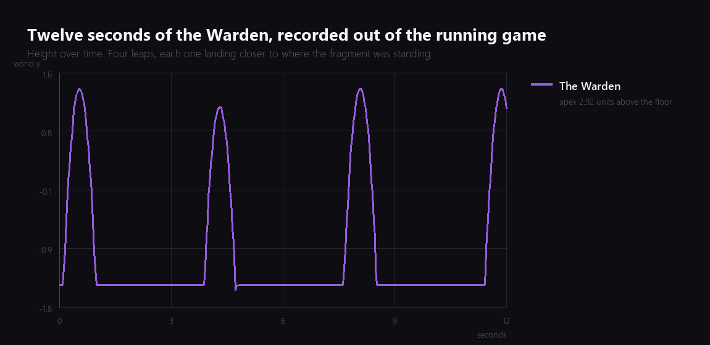
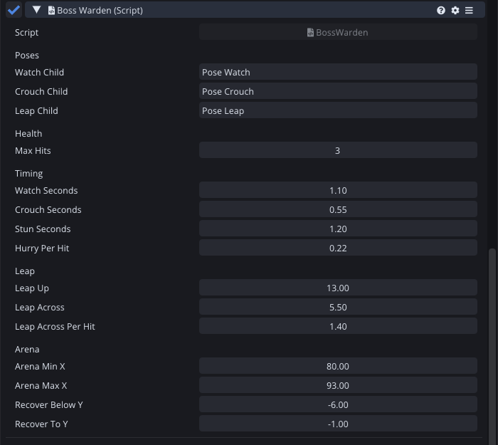
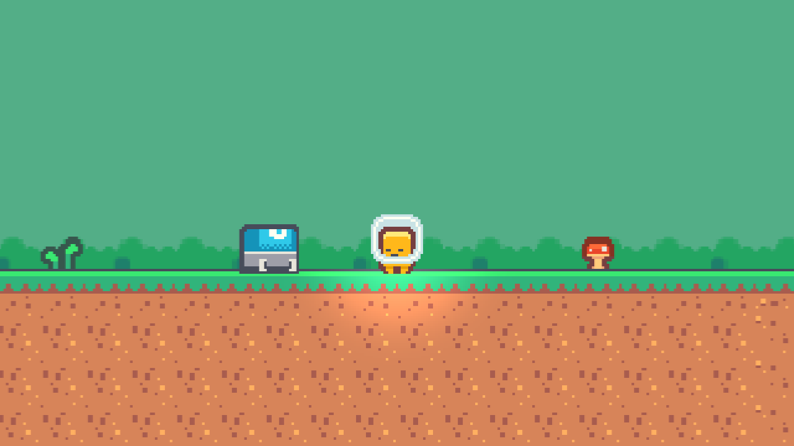

Five weeks ago I wrote that the enemies in this game are moving terrain, that they do not know where the player is, and that an enemy which hunts you is a different design with a different level around it.

This week is that different design, once, at the end.



## What a boss is for

The walkers and the bats make a jump have a wrong moment as well as a wrong place. The Warden has a different job: it is the one thing in the game you are supposed to fail at, learn, and then beat.

That means the fight has to be a loop the player can read. Four states, in order, forever:

- **Watching.** It stands still and faces you.
- **Crouching.** It squats for a fixed time. This is the warning.
- **In the air.** It leaps at where you were standing when it crouched.
- **Stuck.** It lands hard and cannot move for a moment. This is the only time it can be hurt.



The whole design is that the two states where it is dangerous are also the two states where it is loudest, and the state where it is helpless comes right after the state where it looks most threatening. You beat it by standing in the place it is about to land in and then not being there.

## The loop, measured

Twelve seconds of the Warden, recorded frame by frame out of the running game rather than described:



Four leaps. Each one rises 2.92 units, which is very close to the 2.87 that 13 units per second of launch speed and a gravity scale of 3 predict, and the difference is one physics step of launch before the recording starts. Between them, the flat sections are the watching and the being stuck.

Every hit shortens those flat sections and lengthens the leap:

```angelscript
// Everything the Warden does gets faster as it loses, except the crouch, which is the tell.
float hurry = 1.0F - hurryPerHit * float(hits);
if (hurry < 0.35F)
{
    hurry = 0.35F;
}
```

The crouch is deliberately left out of that. If the warning got shorter along with everything else, the last third of the fight would stop being readable, and a fight you cannot read is a fight you win by luck.



## Landing is a fact, not a timer

The one piece of the state machine I would defend hardest is the transition out of the leap:

```angelscript
else if (state == LEAP)
{
    // Landing is the moment the fall stops, not a timer, so a leap into a wall still ends.
    if (body.velocity.y <= 0.0F && Grounded())
    {
        Enter(STUN);
    }
}
```

The obvious version times the leap: it takes 0.88 seconds, so wait 0.88 seconds and call it landed. That works until the Warden clips a corner, or lands on something, or gets shoved, and then the state machine and the physics disagree about where it is and the fight breaks in a way that is very hard to reproduce.

Asking the world instead costs one raycast. The ray starts a tenth of a unit above the feet for the same reason the walker's ledge ray does, which is a mistake I have now made twice and written about twice.

## Three problems the arena had

None of the interesting work this evening was the state machine. It was everything around it.

**It fought a player who was not there.** The Warden leapt towards the fragment from the moment the game started, so by the time you walked into its arena it had spent eighty seconds hopping into the left wall. One check fixed it, and it doubles as the thing that makes the fight start when you arrive:

```angelscript
// Asleep until the fragment walks in. Without this the Warden spends the whole level
// leaping at a player who is eighty units away, and arrives at the arena wall exhausted.
if (!PlayerInArena())
{
    timer = watchSeconds;
}
```

**It leapt off the world.** The first arena I gave it ran to the very edge of the last block, so a leap towards the left wall put half its collider over a pit and it fell out of the level, forever, leaving a boss fight you win by waiting. The arena is now three units in from each edge, and there is a recovery for the case I have not thought of: below minus six, it goes back to the middle and starts again.

**It hit the ceiling.** This one I only found in the recording. The first leaps peaked at 0.97 units instead of 2.92, and the velocity trace showed the reason plainly:

```
t=0.151  y=-0.98  vy=+11.82
t=0.180  y=-0.75  vy=+11.23
t=0.210  y=-0.53  vy=-0.44     <- something is there
```

There was a floating platform over the arena, left over from when the last block was just more level. A boss arena with a platform in the middle of it is a boss arena where the boss headbutts the scenery, so the platform came out. The final block of Tail Chaser is now a clean, flat, empty stretch, which is what an arena should have been from the start.



**Corrected in week fourteen.** "Briefly stompable" was the problem. The window was 1.2 seconds and looked exactly like every other state, and when I sat down and played the whole game I could not find it: I was landing on the Warden more or less at random and sometimes it counted. It is now 1.6 seconds and it strobes, and the three Wardens are tuned differently so beating the first one does not teach you the whole game. Both are covered in [week fourteen]() and [week nineteen]().

## Borrowing sprites from renderers that never draw

A small thing worth writing down, because it took me two attempts.

I wanted the script to hold the three frames and swap them per state. `[Serialize] Sprite@ watchSprite;` compiles, and the field shows up in the inspector, and there is no way for me to fill it in from my own tooling: the sprite reference tools reach engine behaviour fields, not script ones.

The way around it is three child entities named `Pose Watch`, `Pose Crouch` and `Pose Leap`, each carrying a Sprite Renderer with one frame in it, each disabled so they never draw. The script reads the sprite off them once at startup:

```angelscript
// Reads a sprite off a child that exists only to hold it.
private Sprite@ BorrowSprite(const string&in childName)
{
    Entity@ holder = Entity::Find(childName);
    if (holder is null) { return null; }
    SpriteRenderer@ source = SpriteRenderer::Get(holder);
    return source is null ? null : source.sprite;
}
```

Three entities that exist to hold a value is not elegant, and it keeps all the drawing on one renderer, which means flipping, tinting and sorting stay in one place. Filling in a script's resource fields from tooling goes on the engine list.

## Where it is

The Warden watches, crouches, leaps at you, lands, and can be stomped three times while it is stuck. It stays in its arena, it does not start until you arrive, it speeds up as it loses, and a scripted run beat it in nine seconds and four attempts, one of which missed the window.

Tail Chaser has a beginning, a middle and an end.

Total so far: eleven evenings.

---

Next Wednesday: hearts on the screen, a menu that is not the editor's play button, and a save file so the game remembers you beat it.

*Comments and questions welcome ;)*
