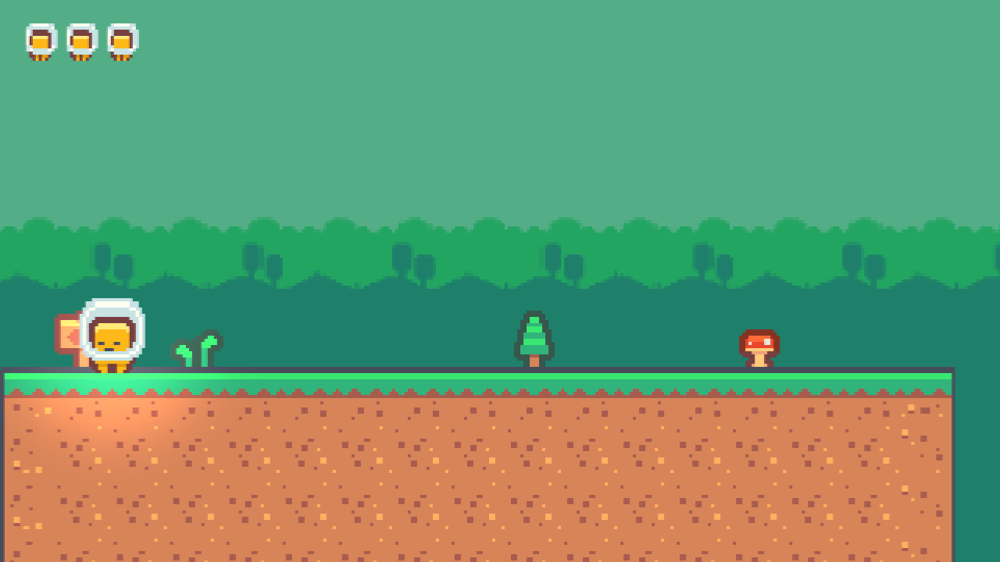
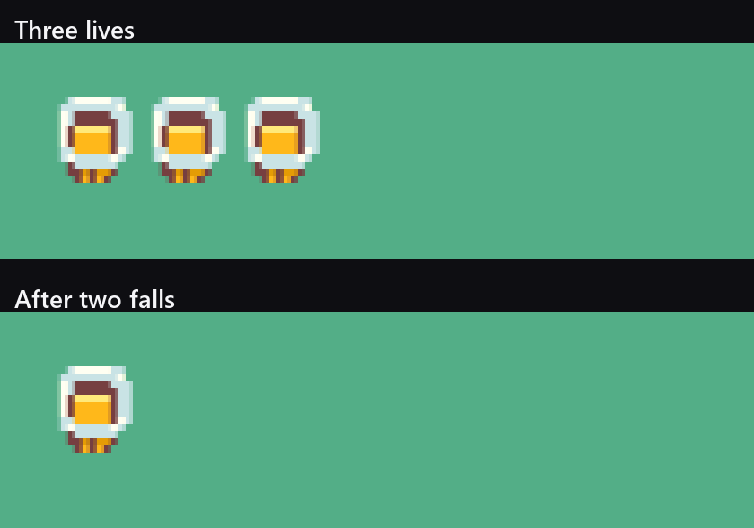

Twelve weeks in, Tail Chaser is a game you can win. It is also a game that tells you nothing: no lives on screen, no clock, and nothing at all left behind when you close it.



## Three heads in the corner

The Kenney UI pack I am using has buttons, panels, sliders and arrows in it, and no hearts. Rather than draw one, the life counter is three small copies of the fragment's own head, which is a thing plenty of games do and which needed no new art at all.



They are three entities parented to the camera, on the Foreground sorting layer, sitting at fixed local positions in the top left. The camera moves and they go with it, which is the whole of the implementation.

This is not how the HUD was supposed to work, and the rest of this post is about that.

## The UI system won

Comet has a real UI module: Canvas, Rect Transform, Image, Text, anchors, pivots, the lot. I built the HUD with it first, and it took me an evening to get three sprites and a clock into the corner of the screen, and I did not get there.

What I got instead was the canvas contents drawing at a scale and position that had nothing to do with the anchors I had set, and text rendering as glyphs that were not the characters I asked for. Reading the values back confirmed they were exactly what I had written: anchor 1,1, pivot 1,1, size 150 by 34, position minus 10, minus 8. The scene agreed with me and the screen did not.

I want to be careful about what I am claiming there. That is not "the UI system is broken", it is "the UI system did not do what I expected and I could not close the gap from the outside in one evening". Almost every other part of this engine I have driven entirely from my own tooling, and this is the first module where doing so was not enough. Somewhere between the rect solver, the canvas scale mode and the font atlas there is a thing I have not understood, and finding it is an engine job for a week that is not this one.

So the HUD is three sprites hanging off the camera. It works, it costs three entities, and it is pixel perfect for free because it goes through the same sprite path as everything else on screen. If a game only needs a handful of icons in a corner, this is a completely reasonable way to build a HUD, and I would probably reach for it again even after the canvas is fixed.

**Resolved in week seventeen.** I found the gap and it was in the engine. `BehaviourRectTransform::LoadBehaviour` assigns all eight of its fields directly and never calls a setter or `Refresh`, so a tool that writes one field of one rect on a live scene stores the value and tells nothing to re-lay out. That is why everything read back correct and nothing moved. Two new editor tools that go through the real setters fixed it, and the HUD is a Canvas now. The whole thing is in [week seventeen]().

## Where the life counter had to live

The first version of the counter was a `RunTracker` script on the HUD that watched the fragment and worked out when it had died. It counted the first death and then missed every other one.

The reason is worth keeping. A death in this game is resolved entirely inside one physics step: the combat script notices the fragment is below the kill height, subtracts a heart, and teleports it to the spawn, all before that step ends. A second script running later in the same step never sees a fragment that is falling and never sees one that is out of the level. It sees a fragment at the spawn point, on this step and on the last one, and concludes that nothing happened.

I tried two ways around it. Watching for the moment the fragment arrives at the spawn is order dependent and counted every other death. Watching for a jump too big to be running, which is the trick that fixed the camera two weeks ago, saw no jump at all, because both endpoints of that jump happen between the two moments this script gets to look.

The fix is to stop being clever. The heart count lives in `PlayerCombat`, so the life icons live there too:

```angelscript
private void ShowLives()
{
    if (hearts == shownHearts)
    {
        return;
    }
    shownHearts = hearts;
    for (uint i = 0; i < lives.length(); ++i)
    {
        lives[i].enabled = int(i) < hearts;
    }
}
```

Nine lines, no races, no guessing. The general lesson is one I keep relearning: if a script has to infer a fact that another script already knows for certain, the answer is usually that the fact is in the wrong place.

## The walker standing on the spawn point

Testing the counter turned up a level bug that six weeks of playing had not.

The counter kept reading two lives a couple of seconds into a fresh run. Not a bug in the counter. Walker A patrols the first block, the first block runs from 0 to 16, and the fragment spawns at 2. Given twenty seconds, the walker reaches the spawn point and takes a heart off a player who has not pressed a key yet.

The first block is the tutorial. It is where you find out that the arrow keys move you and that the jump has a little forgiveness in it, and it should not contain anything that can kill you. Walker A is gone. Tail Chaser now has three walkers, two bats and a boss, and the opening ten seconds are a safe place to learn the controls.

## The save file

The save is the smallest part of this post and the one that took twenty minutes.

```angelscript
string path = App::GetPersistentPath() + saveFile;
FileSystem::Save(path, "{\"runs\":1,\"last\":" + formatFloat(elapsed, "", 0, 2) +
                       ",\"best\":" + formatFloat(best, "", 0, 2) + "}");
```

`App::GetPersistentPath()` is the platform's per game data folder, which on this machine is under `AppData\Roaming`, and which will be the right folder on every platform Comet builds for without me thinking about it. `FileSystem::Save` writes a string to it. That is the entire API surface I needed.

The run ends when the Warden switches itself off, which the tracker notices without the boss ever knowing a save file exists:

```angelscript
// The Warden switches itself off on its third stomp, which is the only end condition the
// game has. Reading it here means the boss never has to know a HUD exists.
if (boss !is null && !boss.enabled)
{
    Finish();
}
```

A previous best only survives if it was actually faster, which is three lines of parsing that I would replace with a real JSON reader in a bigger game and which are fine here.

**Replaced in week twenty-one.** The game got bigger. The file now holds a version and one object per level with an unlock flag, a completion flag, a best coin count and a best time, and it is written with `CometEngine::Json` rather than by concatenation. Finding the fourth `"coins":` in a string by counting was never going to survive that. See [week twenty-one]().

Here is the file, read off the disk after a scripted run that beat the Warden:

```
C:\Users\...\AppData\Roaming\Default Company\Default Product\tailchaser.save

{"runs":1,"last":18.92,"best":18.92}
```

Nineteen seconds, which tells you that run started next to the boss rather than at the beginning of the level.

Company name and product name are still the defaults, which is why that path looks like that. Next week's job, I said, and it took until week twenty-one, by which point the folder was the least of what was wrong with this file.

## What did not get built

There is no title screen. It was on the plan for this evening and the UI detour ate it, and I would rather say that plainly than pretend a series goes exactly to plan every week.

It also matters less than it looks. Loading a scene from a button is one call, and the reason I have not written it is that I do not have a button I trust yet. That is the same problem as the HUD, once.

**Built in week twenty.** A main menu, a level select with locks driven by the save file, and both end-of-level panels, all from one script configured with two strings. See [week twenty]().

## Where it is

Three lives on screen that track the real heart count, a clock that runs from the first frame to the Warden's last, a save file in the right folder for the platform, and a first block that no longer mugs you.

Total so far: twelve evenings.

---

Next Wednesday I stop building for an evening and play the whole thing from the spawn point to the Warden, several times, with the inspector closed. It is the most useful evening of the series and most of the second half comes out of it.

*Comments and questions welcome ;)*
