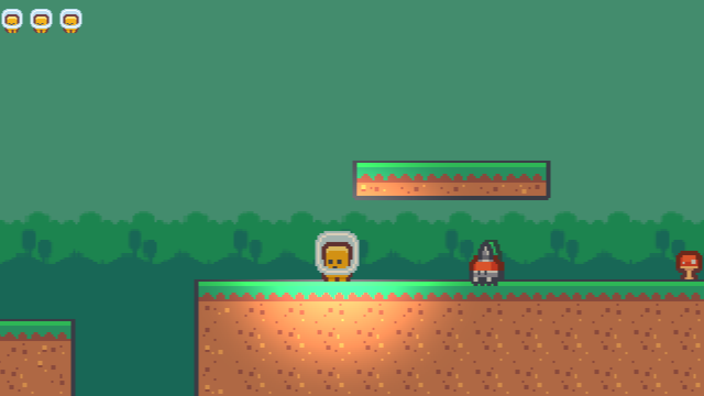
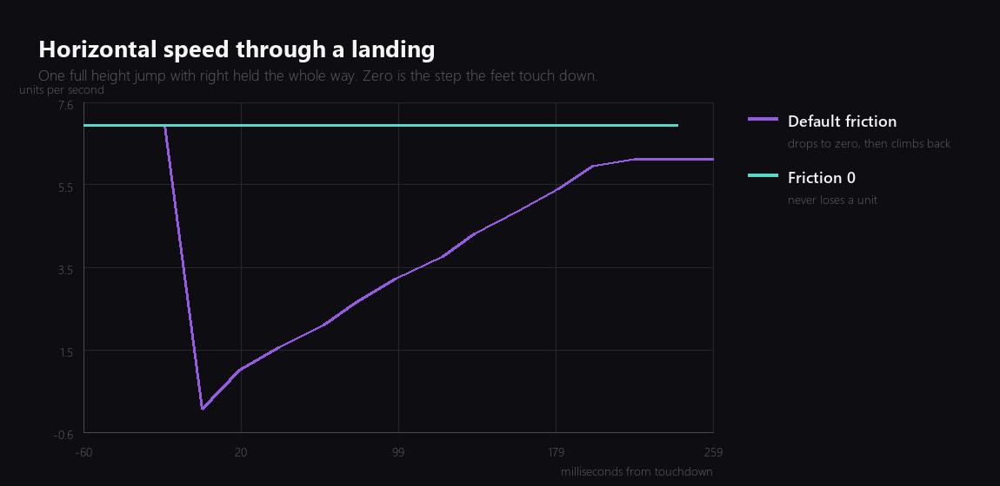
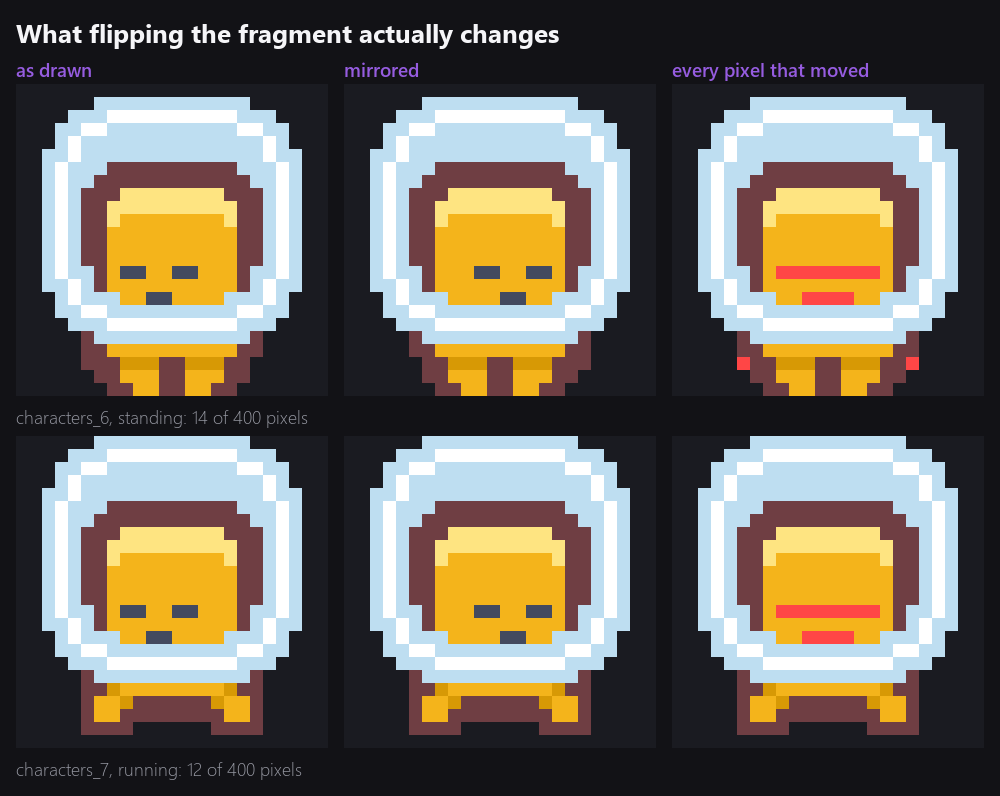
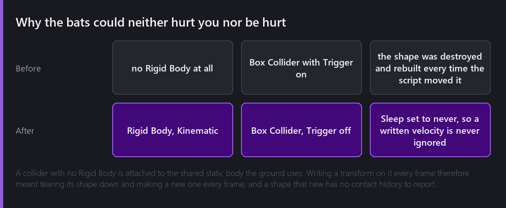
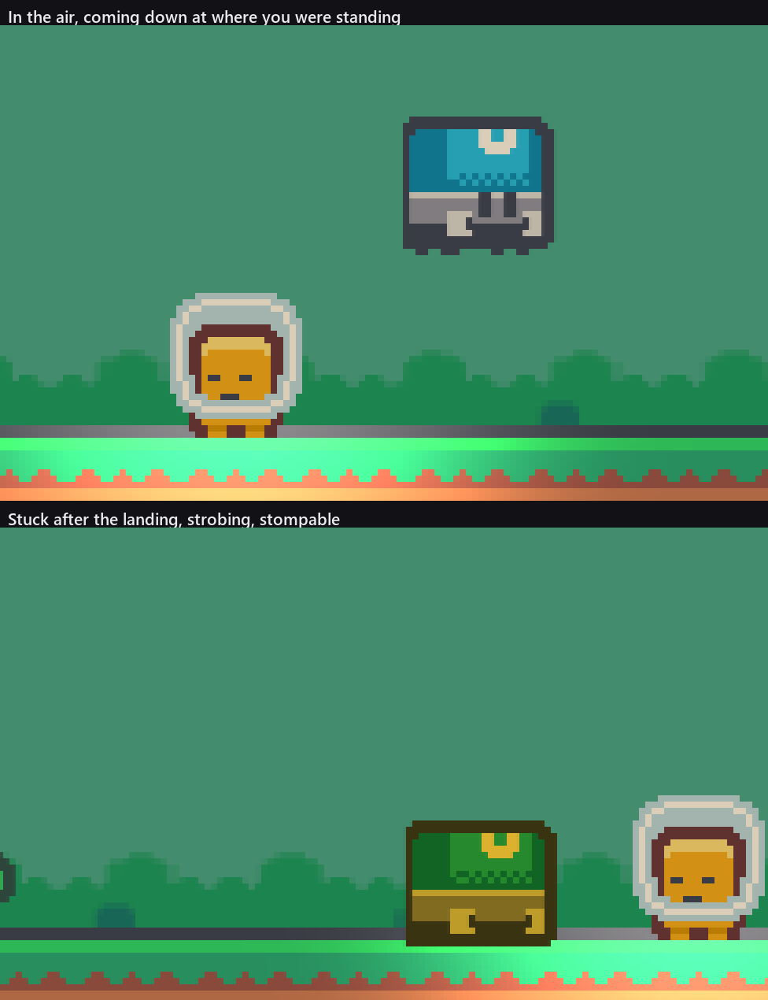
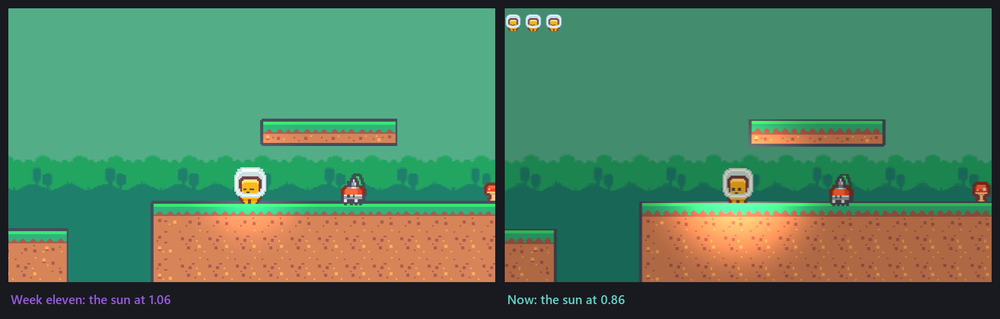

Thirteen weeks of this series were each spent building one system and then testing that system. This week I did something different and sat down to play the whole game from the spawn point to the Warden, several times, without opening the inspector.

It was not a good evening. It was, however, the most useful one so far, and everything in the second half of this series comes from the list I wrote while playing.



## One: the fragment was slower on the ground than in the air

The complaint that started this was vague. Landing felt wrong. There was a moment after every jump where the controls seemed to stop answering, which is the kind of thing that is obvious while playing and impossible to describe.

So I measured it. Comet's `physics_record_body` samples a rigid body once per engine frame for as long as you ask, which is the right shape of tool for a question like this, and one full-height jump with right held the whole way gave me a curve to look at.



The purple line is what was happening. Horizontal speed is a clean 7 units per second all the way down, hits zero on the exact step the feet touch, and then takes nine physics steps to climb back. Nine steps at 50 Hz is 180 milliseconds of a character that is being asked to run and is not running. That is what I had been feeling.

The cause is Box2D's friction model. Friction is solved as a cone: the tangential impulse the solver may apply is the friction coefficient times the normal impulse, and it always aims to drive tangential velocity to zero. Landing from a full-height jump arrives at about 26 units per second downwards, so the normal impulse on that step is large, and the friction it buys is more than enough to erase a horizontal speed of 7.

What I had not noticed is the second half of the same problem. Look at where the purple line settles. It does not return to 7. It stops at 6.16 and stays there, because friction was also shaving about 0.84 units per second off every single step the fragment spent on the ground. Top speed was 6.16 on the ground and 7.00 in the air, the inspector said 7, and I had never checked.

It was not only the fragment. The walkers are configured to patrol at 2.2 and were measured moving at 1.97. Every script-driven thing in the game was running about a tenth slower than the number I had typed.

The fix is to stop asking the solver to have an opinion. Every bit of horizontal movement in this game is decided by a script, so there is nothing for friction to contribute, and a physic material with friction 0 on the fragment, the walkers and the Warden removes it:

```
Assets/Frictionless.cometPhysicMaterial
  friction   0
  bounciness 0
  combine    MINIMUM
```

The teal line is the same jump afterwards. Seven on the way down, seven on the touchdown step, seven after. The walkers now measure exactly 2.2.

There is a small trap in doing this through my own tooling that cost me a while, and it is worth writing down. `behaviour_set_reference` takes the serialized field name, and a collider serializes its material under `Mat`, while the inspector labels it `Material`. Passing `Material` reported success and changed nothing, twice, because the tool sets a key in the behaviour's saved state and then loads that state back, and a key nobody reads is silently harmless. I only caught it by saving the scene and reading the file. That is a tool that should refuse an unknown field name, and I am going to make it do that.

## Two: the flip was backwards, and it barely matters

While playing I kept feeling that the fragment was facing the wrong way, and the code did have the mirror the wrong way round, so I swapped it. Then I went and looked at how much difference it actually makes.



The fragment animates between `characters_6` and `characters_7`, and both are drawn facing the camera. Mirroring one moves fourteen pixels in the standing frame and twelve in the running frame, out of four hundred it fills, and every one of them is the eyes and the mouth, which sit a pixel off centre.

I am reporting this rather than quietly claiming a fix, because the honest version is more useful. Kenney's character pack is drawn front on. If I wanted a fragment that visibly turned to face its direction of travel I would need art that has a direction in it, and this series has a rule about not buying art. The enemies and the Warden are drawn in profile and mirror properly, and the fragment leans its face the other way.

## Three: the bats could neither hurt you nor be hurt

This one was a real bug and a satisfying one to find. The bats fly a slow sine path over the gaps, and they were scenery. Walking into one did nothing. Landing on one did nothing.



The bats had a Box Collider with Trigger switched on and no Rigid Body, which sounds like the correct way to build a thing whose job is to notice overlaps. It is not, and the reason is in how a collider without a body gets attached.

A collider with no Rigid Body of its own is parented to the shared static body the ground lives on. Its position therefore comes from its transform, and the shape has to be rebuilt whenever the transform moves. The bat script writes a new position every frame, so every frame the bat's shape was destroyed and a fresh one created, and a shape created this frame has no contact from last frame to compare against. There is nothing for a begin-touch event to be the beginning of.

Giving each bat a Kinematic Rigid Body and turning the trigger off fixes it, because now the bat has its own body, the body is moved rather than the shape rebuilt, and contacts persist across steps. Sleep is set to never for the same reason it is on the fragment: a body that has gone to sleep does not notice a velocity being written to it.

Verified both directions afterwards: a fragment standing still and walked into loses a heart, and a fragment dropping on a bat from above kills it.

## Four: I could not tell when the Warden was hittable

The Warden's fight is a loop. It watches, it crouches, it leaps at where you are standing, it lands hard, and for a moment after landing it is stuck in the ground and can be stomped. That moment is the whole fight, and while playing I could not find it. I was landing on the Warden more or less at random and sometimes it counted.



The stuck window was 1.2 seconds and looked exactly like every other state. It is now 1.6 seconds and it strobes at 7 Hz, which is what the two panels above are showing: the same Warden, mid-leap and stuck.

Comet's sprite colour multiplies the sprite, which is worth saying plainly because it decides what a tell can be. A multiply can only take light away, so "brighter while vulnerable" is not available. What is available is a hue swing, and multiplying this Warden's blue plate by a warm colour crushes its blue channel and turns it olive, which against the normal blue is unmistakable. The frames above are both captured on verified colour values rather than by taking a screenshot and hoping, because at 7 Hz a blind capture lands on the plain half about half the time.

The other half of the readability problem was the timing. Every hit shortens the Warden's waiting times by 22 percent, so the fight speeds up as it loses, but the crouch never gets shorter. The crouch is the warning, and a warning that shrinks with difficulty is a warning that stops being one.

## Five: the lights were on and doing nothing

I spent an evening in week eleven on 2D lighting and shadows and finished pleased with it. Playing the game, I could not see it.



The measurement I used at the time was the brightness of the pool of light under the fragment against the ground next to it, and in week eleven it was 15.6 out of 255. That is a real difference in a chart and not a difference you notice while jumping over a gap.

The problem was the sun. A global light at 1.06 with a sky fill at 0.82 leaves nothing for a point light to add, because most of the frame is already near white. Dropping the sun to 0.86 and the fill to 0.66, and restricting the fragment's own light to the Ground sorting layer at 1.25, takes the pool to 55.6. Restricting it to Ground matters as much as the numbers: applied to everything, the same light blew the fragment's own sprite out to a white blob, which you can see happening in an earlier attempt I am glad I did not publish.

The left panel above is week eleven's screenshot, unedited, from that post. The right is the same place this week.

## Where it is

Nothing new got built this week. The fragment moves at the speed it says it does, so do the walkers, the bats are dangerous, the Warden tells you when to jump on it, and the lighting is visible while playing rather than only in a chart.

Total so far: fourteen evenings.

---

Next Wednesday the particles come back. I cut them in week nine because they rendered as large white squares, and I finally know why.

*Comments and questions welcome ;)*
