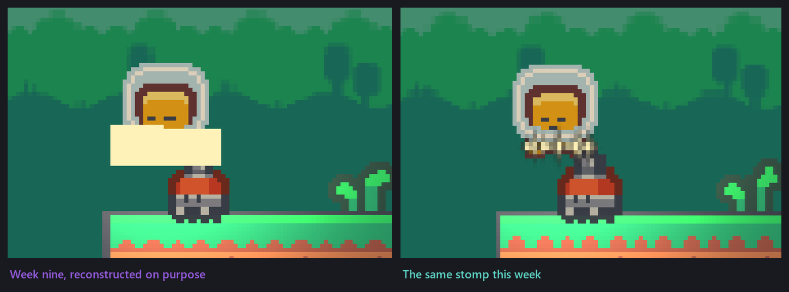
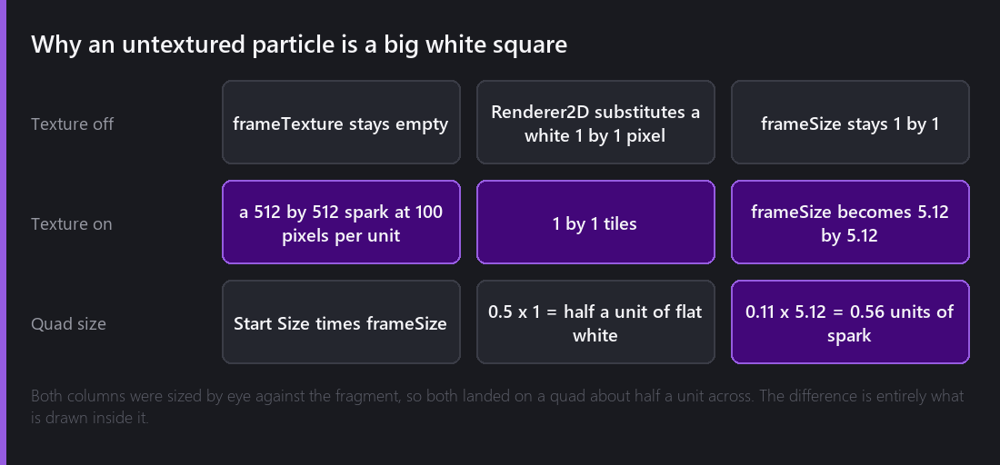
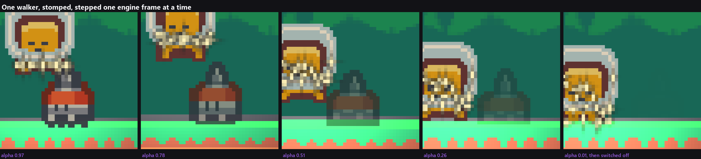

In week nine I wrote about hit stop and screen shake, and I quietly did not write about the third thing on that evening's list. The stomp was supposed to throw sparks. What it threw was large flat white rectangles, and rather than hold up the post I cut the section and moved on.

This week I went back and found out why, and then spent the rest of the evening on what happens to the thing you landed on.


## The white rectangles

Here is the fault next to the fix. The left panel is not an old screenshot; it is this week's build with the two settings put back the way they were, because I wanted to be sure I understood the cause well enough to reproduce it on purpose.



Two things were happening at once, and both come from the same place.

Comet's Particle System has a **Texture Animation** module, and it is off by default. That sounds like a module about animating a flipbook, which is what I assumed, and it is also the only place a particle gets a texture at all. With it off, the frame texture handle stays empty, and `Renderer2D` does not skip a draw with no texture: it substitutes a white one by one pixel, which is the sensible thing for a renderer to do and which makes every particle a flat white quad.

The second half is the size. A particle's quad is **Start Size times frame size**, and frame size comes from the texture: its width in pixels, divided by its pixels per unit, divided by the number of tiles across.



With no texture, frame size stays one by one, so Start Size is the whole answer. I had set Start Size by dragging it until the particles looked about right against the fragment, which landed me on half a unit, and half a unit of flat white is a rectangle the size of the fragment's face.

With `star_06` assigned, the same arithmetic runs on a 512 pixel texture at 100 pixels per unit with one tile, so frame size is 5.12, and Start Size has to come down to about a tenth to produce the same half unit quad. Enabling the module without fixing Start Size gives sparks five units across, which I also managed to do for a few minutes and which is briefly very funny.

## The second particle bug, which was mine

With the sparks textured, they came out as dark blobs.

The eighteen particle PNGs from Kenney's pack are palette images, and their transparency is stored in a `tRNS` chunk rather than an alpha channel. Whatever path the importer took, that chunk did not survive, so every spark arrived with an opaque background the colour of the palette's transparent entry.

The fix was not in the engine. I converted all eighteen to straight RGBA on disk and reimported, and they have been correct since. I am recording it because "the art looks wrong" is easy to spend an evening on in the wrong place, and the first question worth asking is what the file actually contains.

## Value types are bit flags

One more thing, if you drive this system from a script or a tool rather than the inspector. Every start value in the Particle System is a selector, and its `ValueType` is a bit flag rather than an enumeration counting up from zero:

```
NO_TYPE                          0
CONSTANT                         2
CURVE                            4
RANDOM_BETWEEN_TWO_CONSTANTS     8
GRADIENT                        16
RANDOM_BETWEEN_TWO_GRADIENTS    32
```

I lost a little time assuming `1` meant constant and getting a selector that silently produced nothing. The stomp burst uses `8` for lifetime, speed and size, which is why it has a `ValueA` and a `ValueB` rather than a `Value`.

## Dying properly

The other half of the evening. Until this week, stomping an enemy switched it off, and a thing that switches off is a thing that vanishes between two frames. It read as a bug even when it was working.



Those five panels are one walker, captured by stepping the engine a frame at a time and reading the renderer's alpha back on each one, so the numbers under them are measured rather than described. The fade is 0.35 seconds.

The interesting decision is where the death lives. The fragment is the thing that decides a contact was a stomp, and my first version had the fragment switch the enemy off. That cannot work, and the reason is a good one: an enemy switched off by somebody else vanishes on the frame it is touched and never runs anything of its own again, so there is nowhere to put a sound or a fade or anything that has to happen after the hit.

So both sides work it out from the same geometry, separately, and never talk. The fragment bounces. The enemy dies. A script in Comet cannot call a method on another script anyway; reading entity state is the whole channel, and this is a case where that restriction pushed me towards the better design.

The enemy's side of it starts by taking its colliders away:

```angelscript
// A corpse that still has colliders is a corpse that can still hurt the fragment, and the
// contact that killed this enemy is not pulled out of the solver until the end of the step,
// so it would be asked to resolve again on the way past. Every collider goes, not just the
// first: an enemy is allowed more than one.
array<CometEngine::Collider@>@ colliders = CometEngine::Collider::GetAll(entity);
for (uint i = 0; i < colliders.length(); ++i)
{
    colliders[i].enabled = false;
}
```

Then it zeroes the velocity, because whatever the patrol script asked for last step is still in the body and a corpse that keeps walking while it fades is worse than one that vanishes.

## Three things I learned about materials

The fade drives alpha on the renderer's colour, which is enough on its own. I also wanted it to drive a shader parameter, so that a proper dissolve shader can be dropped in later without touching this script, and getting that right taught me three things.

**Reading `.material` clones.** A renderer's `material` property hands back a clone installed on that renderer alone, while `sharedMaterial` hands back the asset every enemy is using. Fading the shared one would dissolve every walker in the level at once. The clone is taken at the moment the enemy starts dying rather than in `Start`, because taking it in `Start` allocates a runtime material for every enemy in the level including the ones nobody ever touches.

**The clone has to be handed back.** It is a runtime resource and it outlives the entity, so disabling the enemy is not enough. The renderer has to let go of it first and then the resource is removed, otherwise the renderer is left pointing at something destroyed. The doc comment on `Renderer.material` says to call `Material.Clear()`. There is no such function; `Material::Remove` is the one that does the work, and that comment is on my list.

**A uniform whose name starts with an underscore is engine provided.** Comet treats those as its own and never exposes them as material parameters, so a dissolve shader cannot call its parameter `_Dissolve` and expect a script to reach it. Writing a parameter the shader does not declare is silently dropped, which means this script costs nothing on an ordinary sprite material and the alpha fade carries the effect by itself.

The fade also runs on scaled time rather than unscaled, on purpose. The fragment freezes the game for a moment on an impact, and a corpse that keeps dissolving through the freeze is the only thing on screen that did not notice the hit.

## Where it is

Stomping something now throws about twenty gold sparks from the point of contact and the thing you stomped fades out over a third of a second with its colliders already gone. Both were on the week nine list.

Total so far: fifteen evenings.

---

Next Wednesday, sound. There are six things in this game that should make a noise and at the moment none of them do, and the reason is more interesting than I expected.

*Comments and questions welcome ;)*
