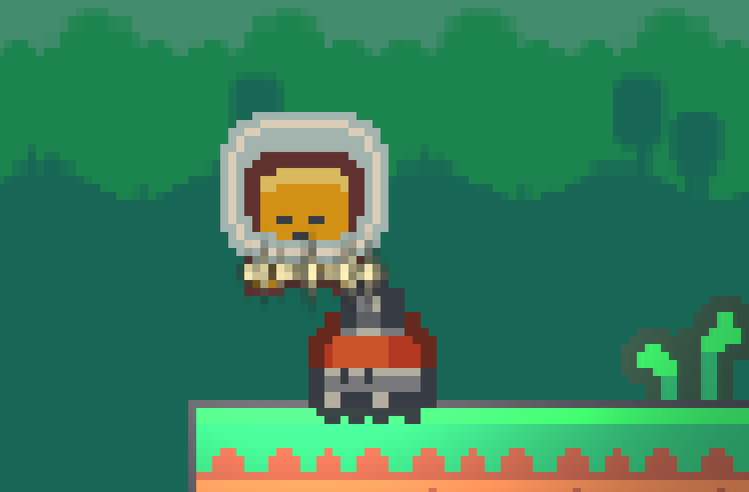
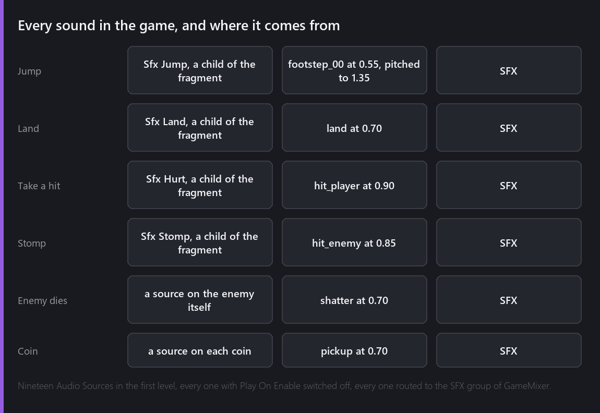
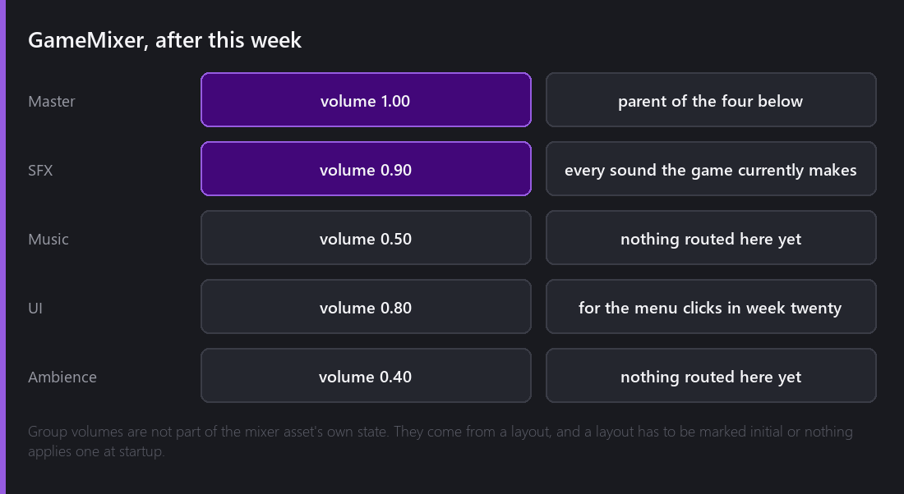

Fifteen weeks of a game with no sound. I had imported a pack of effects in week one and then never come back to them, which is roughly what happens to sound in every project I have worked on.



## What makes a noise

Six events, and here is exactly where each one comes from:



Nothing surprising in the list. The one detail worth pointing at is the jump. Kenney's SFX pack has footsteps, a landing, two hit sounds, a shatter, a pickup and a set of UI clicks, and it does not have a jump. `footstep_00` played at 55 percent volume with the pitch pushed to 1.35 reads convincingly as a push off, and it cost nothing but a number.

## One source per sound

The first thing I tried was one Audio Source on the fragment, changing its sample before each play. That is wrong for a reason I should have seen coming: two sounds can overlap. Land on an enemy while taking a hit from the bat above it and the second play cuts the first off.

The second thing I tried was several Audio Sources on the fragment. The Audio Source behaviour is registered as one you may have more than one of, so the editor lets you do it, and then a script cannot tell them apart. `AudioSource::Get(entity)` returns one of them, and there is no ordinal to ask for.

So each sound is its own child entity, named for what it is, and the fragment's script finds them by name:

```angelscript
// One child entity per sound, each with its own Audio Source. A script cannot pick between
// several sources on one entity, and it can find a child by name, so the children are the API.
private AudioSource@ FindSound(const string&in childName)
{
    Entity@ holder = Entity::Find(childName);
    return holder is null ? null : AudioSource::Get(holder);
}
```

Four children on the fragment, `Sfx Jump`, `Sfx Land`, `Sfx Hurt` and `Sfx Stomp`. It looks slightly silly in the hierarchy and it is the arrangement that actually works. The naming also means the editor shows you the whole sound design of the character by expanding one node.

There is a fire-and-forget call, and what it does not carry matters as much as what it does. The `AudioSource` namespace has `PlaySingle(sample, volume)` for a 2D one shot, `PlaySingleAtPosition(sample, position, volume)` for a 3D one, and tracked variants of both that hand back a source which destroys itself when the sound ends. What none of them take is a pitch or a mixer group. Those live on a source, so a sound whose pitch matters, like the jump, needs one.

The coin uses the detached call, for a reason I only found by getting it wrong. A coin plays its pickup sound and then switches itself off, and switching an entity off stops every sound its own Audio Source is playing. A coin that plays through its own source is a coin nobody ever hears. So the coin reads the clip off its source, plays it detached, and then disappears.

The enemies and the coins own their own sources rather than borrowing the fragment's, because each of them already owns its own death. The walker plays `shatter` from the same script that starts its fade, which means the sound comes from where the enemy was rather than from where the fragment is.

## Play On Enable defaults to true

This one is worth writing down, because it is not a bug and it wasted twenty minutes.

An Audio Source serializes a field called `Play`, which is play-on-enable, and it defaults to **true**. That is the right default for the common case, which is a music track or an ambience loop on an entity that exists to make a noise. It is the wrong default for nineteen effect sources, and the symptom is a game that plays every sound in the level in the same frame the scene loads and then goes quiet.

All nineteen have it off. The fragment's four are children of the fragment and would otherwise fire at the spawn; the ten coins would fire from wherever they are hanging.

## The mixer, which was set to zero

With everything wired and every source verified, the game was still silent.



A mixer group's volume is not part of the mixer asset's saved state. What the asset stores is a set of **layouts**, each capturing a volume, pitch and mute value for every group, and one of them can be marked as the initial layout to apply at runtime.

The layout a new mixer ships with sets Master to 1 and every child group to 0. Nothing in my project had marked any layout as initial, so at runtime the groups came up at whatever that default said, and every effect was routed to SFX at volume zero. Every source was playing. The mixer was throwing all of it away.

The fix is one flag and one set of numbers: SFX at 0.90, Music at 0.50, UI at 0.80, Ambience at 0.40, captured into a layout and that layout marked initial. Music and Ambience have nothing routed to them yet and exist because a game that grows a music track later should not need a new mixer.

I also cleaned up after myself. Experimenting had left four layouts in that asset, three of them called "New Layout" and one that silences the game, and shipping a project with a layout named "New Layout" that mutes everything is exactly the kind of thing that turns into a bug report in a month. There is one layout now.

## Verifying sound without listening to it

Every other week I have been able to check my work by reading a number back. Sound is harder, and I want to be honest about the standard I held it to.

What I verified: every one of the nineteen sources resolves to a real sample and a real mixer group, every one has Play On Enable off, the mixer has one initial layout with non-zero volumes, and a scripted run of the level that jumps, lands, takes a hit, stomps a walker and collects a coin produces no errors in the console from any of the six paths. What I did not verify with a tool is that it sounds good, because I listened to it, which is the only way that question gets answered.

It sounds thin. Six effects with no music and no ambience always will.

## Where it is

The game makes a noise when you jump, land, get hit, stomp something, kill something and pick something up, and the mixer is no longer throwing it away.

Total so far: sixteen evenings.

---

Next Wednesday I go back to the thing that beat me in week thirteen. The HUD is three sprites hanging off the camera because I could not get the Canvas to do what I wanted, and this week I found out why, which took two new editor tools to work around.

*Comments and questions welcome ;)*
