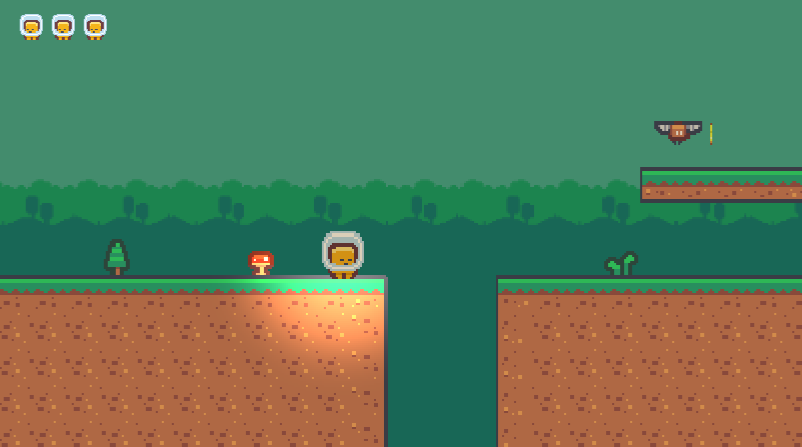
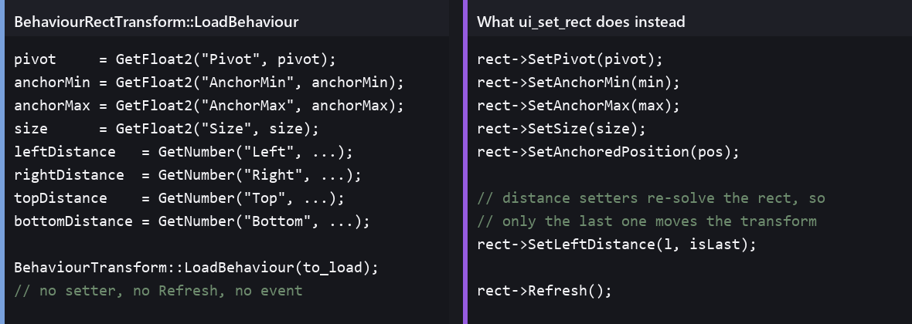
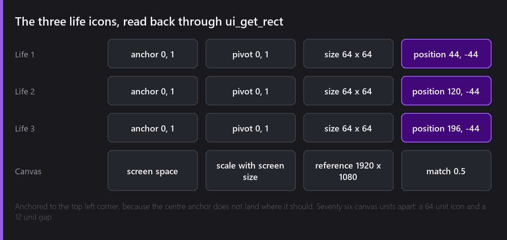
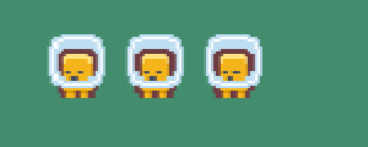

In week thirteen I built the HUD as three sprites parented to the camera and wrote that the UI system had beaten me. What I said at the time was that the canvas contents drew at a scale and position that had nothing to do with the anchors I had set, that reading the values back confirmed they were exactly what I had written, and that finding the gap was an engine job for another week.

This is that week.



## Reading back correct and drawing wrong

The symptom was specific enough to be a good clue. I would set an anchor, a pivot, a size and a position through my own editor tooling, read all four back, get exactly what I had written, and see nothing change on screen.

The place to look was therefore not the rect solver. Something was storing my values without ever telling anything else about them.



`BehaviourRectTransform::LoadBehaviour` assigns every one of the eight fields directly. It never calls `SetPivot`, `SetAnchorMin`, `SetAnchorMax`, `SetSize` or `SetAnchoredPosition`, and it never calls `Refresh`.

That matters because the setters do work beyond the assignment. Each of them re-solves the rect from the anchors it now has, and `Refresh` raises the event an Image or a Text listens for to rebuild its quad. Assigning `size` and stopping means the field says 64 and the quad on screen is still whatever it was.

I want to be fair to the code, because I wrote it. For loading a scene this is fine: every rect in the hierarchy gets solved top down once the whole tree exists, so skipping the per-field work is an optimisation rather than a bug. It only breaks when something writes one field of one rect at a time on a live scene, which is what an editor tool does and what nothing in Comet did until this project.

Which is the useful lesson from the whole detour. My tooling reaches the engine by asking a behaviour to save itself to JSON, changing one key, and asking it to load that JSON back. That is a beautifully general trick and it works on every behaviour in the engine except the ones whose load path is not equivalent to their setters.

## Two tools

Rather than change `LoadBehaviour` and risk the scene load path I have been relying on for a year, I added a module tool that goes through the setters:

```cpp
// Pivot first, then anchors, then size, then position: each of those setters reads the
// state the previous one leaves behind.
rect->SetPivot(...);
rect->SetAnchorMin(...);
rect->SetAnchorMax(...);
rect->SetSize(...);
rect->SetAnchoredPosition(...);
rect->Refresh();
```

The order is not arbitrary and I got it wrong twice. Each setter solves against the state the last one left, so setting size before the anchors sizes an axis that is about to be stretched, and setting the position before the pivot moves the wrong point.

The distance setters have their own rule. `SetLeftDistance`, `SetRightDistance`, `SetTopDistance` and `SetBottomDistance` each take a flag saying whether they should move the transform, because each one re-solves the rect and only the last of them should be allowed to commit. The engine's own UI factory does the same thing, which is where I found the pattern.

The second tool sets the canvas scaler, which is three calls that have to happen in order: the scale mode, then the reference resolution, then the match mode and its value.

Two files, `UiRectTools.cpp` and one line in the module registrar, and the Canvas became something I can drive.

## Anchoring from the corner

One fault I have not fixed and am working around. A rect anchored at the centre, 0.5 and 0.5, lands hundreds of canvas units to the left of where it should. Anchored to a corner it is exact.

Everything in this game's UI is therefore anchored to the top left, and the numbers are all offsets from that corner:



Three 64 unit icons at x = 44, 120 and 196, which is a 64 wide icon and a 12 unit gap, and y = -44 in each case because the pivot is the top left and down is negative from there.

The canvas is screen space, scaled with screen size, against a 1920 by 1080 reference with the match at 0.5, so it splits the difference between matching width and matching height. On a wider screen the icons stay the same size relative to the frame rather than the pixel, which is the reason to use a canvas at all rather than sprites hanging off the camera.

Here is the corner of a real frame, enlarged:



## What the canvas buys

It is worth asking what changed for the player, because the answer is nearly nothing and I still think it was the right week.

The three sprites hanging off the camera worked. They were pixel perfect for free because they went through the same sprite path as everything else, they cost three entities, and if this game were only ever going to have three icons in a corner I would have left them alone and not written this post.

What the canvas buys is everything after the icons. A game over panel that has to cover the screen at any resolution, a level select with eight buttons that have to sit in a grid, a title that has to stay centred. None of that is reasonable to build out of sprites positioned by hand in world units, and all of it is arriving in the next three weeks. The HUD was the small thing I could use to find out whether the foundation worked.

## Where it is

The three lives are Images on a Canvas that scales with the screen, driven by two new editor tools, and the engine fault that stopped me in week thirteen is written down with a reproduction rather than left as a shrug.

Total so far: seventeen evenings.

---

Next Wednesday, something to collect. The game has nothing in it to pick up, which means there is nothing to do in a level except reach the end of it.

*Comments and questions welcome ;)*
