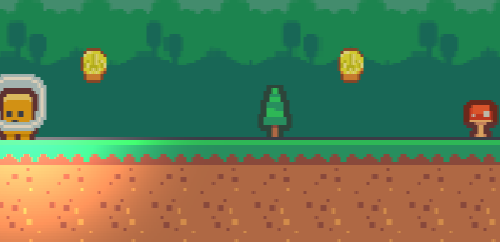
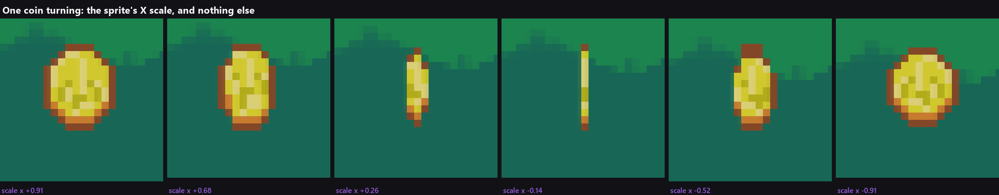
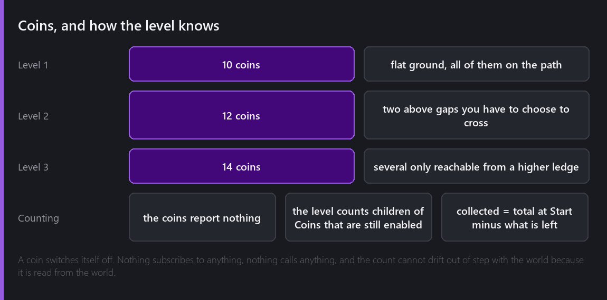
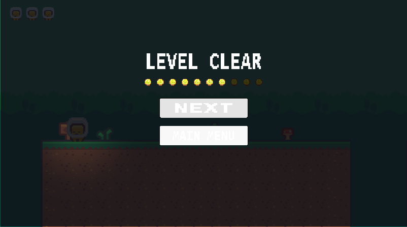

Until this week the only thing to do in a level was get to the end of it. There was no reason to jump onto the high ledge, no reason to cross the second gap rather than going round, and no reason ever to play a level twice.



## A disc that turns

Kenney's object sheet has a coin drawn face on and nothing else, so a turning coin needs either more art or a trick. The trick is one line:

```angelscript
float turn = Math::Cos(elapsed * (2.0F * Math::PI) / Math::Max(spinPeriod, 0.01F));
Vector3 scale = startScale;
scale.x = startScale.x * SpinWidth(turn);
entity.transform.scale = scale;
```

A cosine narrows the coin to an edge, passes through zero, and brings it back out mirrored, which is what a turning disc does. Six frames of a real one, stepped an engine frame at a time and captioned with the scale value read back off the transform:



There is one guard on it and it exists because I hit the bug. The coin has a collider, the collider is scaled by the transform, and it is rebuilt whenever the transform moves, so a coin allowed to reach exactly zero width becomes a box the solver cannot use. `SpinWidth` never lets the absolute value below 0.06, which is a sliver two pixels wide and completely invisible:

```angelscript
private float SpinWidth(float turn) const
{
    float width = Math::Max(Math::Abs(turn), minSpinWidth);
    return turn < 0.0F ? -width : width;
}
```

The coin also bobs, on a 1.6 second period against the spin's 1.1, deliberately not a multiple, so the two never settle into looking like one movement.

Both animations are written from a position read once in `Start` rather than from the live transform. Reading the transform each frame makes this frame's result the next frame's starting point, and the coin slowly walks off its spot. That is the same class of mistake as the camera drift in week ten and I still nearly made it again.

## Nothing reports anything

The coins do not report being collected. A coin switches itself off, and the level script counts how many children of the `Coins` entity are still enabled:



The total is measured once in `Start`, because it only exists to be compared against what is left afterwards. Counting again at the end would always answer with the number of coins nobody took.

This is the third time in this series I have ended up with two scripts that never speak. A script in Comet cannot call a method on another script, so the only shared channel is the state of entities, and by now I have stopped treating that as a restriction. A count read from the world cannot drift out of step with the world.

Two details in the pickup that took a second attempt.

**The guard is a flag, not the enabled state.** A contact already in the solver keeps being delivered for a step or two after the entity is switched off, and a disabled script still gets called, so `if (collected) return;` is doing real work.

**The sound has to be detached.** Switching an entity off stops every sound its own Audio Source is playing, so a coin that plays its pickup through its own source and then disables itself is a coin nobody ever hears. It reads the clip off the source and plays it through `AudioSource::PlaySingle` instead, which is not attached to anything and outlives the coin.

## The screen at the end

Collecting things is pointless if the game never tells you how you did.



That is a real frame with seven coins taken. One pip per coin in the level, the ones you found lit and the ones you missed dimmed rather than hidden, so the row says both how many there were and how many you got. Ten pips in level one, twelve in level two, fourteen in level three.

It is pips rather than a number for a blunt reason: the Text renderer in this build draws the wrong glyphs, which is a fault I have written about before and have not fixed. Every piece of readable text in this game's menus is a PNG I rendered outside the engine. A row of coin icons needs no font at all, and I think it reads better than "7 / 10" would have anyway.

The count also goes into the save file, and it keeps the highest rather than the latest:

```angelscript
// Nothing here can make a save worse: the coins keep the highest and the time keeps the
// fastest, because replaying a level for fun should not cost the player the record they set on
// the run that mattered.
if (coins > entry.GetInt("coins", 0))
{
    entry.SetInt("coins", coins);
}
```

Which matters more than it sounds, because the level select in two weeks shows that number per level, and a player who replays level one for fun and quits halfway should not lose the ten they already found.

## What I did not build

There is no coin counter on screen while you play. I know what it would take, which is a coin icon and two digits rendered as sprites, and I decided against it: with no text renderer I would be building a number out of ten PNGs to tell the player something the level tells them at the end anyway.

## Where it is

Ten, twelve and fourteen coins across the three levels, each one turning and bobbing on two lines of maths, each one making a noise that survives its own disappearance, and a completion screen that shows you exactly what you left behind.

Total so far: eighteen evenings.

---

Next Wednesday, the other two levels. Until now this series has had one level in it, and the word "levels" has been doing a lot of quiet work in these posts.

*Comments and questions welcome ;)*
