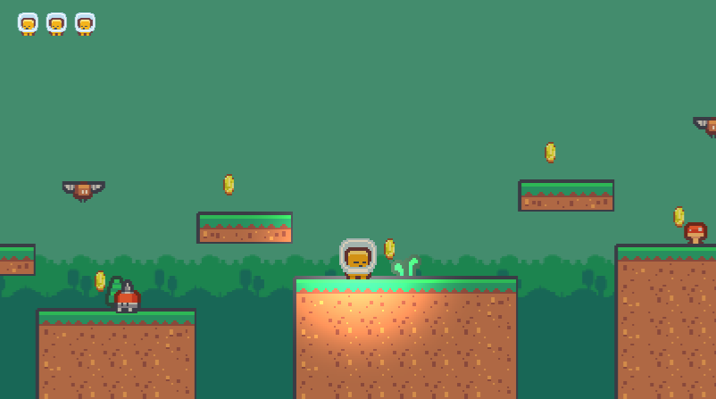
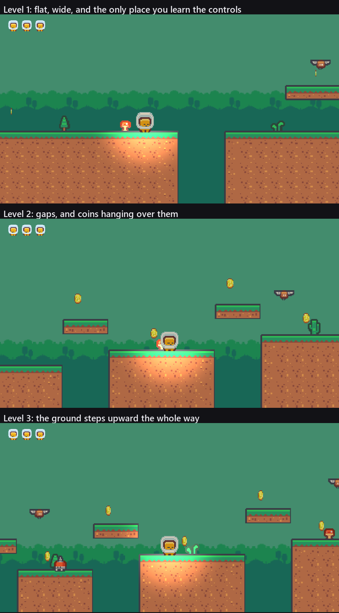
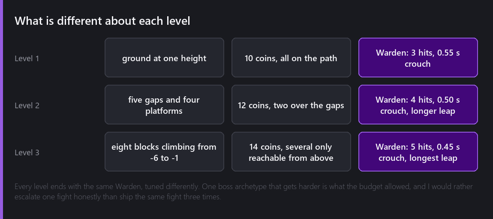
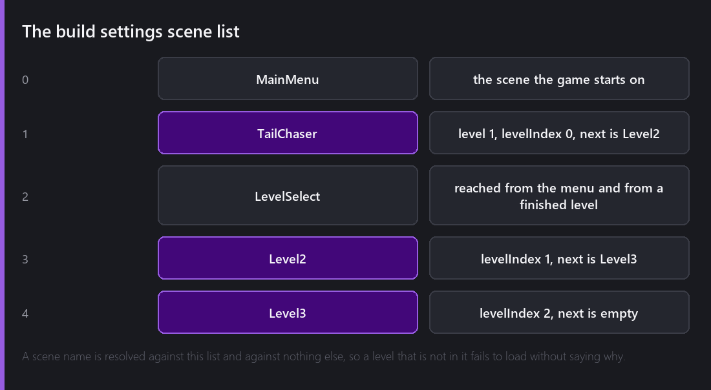

For eighteen weeks this series has said "levels" and meant one level. The word has been doing a lot of quiet work.



## Copy and repaint

Building the second and third levels did not start with an empty scene, and I think that is the right call rather than a lazy one. Level one already had a camera rig with the follow script tuned, a fragment with two scripts and four sound children, a HUD, two panels, a lighting setup, an input handler and a level script. Rebuilding all of that twice would have been an evening each of moving numbers between inspectors.

So each new level is a duplicate of level one with the terrain painted over and the contents moved. Duplicating a scene is one call, and after that the level is a list of rectangles:

```python
BLOCKS = [(0, 8, -6), (12, 18, -6), (22, 26, -5), (30, 34, -4),
          (38, 44, -3), (48, 52, -2), (56, 62, -1), (66, 86, -2)]
PLATFORMS = [(9, 11, -3), (19, 21, -3), (27, 29, -2), (35, 37, -1),
             (45, 47, 0), (53, 55, 1), (63, 65, 1)]
```

That is level three: eight ground blocks whose top edge climbs from minus six to minus one, and seven small platforms bridging the gaps between them. A script paints those into the tilemap, moves the coins and the enemies to match, and sets the camera bounds to the new width.

The reason to keep the terrain as a list of rectangles in a script rather than painting it by hand is that I changed my mind about level three's shape four times, and each change was thirty seconds instead of ten minutes.

## What is different about each



Three screenshots of one level with the ground moved around would be a waste of two evenings, so each level is trying to do a different job:



**Level one** is flat. The ground is at one height for the first sixteen units and there is nothing near the spawn that can hurt you, because this is where a player finds out that the arrow keys move them and that the jump has forgiveness in it. The first gap arrives once you have had a chance to notice you can jump.

**Level two** is the one that asks questions. Five gaps, four platforms, and two of the twelve coins hang over a gap so that collecting everything means committing to a jump you could have walked around. That is the whole design: the safe route exists and it costs you coins.

**Level three** climbs. Every block is higher than the last one, and several of its fourteen coins sit on ledges you can only reach by taking the platform above rather than the one in front. It is the shortest of the three end to end, at eighty-seven units against level one's ninety-seven, and it takes the longest to play, because climbing eighty-seven units of stepped ground is not the same job as running along ninety-seven flat ones.

## The same boss, three times, differently

Every level ends with the Warden, and until this week it was configured identically in all three, which meant beating it in level one taught you the entire game.

It now escalates. Three stomps in level one, four in level two, five in level three, with the gap between leaps shrinking and the leap itself getting longer each time:

```
              hits   watch   crouch   stun   leap across
Level 1         3     1.10    0.55    1.60      5.5
Level 2         4     0.95    0.50    1.45      6.2
Level 3         5     0.85    0.45    1.30      6.8
```

The crouch is the number I moved least, and deliberately. The crouch is the only warning the player gets before a leap, and a warning that shrinks with difficulty is a warning that stops being one. It goes from 0.55 to 0.45 seconds across the whole game, while the stun window the player has to hit shrinks by nearly twice as much proportionally.

I want to be honest about what this is. It is one boss archetype tuned three ways, not three bosses. A second enemy pattern for level two and a third for level three would be better and would have cost two evenings I do not have. Escalating one fight is the version of this that fits in the budget, and I would rather do that well than ship the same fight three times and hope nobody notices.

## Wiring them together

Each level's script carries the two facts that connect it to the rest of the game: which entry in the save file it is, and which scene comes after it.

```
Level 1   levelIndex 0   next: Level2
Level 2   levelIndex 1   next: Level3
Level 3   levelIndex 2   next: (empty)
```

Level three's next scene is empty, so its completion panel offers only the menu. That is the end of the game.

All five scenes have to be in the build settings list, because a scene name is resolved against that list and against nothing else:



A name that is not in the list fails to load and does not say why, which cost me ten minutes the first time and is the sort of thing I would like the engine to warn about.

## What I checked

Each level was walked from its spawn with the input driven from my tooling, and I recorded where the fragment ended up after fixed intervals, which is how I found that level two's first gap arrives nine units after the spawn rather than the twelve I had intended. Each level's coin count was read back off the scene rather than counted by hand: ten, twelve, fourteen.

One thing that surprised me, and that only turned up because I was taking screenshots: teleporting the fragment to a spot to photograph it costs a life. Writing a transform on a body the solver owns is not the same as moving it, and the level script's own death detection reads the resulting jump as a respawn. Nothing in the shipped game teleports the fragment except an actual respawn, so this is a fault in my capture tooling rather than in the game, but it did produce one screenshot with the wrong number of lives in the corner that I nearly published.

## Where it is

Three levels of ninety-seven, eighty-nine and eighty-seven units, thirty-six coins between them, and three Wardens that are the same Warden trying harder.

Total so far: nineteen evenings.

---

Next Wednesday, the front of the game. A main menu, a level select that knows what you have finished, and the two things that go wrong when you die three times.

*Comments and questions welcome ;)*
