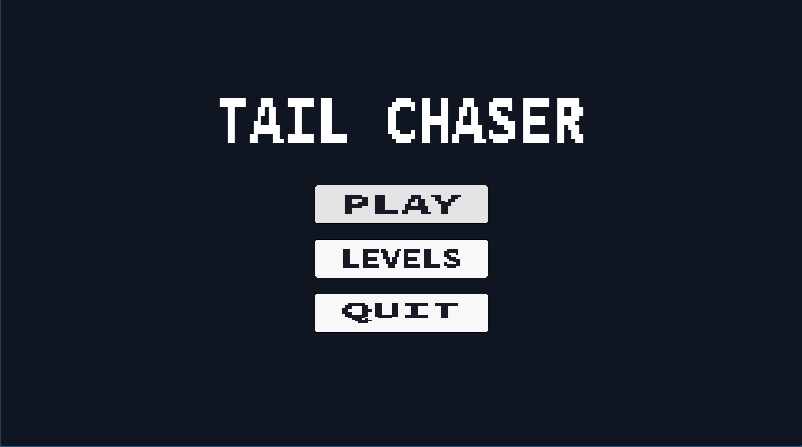
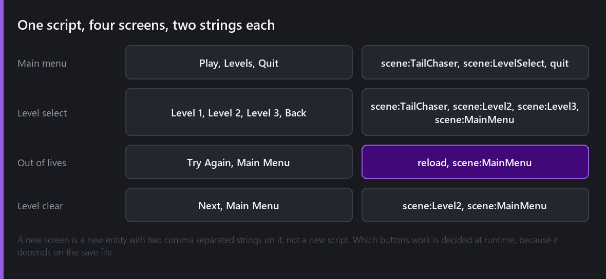
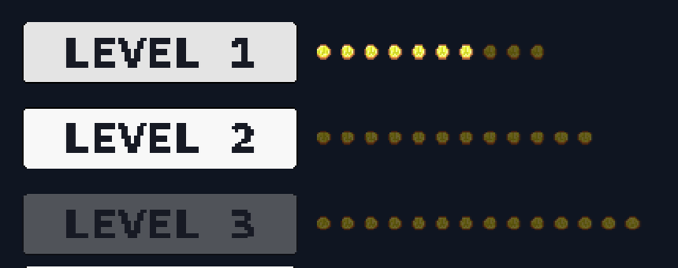
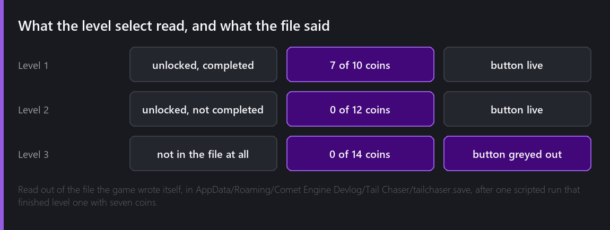
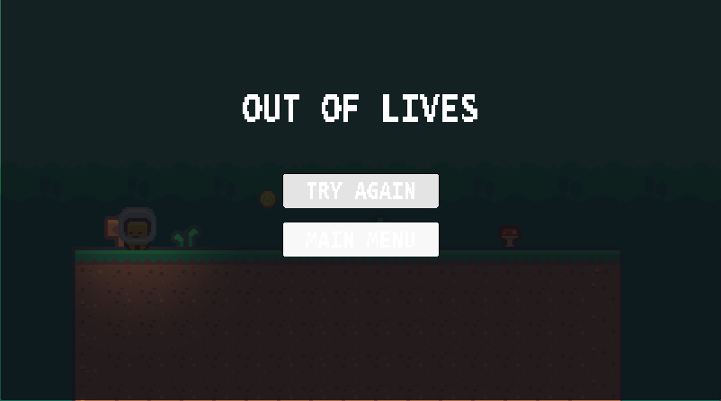

Nineteen weeks in, the game started in whatever scene the editor had open and ended by running out of level. This week it gets a front door.



## One script, four screens

There are four screens in this game: the main menu, the level select, the panel that appears when you die three times, and the panel that appears when you finish a level. They are all the same script.

What tells them apart is two comma separated strings:



A new screen is a new entity with a list of button names and a list of actions on it. `scene:Name` loads a scene, `reload` restarts the current one, `quit` quits, and `none` does nothing, which is what a button with no action gets rather than an error, because a button that is really a label is a reasonable thing to build.

The clicks are wired at runtime rather than in the inspector, and that is not laziness. Whether a level button should do anything depends on the save file, and the save file is not readable until the game is running. A button whose level has not been reached is never wired in the first place.

## Eight nearly identical functions

Here is the part of this week I would change about the engine if I could.

A Button hands its click to a `CometDelegate`, and a `CometDelegate` takes no arguments. There is no sender, no index, no payload. Which button was pressed can therefore only be carried by which function was bound to it, and there is no way to build a delegate from a number at runtime.

So the script has eight handlers:

```angelscript
switch (slot)
{
    case 0: button.onClick.AddRuntimeListener(CometDelegate(OnSlot0)); break;
    case 1: button.onClick.AddRuntimeListener(CometDelegate(OnSlot1)); break;
    case 2: button.onClick.AddRuntimeListener(CometDelegate(OnSlot2)); break;
    ...
}
```

and eight one-line functions that each call `Activate` with their own number. Eight is the most buttons any single screen in this game can have, which is more than any of them needs, and it is an arbitrary limit that exists because of how the delegate is shaped rather than because of anything about menus.

The listeners come off again in `OnDestroy`, because a delegate holds a reference to the script for as long as the button holds the delegate.

## Locking


Three levels, and level two only opens once level one is finished. A locked button keeps its place in the list rather than disappearing, so the menu does not reshuffle itself as the player gets further, and `interactable` goes off, which also unhooks the engine's own pointer events so the click cannot arrive by another route.

Deciding what is locked turned out to have a wrinkle. The action for level one is `scene:TailChaser`, because that is what the first level's scene has been called since week one, and the level select's own Back button is `scene:MainMenu`. So the test cannot be "is this a scene action":

```angelscript
// The number in a scene name like "Level2", or zero when the name is not a numbered level. The
// byte count is what does the real work: it says how much of the text parseInt actually consumed,
// so "Level2" answers 2 and "LevelSelect" answers nothing at all.
private int LevelNumber(const string&in sceneName) const
```

`parseInt` in AngelScript takes a `uint` out parameter telling you how many bytes it consumed, which is the clean way to ask whether the whole of the remaining text was a number. `LevelSelect` gets zero and is never locked. I would have written something with a regular expression in it if that had not been sitting there.

## Coins on the level select

The level select knew which levels were open and said nothing about what you had found in them, which made collecting every coin a goal with no scoreboard.



One pip per coin in that level, lit for the ones you have found. That crop is a real frame, and everything in it came out of the file the game wrote for itself:



Level one finished with seven of ten. Level two open because finishing level one opened it, and no coins because I have not played it. Level three not in the file at all, so the button is grey. The rows carry the totals themselves, because the number of pips in a row is the number of coins in that level, and the script that lights them never has to be told either number.

## The bug that made losing impossible

The panel for running out of lives has existed since week thirteen. This week I finally tested the thing it is for, by driving the fragment into the pit three times and watching the corner:

```
fall 1: lives on, on, off
fall 2: lives on, off, off
fall 3: lives on, on, on
```

Three hearts back, and no panel. The respawn had this in it:

```angelscript
private void Respawn()
{
    if (hearts <= 0)
    {
        hearts = maxHearts;
    }
    ...
}
```

That line is there because the first version of the fragment had no game over screen and needed the pit not to be permanent. It survived the week the panel was added, and it means the fragment can never actually run out: the third death quietly hands back three more, and the panel is unreachable in a way that no amount of playing would ever reveal as a bug rather than as a game that is simply hard to lose.

Running out of hearts is now its own outcome. The fragment is put back at the spawn, standing still, and stays there while the panel comes up a beat later, because a panel that lands on the same frame as the death is never read as a consequence of it.



Try Again is the `reload` action, which reloads the scene by its id rather than by its name. Loading by name refuses to load the scene that is already loaded, quietly, and an id also happens to be the only handle to a scene that still means anything in a build, where a scene fetched at runtime reports no name. Reloading is also the entire answer to "do the enemies come back", because every enemy in the level is part of the scene.

## Two things I am not happy with

The next level is written down twice: once on the level script and once in the completion panel's action list. Two places that have to agree about the same fact is a bug waiting for the week I rename a scene.

And the locked-button relabel does nothing. The script appends a suffix to the button's Text to say why it cannot be pressed, and the suffix is set to empty everywhere, because this build's Text renderer draws the wrong glyphs and every readable word in these screenshots is a PNG I made outside the engine. A grey button is doing the whole job of telling the player that level is not open yet, and it is not enough.

## Where it is

A main menu, a level select that reads real progress and shows the coins per level, locks that open as you finish levels, a losing screen that can now be reached, and a Try Again that puts every enemy back.

Total so far: twenty evenings.

---

Next Wednesday, the save file itself. It has been a hand built string of JSON since week thirteen and Comet has a proper JSON object class that I should have used from the start.

*Comments and questions welcome ;)*
