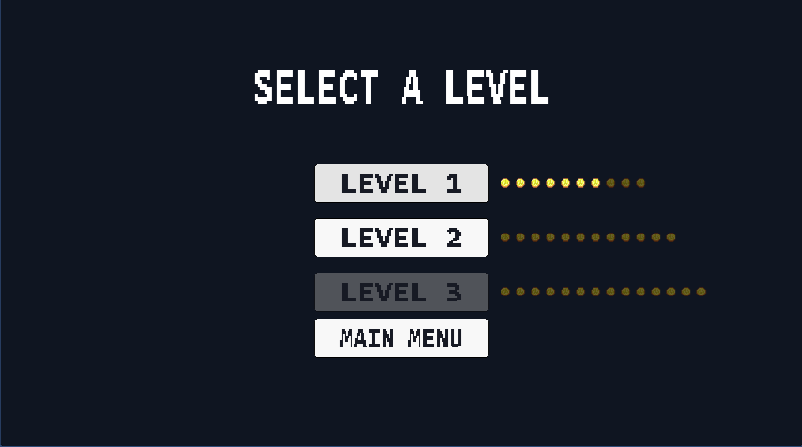
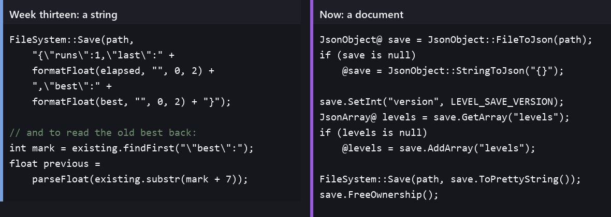
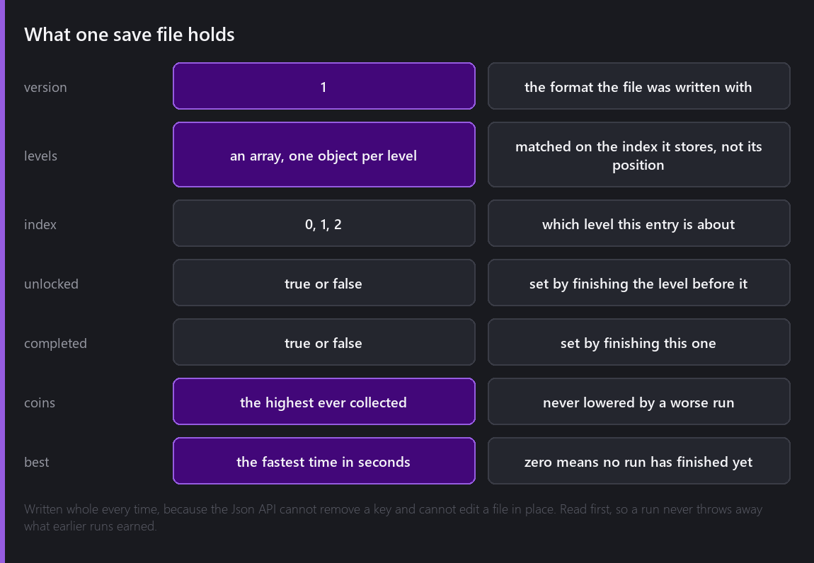

The save file in week thirteen was one line of string concatenation and I described it at the time as three lines of parsing I would replace with a real JSON reader in a bigger game. The game got bigger.



## What was wrong with the string

Nothing, while the file had two numbers in it.



The left column is week thirteen. It writes a run count, the last time and the best time, and to compare against a previous best it finds the text `"best":` and calls `parseFloat` on everything after it.

That works, and it stops working the moment the file has structure. A save with three levels in it, each holding an unlock flag, a completed flag, a coin count and a best time, is a document, and finding the fourth `"coins":` in a string by counting is the kind of code that fails silently on the day somebody adds a field.

Comet has had `CometEngine::Json` the whole time. I did not use it in week thirteen because the file had two numbers in it, and that was the right call then and the wrong one to leave in place.

## The API

Reading is one call, and a missing file is not an error:

```angelscript
// A missing or unreadable file is not a failure, it is the first run.
JsonObject@ save = JsonObject::FileToJson(path);
if (save is null)
{
    @save = JsonObject::StringToJson("{}");
}
```

From there it is `SetInt`, `SetFloat`, `SetBool` and `SetString` on the way in, the matching getters with defaults on the way out, `AddArray` and `GetArray` for arrays, and `AddObject`, `GetObject` and `GetSize` on those. `ToPrettyString` gives you something to hand to `FileSystem::Save`.

Two things about it shaped how I wrote this.

**There is no remove, and no edit in place.** You cannot take a key out of a document and you cannot write one field of a file. So the file is read whole, changed, and written whole, which is also the behaviour I want for a different reason: a run that overwrote what earlier runs had earned would be a bug the player only notices much later.

**Only the root is yours to free.** The handles that come out of a document belong to that document, so `FreeOwnership` on the root has to be the last line that touches any of them:

```angelscript
FileSystem::Save(path, save.ToPrettyString());

// This hands the root back to the engine, and every handle taken out of it dies with it, so it
// has to be the last line that touches any of them.
save.FreeOwnership();
```

I got that wrong once, in the reader on the level select, by freeing the root and then reading an integer out of a child object. It did not crash. It answered with a number that was not in the file, which is worse.

## The shape of the file



Levels are matched on the index they store rather than on their position in the array, so a file whose entries were written in a different order still means what it says. A level the file has never heard of is appended with every field present, because a reader that finds half an entry cannot tell a missing key from a zero.

Two rules keep the file monotonic. Coins keep the highest ever collected and the best time keeps the fastest, so replaying level one for fun and quitting halfway cannot cost you the ten coins you already found. And nothing at all is written on a loss, because a run that ended badly has no record in it worth keeping and writing one would let a player lower their own best time by failing.

Finishing a level is the only thing in the game that opens the next one:

```angelscript
// Finishing a level is the only thing in the game that opens the next one.
JsonObject@ next = Entry(levels, levelIndex + 1);
if (next !is null)
{
    next.SetBool("unlocked", true);
}
```

`Entry` finds the object for a level index or appends a fresh one, so unlocking level two works whether or not the file has ever heard of level two.

## Where it goes

`App::GetPersistentPath()` is the platform's per game data folder, and it is built from the company and product names in the project settings. In week thirteen those were still the defaults and the file was landing in a folder called `Default Company/Default Product`, which I said at the time was the next week's job and which took nineteen weeks to get to.

It is now this, and I read the file back off disk to check:

```
C:\Users\...\AppData\Roaming\Comet Engine Devlog\Tail Chaser\tailchaser.save

{
    "version": 1,
    "levels": [
        {
            "index": 0,
            "unlocked": true,
            "completed": true,
            "coins": 7,
            "best": 3.544
        },
        {
            "index": 1,
            "unlocked": true,
            "completed": false,
            "coins": 0,
            "best": 0
        }
    ]
}
```

Level one finished with seven of its ten coins, in three and a half seconds because that run started next to the boss, and level two opened by that same act and never played. Level three is not in the file, which is how the level select knows to grey it out.


That crop is what those numbers look like in the game. Nothing in it is hand placed: the pip counts come from the levels, the lit ones come from the file, and the grey button comes from an entry that does not exist.

## The version number

There is a `version` field and nothing reads it yet.

I want to be honest that this is a guess about the future rather than a feature. If I ever add a fourth level or a second collectable, the shape of this file changes, and a reader that finds a file it does not understand needs to be able to tell the difference between an old format and a corrupt one. A number that has always been there costs nothing now and is impossible to add later.

## Where it is

One file per player holding a version, an unlock flag, a completion flag, a best coin count and a best time per level, written with the engine's own document class, in the right folder for the platform, and read by two different screens that never speak to each other.

Total so far: twenty-one evenings.

---

Next Wednesday is the last one. A build, and an honest look at what twenty-two evenings of making a game with my own engine actually produced.

*Comments and questions welcome ;)*
