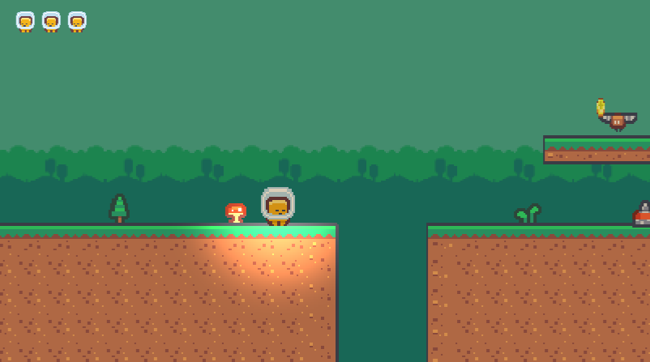
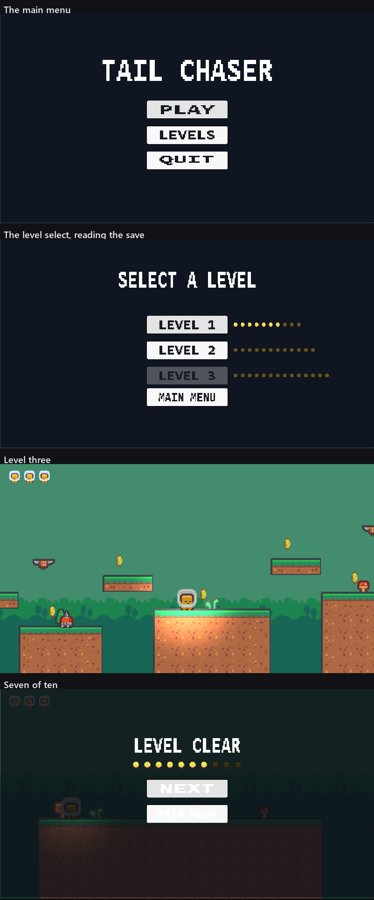
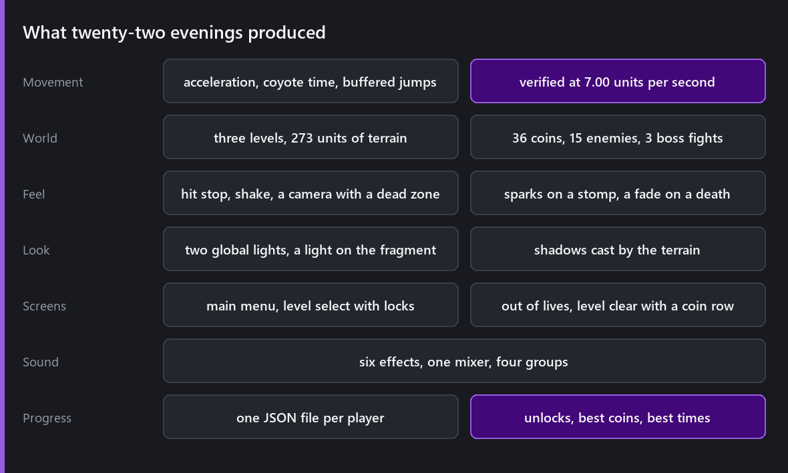
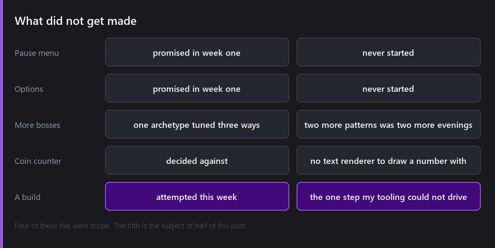

Twenty-two Wednesdays ago I said I would find out whether Comet Engine is pleasant to make a game with, and that whatever existed on the last one would go out in whatever state it was in.

## The game

Here is what is actually there, all of it read back off the project rather than remembered:

Three levels of ninety-seven, eighty-nine and eighty-seven units. Thirty-six coins. Three walkers and two bats in each level, and a boss at the end of each that is the same boss with three, four and five hits and a shorter fuse each time. A main menu, a level select that greys out what you have not reached and shows how many coins you found in what you have, a screen when you die three times and a screen when you win with a row of pips saying what you missed. Six sound effects. One save file that no run can make worse.

You will play the whole thing in about fifteen minutes, which is what I said in week one.

## What did not get made

The pause menu and the options screen were in the first post's definition of finished and neither exists. I am not going to dress that up: they were the two easiest things on the list to cut when a week ran short, and a week ran short about eight times.

The second and third boss patterns are the cut I regret. One archetype tuned three ways is a real escalation and it is not three fights.

And then there is the build.

## The build

This is the part of the post I did not plan to write.

Everything else in this series I have driven from my own tooling: the scenes, the tilemaps, the particles, the physics measurements, the screenshots, the lighting, the menus, two new editor tools when the engine got in the way. Twenty-one weeks of that gave me a habit of assuming anything in the editor is reachable.

The build is not. Here is precisely what happened, because a vague account of this would be worthless.

The build path is set by a folder picker in the Build panel, and no tool exposes it. I found where it is kept, which is `Build.BuildSystem.BuildPath` in the project's `.user/UserEditor.cometConfig`, closed the editor so it would not write over me, set the path, and reopened. That worked: `build_get_status` came back with the path and no complaint.

Then `build_run` never returned. Not slowly: it did not return at all, and while it was outstanding the editor stopped answering any other request. The process stayed alive and its window kept responding, the CPU stayed flat, and after eight minutes the output folder still had zero files in it. I restarted the editor, opened the Build panel first in case the tool needed it visible, fired the call without waiting on the reply this time, and polled the status separately. Same result: no progress, no files, no answer.

The shape of that says the tool is waiting on something inside the editor's own interface that only a person at the keyboard can dismiss, and I have no way to reach it. I could keep guessing, and I would rather write down what I know.

So there is no build in this post. The game runs, and it runs from inside the editor, and the thing that turns it into something you could send to another person is the one step of this project I could not do.

## What twenty-two evenings taught me about my own engine

The honest headline is that the engine held up and the tooling around it was better than I expected, and every serious hole I hit was in the same place.

**What was good.** The physics, animation, tilemap, particle and lighting systems all did what they said, first time, most weeks. The MCP server turned out to be the most valuable thing in the project by a distance: being able to ask a running editor for a rigid body's velocity curve, or step one engine frame and read a renderer's colour back, is how nearly every bug in this series got found. Half of these posts have a chart in them that would not exist otherwise.

**What was bad, and it was all one area.** The UI module cost me three separate weeks. `BehaviourRectTransform::LoadBehaviour` assigns its fields without calling its own setters, so anything editing one rect at a time on a live scene stores values that never take effect. A rect anchored at the centre lands hundreds of units from where the numbers say. And the Text renderer draws the wrong glyphs, which is why every readable word in this game's menus is a PNG I made outside the engine with a Python script.

That last one is the one I want to chase first, because a 2D engine whose font rendering I cannot trust is missing something fundamental, and shipping a menu made of pictures of words to get around it is not a state I want to leave the engine in.

**The list I am taking into the engine.** The Text renderer. Centre anchoring. `LoadBehaviour` and its setters. `behaviour_set_reference` accepting a field name nothing reads and reporting success, which cost me an hour in week fourteen. `Renderer.material`'s doc comment naming a function that does not exist. A scene name that is not in the build list failing silently. Setting a build path from a tool. Filling in a script's resource fields from a tool. And a way to give a Button's click handler an argument, so a menu does not need eight identical functions.

## Was it pleasant?

Mostly, and not in the places I expected.

The weeks I enjoyed were the ones where the engine got out of the way and the problem was the game: the jump, the camera, the boss loop, deciding what a level is for. The weeks I did not enjoy were the ones where I was fighting my own code from the outside with no way in, and every one of those was the UI.

The most useful evening of the twenty-two was week fourteen, when I stopped building and played the whole thing. Five real faults in one sitting, including two that had been in the game for weeks and one that meant the game could not be lost. Nothing in my tooling was ever going to find those, because they were all questions about how it felt rather than about what it did.

The thing I would tell myself in week one is that the plan was fine and the definition of finished was wrong. "One level and one boss" got me to a demo in thirteen weeks. What made it a game was the nine weeks after that: something to collect, somewhere to go next, a reason to replay a level, and a screen that tells you how you did.

## Where it is

A finished small game, built one evening a week for twenty-two weeks, in an engine I wrote, with a list of nine things I am going to fix in that engine because of it.

Total: twenty-two evenings.

---

This is also where the Wednesdays stop for now. Seventy-four of them without missing one, and I would like to take some time to think about what the next one should be instead of starting another series on the following Wednesday because it is the following Wednesday.

I have a few ideas about where to go next, and none of them is ready. When one is, the weekly posts come back.

*Comments and questions welcome ;)*
