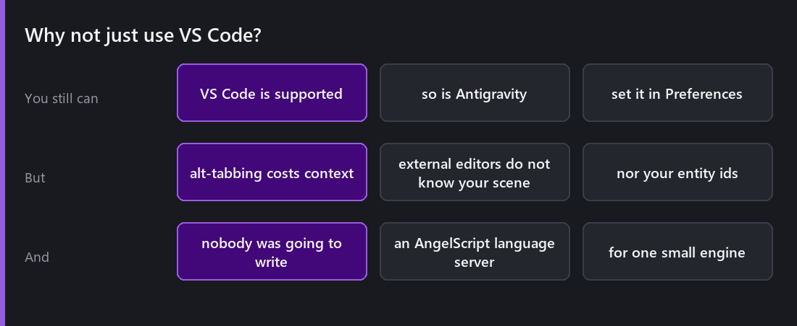
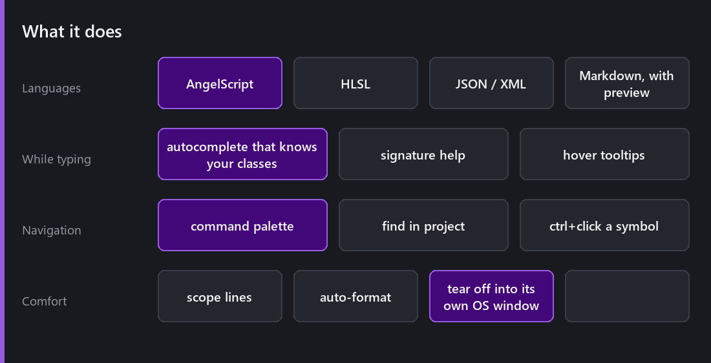
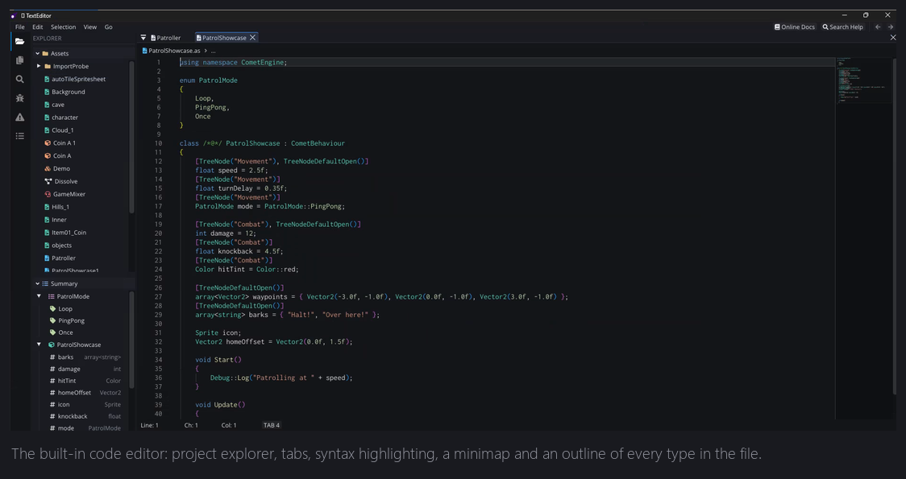
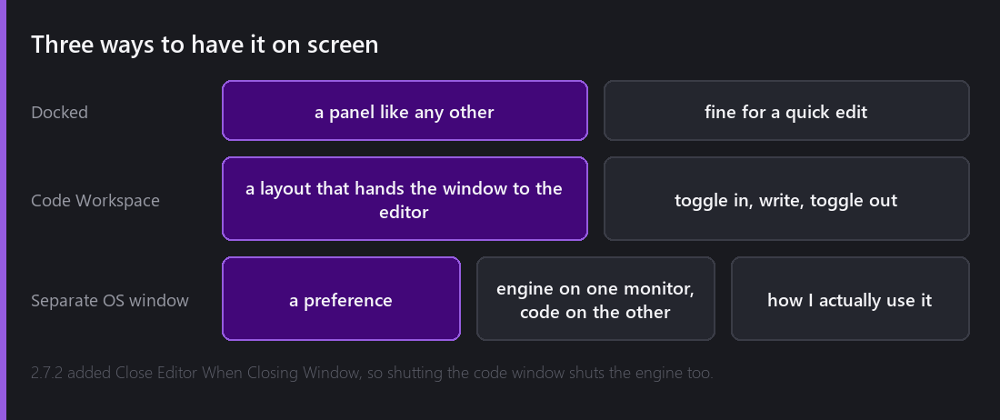

Comet 2.6 added an in-editor text editor. 2.7 added breakpoints and debugging to it. 2.7.1 and 2.7.2 are almost entirely a list of fixes to it.

Writing a code editor is a strange thing for a one-person game engine to do, and the first question is fair: why not just use VS Code?

## Why not just use VS Code

You still can. VS Code is a supported external editor, so is Antigravity from 2.2, and if that is your preference nothing here takes it away.

But three things pushed me into building one anyway.

**Nobody was going to write an AngelScript language server.** Modern editor intelligence — autocomplete, go-to-definition, find references — comes from language servers, and language servers exist for languages with large communities. AngelScript embedded in a specific engine, with that engine's specific API surface and its generated bindings, is never going to get one. The editor that understands Comet scripts has to be written by whoever wrote Comet.

**Alt-tab costs more than it looks.** Not the seconds. The context. Going out to another window to change one line and coming back is a break in attention, thirty times an hour.

## What is in it

**Syntax highlighting** for AngelScript, HLSL, JSON, XML and Markdown — and from 2.8, Markdown files render a live preview behind a button in the top right, which is how I read the engine's own docs without leaving the editor.

**Autocomplete that knows your project.** Not word completion — it knows your classes, your methods, their parameters, and the whole engine API. It knows which `using namespace` directives are in scope, which is the kind of detail that makes it feel correct or broken with nothing in between.

**A command palette** for jumping to files and running actions without leaving the keyboard.

**Find in Project** across every script.

**Ctrl+click a symbol** to jump to it.

**Hover tooltips** showing signatures and types.

**Scope lines**, the vertical guides connecting a block's braces, which sound trivial and are the single feature I would miss most.

**Auto-formatting** that understands AngelScript, including the parts that are annoying — preprocessor directives like `#if` and `#else` used to cause everything after them to over-indent, fixed in 2.8, and a comment on the line above a `{` used to make the brace indent wrongly, fixed in 2.7.2.

## The Code Workspace

The editor is a panel, so it docks like any other. But writing code inside a game editor layout is cramped — you want the file, and you do not need the Hierarchy.

So there is a **Code Workspace**: a layout that hands most of the window to the editor. Toggle in, write, toggle out.

Better still, there is a preference to make the text editor **always live in its own OS window**. That is how I use it — engine on one monitor, code on the other, both fullscreen, no alt-tab because they are genuinely two windows.

## The parts that were harder than expected

**Highlighting is easy; understanding is not.** Colouring keywords is a lexer and an afternoon. Knowing that `player` on line 40 is a local of type `Entity` declared on line 12 inside a method whose class is in a namespace — that is a symbol table, scope tracking and incremental re-parsing on every keystroke.

The bug list tells the story better than I can. Local variables not appearing in autocomplete when the method had more than one parameter. Member variables coloured wrongly when their class was inside a namespace. Classes declared `mixin` not being recognised as classes. Autocomplete failing when calling a method on a parent class.

**Fonts matter.** 2.7.1's entire "Changed" section is one line: the text editor font was changed to a more readable one. That was a real complaint, from me, about my own editor, after a week of using it properly.

## Was it worth it?

For the engine, unambiguously yes — but not for the reason I expected.

I built it for convenience. What it actually bought was **the ability to add tooling that understands Comet specifically**. Once the editor has a symbol model of your project, Find All References becomes possible. Rename Symbol becomes possible. Breakpoints become possible.

That is next week.

---

Next Wednesday: the two features that made the built-in editor stop being a toy. Find All References, Rename Symbol across a whole project, and a real AngelScript debugger with breakpoints, stepping and variable inspection — including in a game running as a standalone build.

*Comments and questions welcome ;)*
