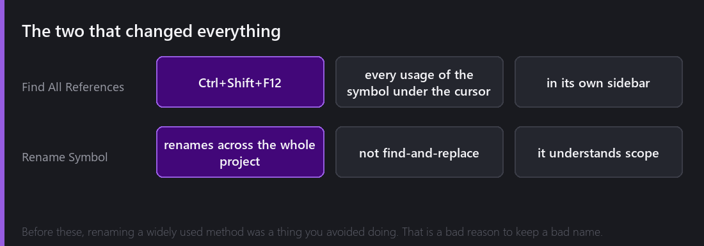
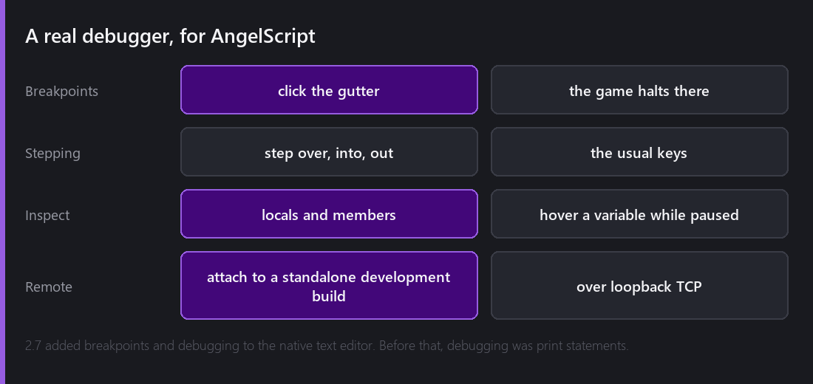
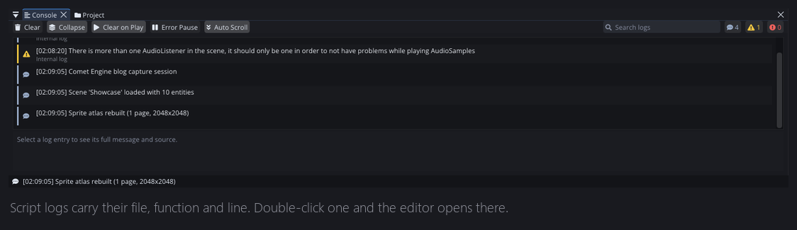
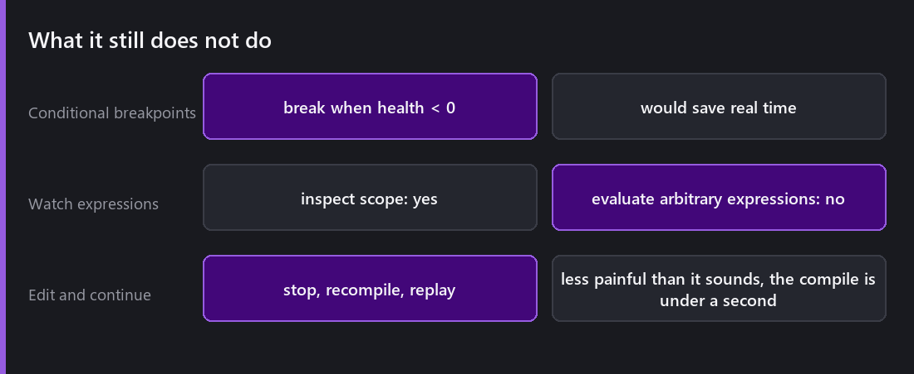

[Last Wednesday]() ended on a claim: the point of building an editor inside the engine was not convenience, it was that it makes tooling possible which an external editor could never provide.

Here are the three features that prove it.

## Find All References

Put the cursor on a symbol, press `Ctrl+Shift+F12` — or right-click it — and a **References** sidebar lists every usage in the project.

Not text matches. *Usages.* A local variable called `speed` in one method is not the same symbol as a member called `speed` in another class, and the difference matters enormously when you are trying to answer "what would break if I changed this?"

That question is the one this feature exists for. Before it, the honest answer for any widely used method was "I do not know", and the practical consequence was that I did not change things I should have changed.

## Rename Symbol

The natural next step, and the one that changes behaviour.

Rename a symbol and it is renamed everywhere it is genuinely that symbol. Not find-and-replace — a `Fire()` method on your weapon class is not touched when you rename a `Fire()` on your particle emitter, and a string containing the word "fire" is left alone.

The effect on how I work is disproportionate. **Bad names survive because renaming them is risky.** Remove the risk and names improve continuously instead of being frozen at whatever you thought on the first day. Half the identifiers in the engine's AngelScript layer are better than they were, purely because fixing one stopped being a small project.

## A real debugger

2.7 added breakpoints and debugging for AngelScript in the native editor.

Click the gutter, get a breakpoint. The game halts on that line. From there: step over, step into, step out, look at the call stack, inspect locals and members, hover a variable while paused to see its value.

## Debugging a build

This is the part that makes the whole thing more than a convenience.

The debugger attaches over loopback TCP to a **standalone development build**. Not the game inside the editor — the actual exported game, running as its own process.

You export with `Development Build` enabled, run it, attach, and set breakpoints in a shipped binary. The [profiler]() attaches over the same channel at the same time.

"It only happens in the build" is the worst sentence in game development, because historically it meant your tools stopped existing exactly when you needed them. In-editor everything works, in the build it does not, and all you have is a log file. Remote attach turns that into a normal debugging session.

## What I learned building it

**A debugger is mostly bookkeeping.** AngelScript provides the hooks — line callbacks, stack inspection, variable enumeration. The work is everything around them: mapping bytecode positions back to source lines through a file that may have been edited since, keeping the UI responsive while the game is halted, deciding what happens when a breakpoint is hit inside a callback the engine is iterating over.

**Halting a game is a strange state.** The game is paused, but the *editor* must keep drawing, keep responding, keep letting you inspect. Comet's editor and game share a process, so "pause the game but not the editor" required care that a separate-process debugger would not need.

**The bugs are all edge cases.** Every debugger bug I fixed was some variation of "this works unless the thing is inside a namespace / inside an array / inherited from a parent / declared as mixin". The happy path was working within a week; the long tail took months.

## What is missing

**No conditional breakpoints.** Break-when-`health < 0` would save real time and it is not there yet.

**No watch expressions.** You can inspect variables in scope; you cannot type an arbitrary expression and evaluate it.

**No edit-and-continue.** Change a script while paused and you have to stop, recompile and replay. Given how fast the [compile loop]() is, this bothers me less than it might.

**No visual script debugging from here** — that graph debugging is its own thing, and it is [two weeks away]().

---

Next Wednesday: the other way to write gameplay logic in Comet. Visual Scripting, where the node graph compiles directly into AngelScript bytecode and runs at exactly the speed of hand-written code — and where every node is generated from the engine's own API rather than written by hand.

*Comments and questions welcome ;)*
