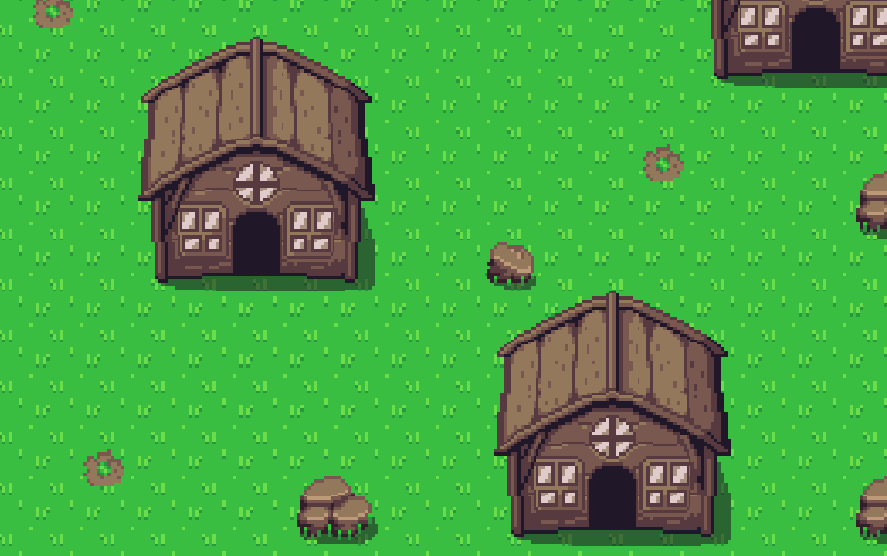
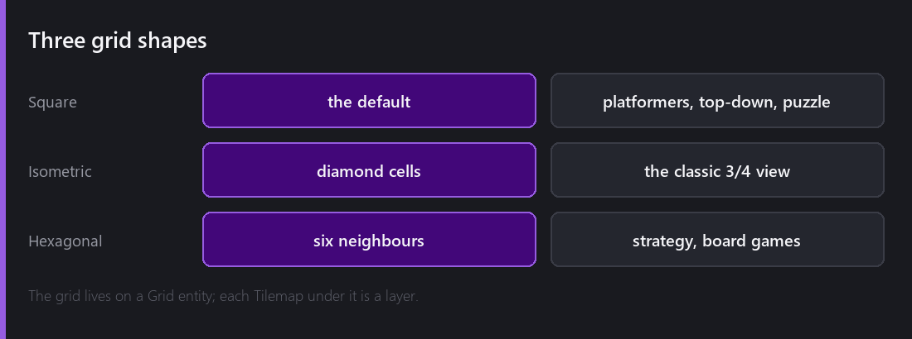
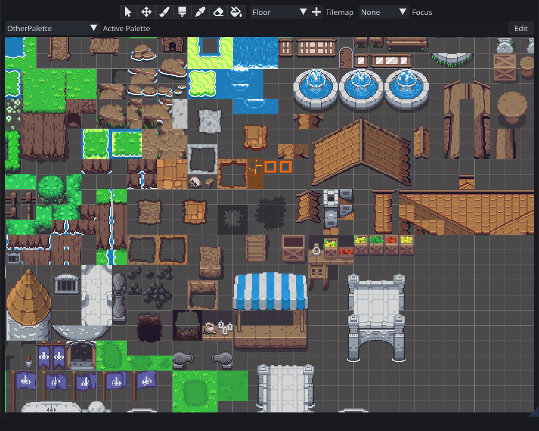
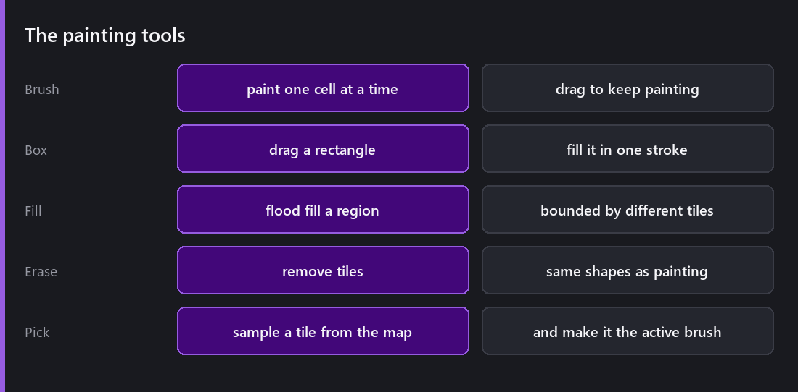
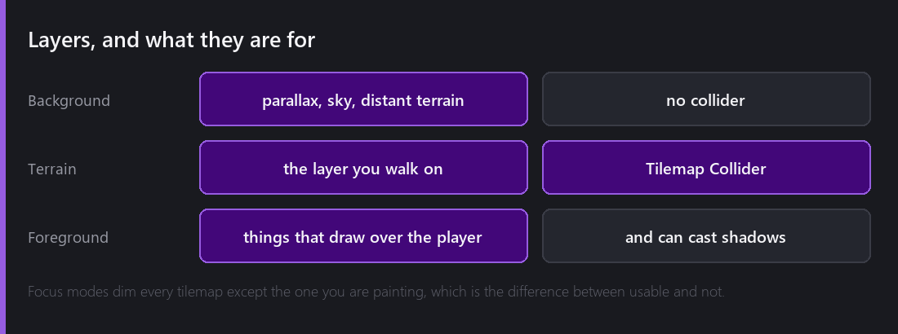
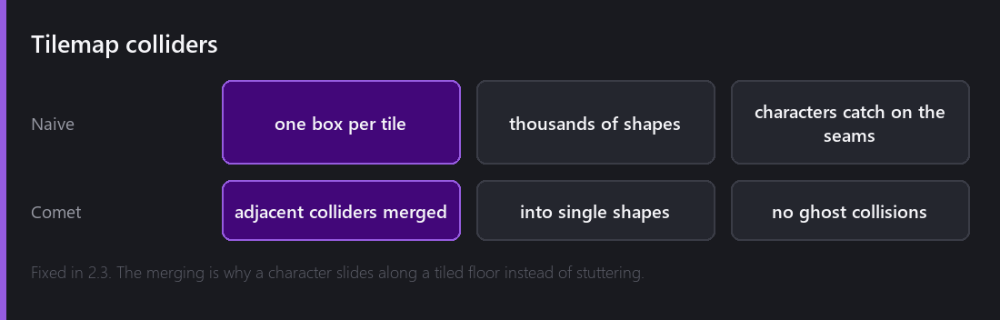

Tilemaps are one of the oldest ideas in 2D games and I still use them for almost every level. Instead of placing four thousand sprite entities, you paint cells on a grid, and the renderer treats the whole thing as one object.

The payoff is not only authoring speed. A tilemap of two thousand tiles from one tileset [batches into a handful of draw calls](), and two thousand separate sprite entities would not.

That is three tilemap layers, ground, scattered detail and buildings, under one grid. Every cell in it is two numbers and a tile index.

## The grid

Everything starts with a **Grid** entity, which decides the cell shape: square, isometric or hexagonal. Under it sit one or more **Tilemap** entities, and each one is a layer.

That split matters more than it looks. The grid owns the coordinate system and the tilemaps own the content. Change the cell size on the grid and every layer moves together, because they were never storing world positions in the first place, they store cell coordinates.

## The Tile Palette

The Tile Palette panel is where you build your brush set and where you paint from.

You fill a palette by dragging in a texture, a set of sprites, or existing tile assets. Since 2.1 all three show a **placement preview** at the mouse position, so you can see what you are about to paint before you commit. It sounds obvious and it really was missing.

The palette is itself a tilemap. That is why it looks like a level laid out flat. You arrange your brushes spatially, in the shape they will be used in, instead of scrolling a list of thumbnails.

The tools are what you would expect: brush, box, fill, erase and pick. Pick is the one I would get into the habit of using, because sampling a tile straight off the map is far faster than hunting for it in the palette.

2.3 added a `+` button that creates a new Tilemap inside the currently active Grid without leaving the panel. It is a small thing and it saves a trip to the Hierarchy every time you want a new layer.

## Layers

A level is almost never one tilemap. The usual arrangement is a background for parallax and sky, a terrain layer that you actually walk on, and a foreground for the things that draw over the player.

The problem with layers is that painting becomes ambiguous, because it is not obvious which one your stroke is going into. My answer to that is **focus modes**. The Tile Palette can focus on the active tilemap, on the whole grid, or on everything, and the tilemaps that are not focused render dimmed.

I would put this in the small set of features that decide whether a tool is usable at all. Painting into the wrong layer and not noticing for ten minutes is a horrible experience, and dimming everything else removes it.

## Colliders, and the seam problem

Add a **Tilemap Collider** and your painted terrain becomes solid. The naive way to do that is one collider box per tile, and it produces a specific and infuriating bug: a character running along a perfectly flat tiled floor catches and stutters on the boundaries between tiles.

It happens because floating-point positions on shared edges are not exactly equal, so the physics engine occasionally believes there is a lip between two boxes.

Comet merges adjacent colliders into single shapes, so a run of twenty floor tiles is one collider with two ends and no seams inside it. That fix landed in 2.3, and it is what makes the difference between a tilemap you can build a platformer on and one you cannot.

`HasColliderAt` lets a script ask whether a specific cell is solid, which is the cheap way to do grounded checks and wall detection without raycasting.

## Two bugs worth knowing about

Both are fixed, and both come from the fact that a tilemap is a rendering optimisation as much as it is a level editor.

**Tiles disappearing after a stroke.** Until 2.8, tiles you painted could vanish once their tilemap stopped being the active paint target. The tiles were still there. The culling tree had not been rebuilt after the stroke, so the renderer sincerely believed there was nothing in that region to draw.

**Tiles drawn twice.** Tilemaps in `Individual` rendering mode could skip or duplicate tiles when a scene was rendered by more than one camera in the same frame, because the per-frame state was not per-camera.

Neither of them was ever reported as "the tilemap is broken". Both were reported as "sometimes the level looks wrong", and that is why I think the [stats overlay]() is worth checking whenever something looks off.

## What this costs

A tilemap is cheap in memory, because a cell is an index and not an object, and cheap in draw calls when the tiles share a tileset.

Where it gets expensive is colliders on very large maps, because the merging runs over the painted cells, and many layers combined with many cameras, because each combination is its own render pass. On a level big enough for that to show, the answer is usually fewer and larger tilemaps rather than many small ones.

---

Next Wednesday, the part that stops tilemap painting being tedious: tiles that pick their own sprite. Rule tiles, autotile bitmasks, randomness seeded by position so a level looks varied and never changes, and reskinning a whole ruleset without redoing the rules.

*Comments and questions welcome ;)*
