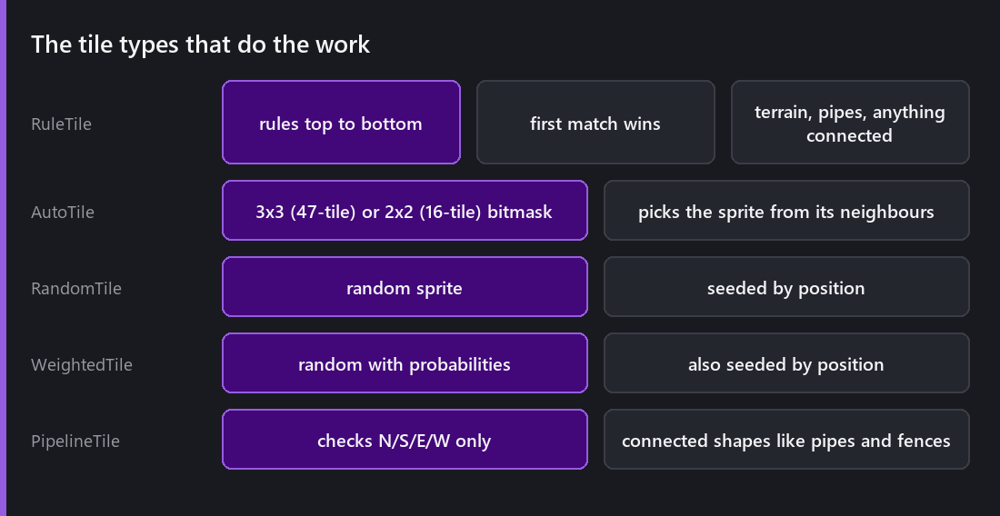
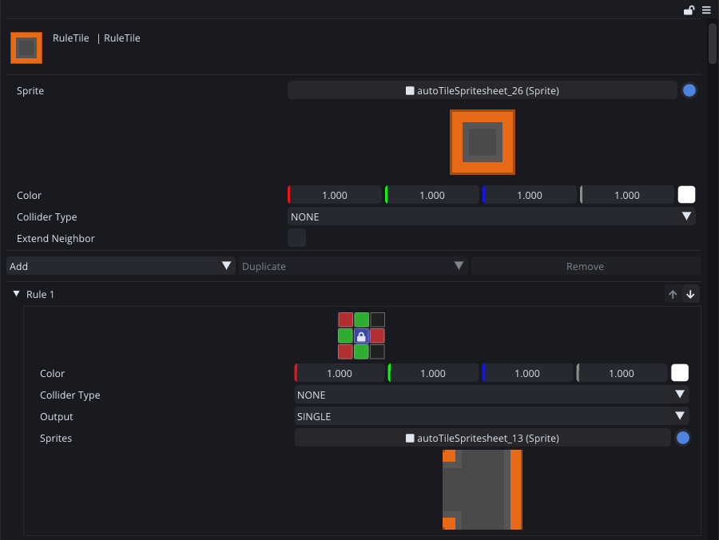
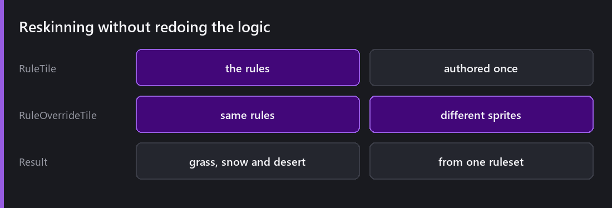
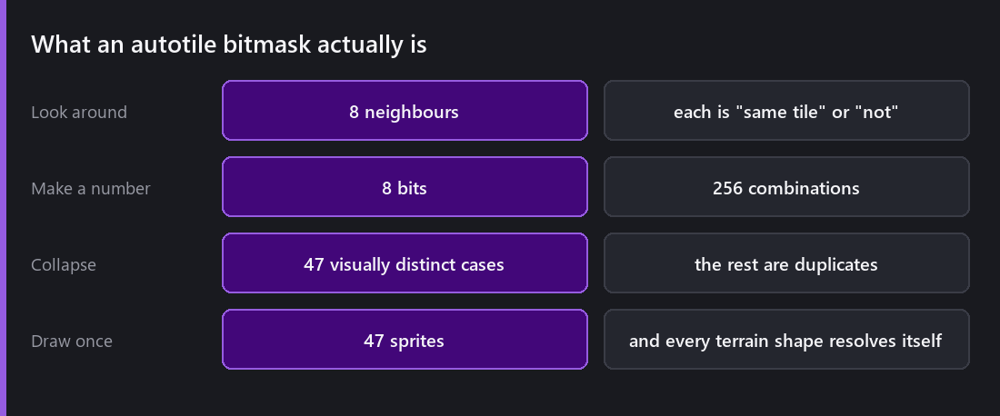
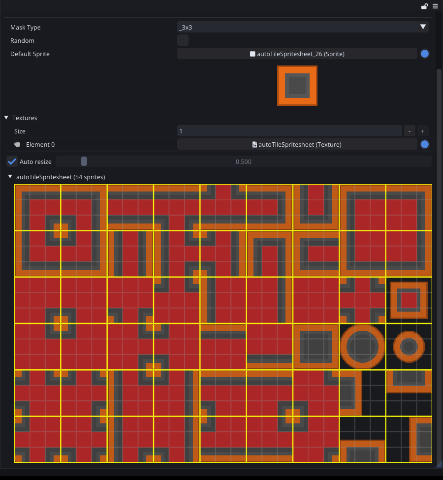
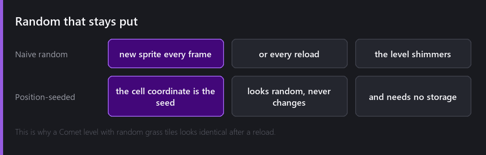
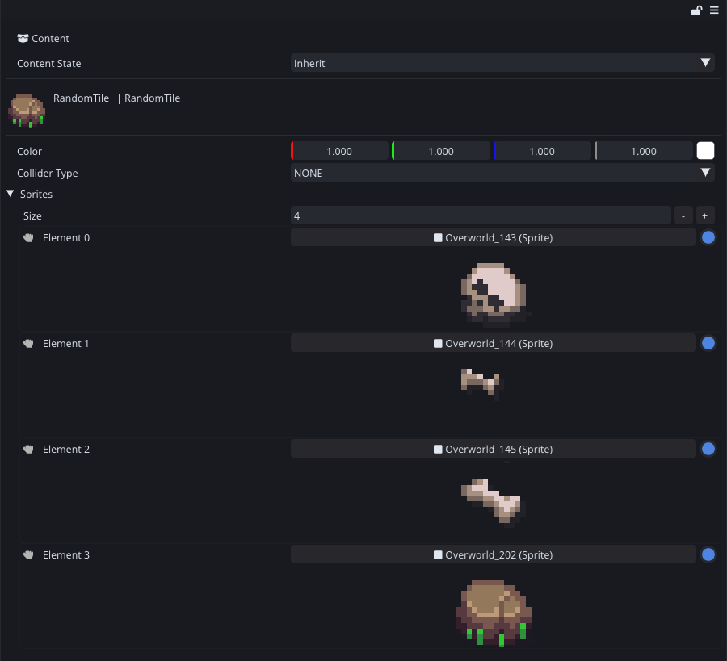
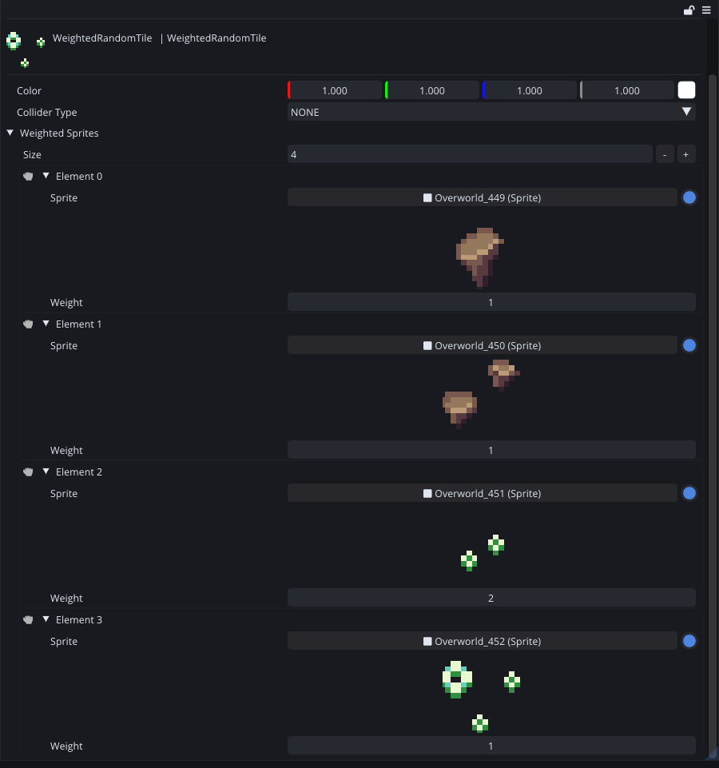
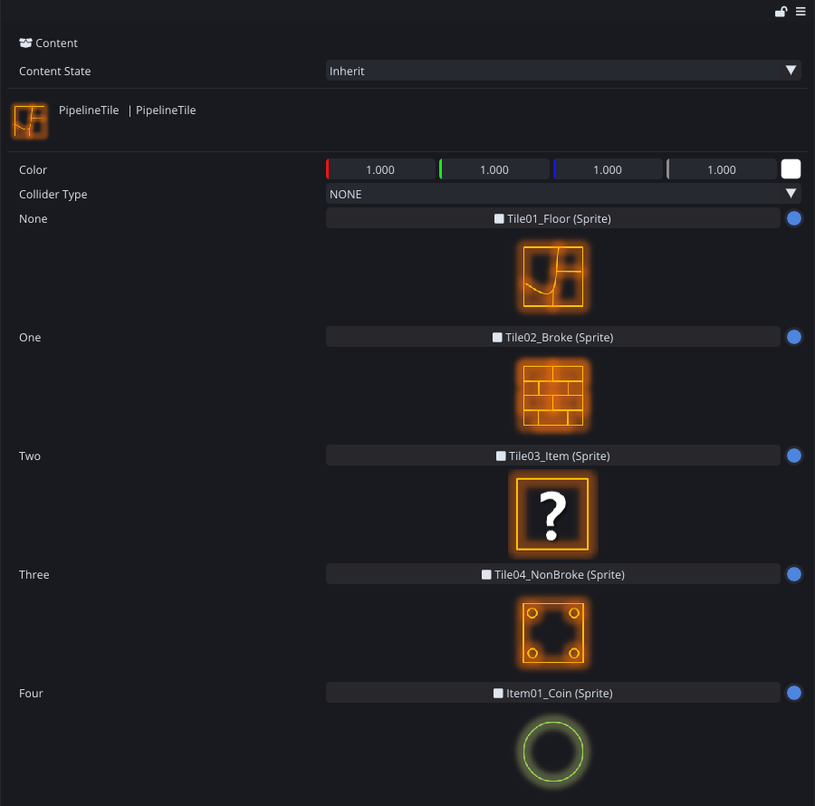

[Last Wednesday]() covered painting cells. This week is about not having to paint them one by one.

The problem is this. You draw a grass tileset: a flat top, a left edge, a right edge, an inner corner, an outer corner, a single isolated block, and so on, around fifteen sprites for a terrain that looks convincing. Then you paint a hill, and you have to choose the correct one of those fifteen for every single cell, by eye, forever.

The tile types in this post do that choosing for you.

## RuleTile

This is the general case. A **RuleTile** holds a list of rules, and each rule says "if the neighbours look like this, use that sprite". Rules are evaluated from top to bottom and the first match wins, so the ordering matters. Put your specific cases above the general ones.

Each rule is that little 3×3 grid. Green means "must be the same tile", red means "must not be", grey means "do not care", and the sprite underneath is what you get when the pattern holds. This one has forty-seven of them.

You paint one tile type. The tile works out which sprite to show from what is around it, and it evaluates again when the neighbourhood changes, so drawing a hill just gives you a correct hill.

2.5 added **RuleOverrideTile**, which takes the rules of an existing RuleTile and swaps only the sprites.

This is what makes the system pay off across a whole project. You author the terrain logic once and then get grass, snow and desert by supplying three sprite sets. If you fix a rule later, all three get the fix.

There are **IsometricRuleTile** and **HexagonalRuleTile** variants too, because "which neighbours count as adjacent" is a different question on those grids.

## AutoTile and the bitmask

**AutoTile** is the formalised version of the same idea. It is worth understanding how it works, because the numbers look arbitrary until you see where they come from.

Look at a cell and its eight neighbours. Each neighbour either is or is not the same tile. Eight yes or no answers is eight bits, so 256 possible neighbourhoods.

Most of those look identical, though. Whether a diagonal neighbour exists only matters if both of its adjacent orthogonal neighbours also exist, because otherwise that corner is already an edge and the diagonal changes nothing. Collapse all the duplicates and the 256 possibilities become 47 distinct cases.

That is where the 47-tile layout comes from. You draw 47 sprites and every possible terrain shape resolves itself. Comet also supports the simpler 2x2 / 16-tile layout, which only looks at four neighbours. Fewer sprites to draw, blockier results, and completely fine for a lot of art styles.

An AutoTile is one asset pointing at one sheet. You pick the mask type, drop the texture in, and the yellow grid above is the slicing it derived. There is no per-rule authoring at all.

## Random that stays put

**RandomTile** picks a random sprite from a set. **WeightedTile** does the same with per-sprite probabilities, so your rare cracked-stone variant shows up one time in twenty instead of one in five.

The only difference between the two is that `Weight` field. Everything else is shared, including the seeding I describe below.

The important decision is in how the randomness works. A naive implementation calls a random number generator when the tile is drawn, and then the ground shimmers because sprites change every frame, or the level looks different every time you load it.

Comet seeds the choice from the tile's position instead. Cell (14, 7) always produces the same "random" sprite, forever, on every machine. The map looks varied, it never changes, and nothing has to be stored, because the variation is a pure function of the coordinate. A hundred thousand randomised tiles cost zero bytes of save data.

## PipelineTile

**PipelineTile** checks only the four orthogonal neighbours and picks the sprite that connects correctly. Pipes, fences, wires, rope bridges, roads, anything where diagonals are meaningless and you need exactly the sixteen connection cases.

Five slots, named for how many neighbours connect: none, one, two, three, four. That is the whole asset.

It is simpler than a full autotile, and it is the right tool when the thing you are drawing is a network rather than a surface.

## A bug I hit

Removing a `TileAsset` that was in the active Tile Palette crashed the editor, and it did so right through to 2.1.

It is obvious in hindsight. The palette held a pointer to something the project browser had just deleted. It only shows up once you are iterating, though, because you have to actually change your mind about a tile to hit it. Building a level from scratch never triggers it. Redesigning one does. I think that is a good argument for using your own tools for real work and not only for demos.

## Where the limits are

Rule evaluation happens when a tile's neighbourhood changes, not every frame, so a static level costs nothing at runtime. Painting is where you feel it. A large box fill with a complex RuleTile re-evaluates every affected cell and their neighbours, and on a big stroke you will notice it.

The other limit is authoring. A RuleTile with forty rules is genuinely hard to reason about, because "first match wins" means the behaviour depends on an ordering you cannot see all at once. When a ruleset gets that big, I usually end up splitting it into two simpler tile types instead of keeping one clever one.

---

Next Wednesday I will talk about the art that fills all those cells: the Sprite Editor with slicing, pivots and 9-slice borders, sprite atlases, and the reason all of it exists, which is draw calls.

*Comments and questions welcome ;)*
