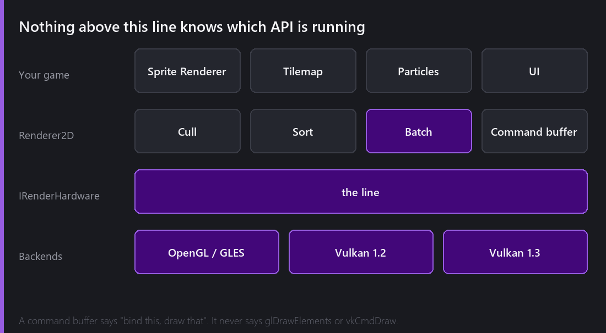
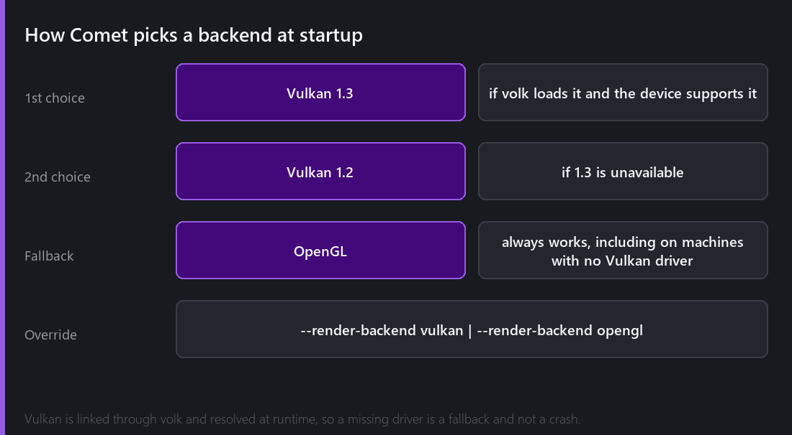
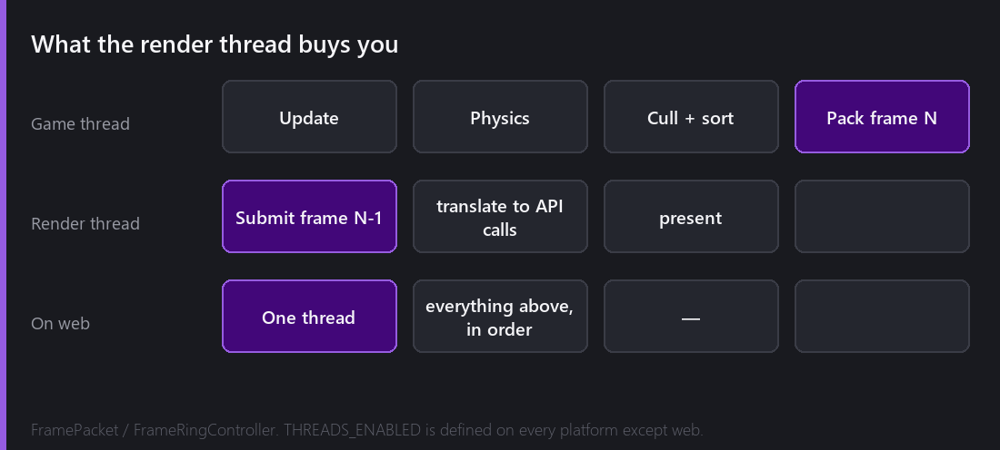

[Last week]() followed a frame from a scene full of sprites down to a handful of draw calls. That post stopped at the moment the work got handed over. This one is about who it gets handed to.

Comet has two rendering backends. It picks one at startup, and nothing above a certain line in the code ever finds out which.

## The line

Everything above `IRenderHardware` deals in intentions: *bind this texture, set this uniform, draw these vertices*. That is what a command buffer is — a list of operations with no opinion about graphics APIs.

Below the line, a backend translates that list into real calls. The OpenGL backend emits GL calls. The Vulkan backend records command buffers, manages descriptor sets, and does all the ceremony Vulkan requires.

The value of the split is not theoretical. It means a bug in sprite batching is a bug in *one* place rather than two, and adding Vulkan did not require me to touch the sprite renderer, the tilemap renderer, the UI or the particle system at all.

## Why Vulkan, in a 2D engine

This is the fair question. A 2D engine drawing textured quads is not exactly starved for GPU throughput, and OpenGL handles it fine.

Three honest reasons.

**Android.** OpenGL ES on Android is a lottery. Driver quality varies enormously between vendors, and "works on my phone" means very little. Vulkan on Android is not perfect either, but it is far more consistent, and having a second path to fall back to when one of them misbehaves on a specific device has already saved me.

**Compute.** This is the big one, and it did not become obvious until 2.8. GPU particle simulation needs compute shaders and indirect drawing. Those are available on desktop OpenGL 4.3+, but not on OpenGL ES, and not on the web. Having a Vulkan backend meant the GPU particle path had somewhere good to live rather than being a desktop-OpenGL-only curiosity.

**Explicit control.** Vulkan makes you say what you mean. Writing the backend forced me to be precise about resource lifetimes and synchronisation in ways that found real bugs in the shared layer above.

What Vulkan is *not* here is a performance win for ordinary 2D work. For a typical scene the two backends produce the same frame in about the same time, because the bottleneck is the CPU deciding what to draw, not the GPU drawing it.

## Choosing, and not crashing

Vulkan is linked through **volk**, which resolves the Vulkan entry points at runtime rather than at link time. That single decision is what makes the whole thing safe: on a machine with no Vulkan driver, volk simply fails to load, Comet notices, and OpenGL is used instead. The alternative — linking Vulkan directly — means the executable refuses to start at all on those machines.

You can force either with `--render-backend vulkan` or `--render-backend opengl`, which is invaluable for isolating a rendering bug, and mandatory for one specific thing: **screenshots**. The editor's built-in screen capture only works on the OpenGL backend, which is why every image in this series of posts was taken with the engine launched that way.

Vulkan is compiled in for standalone desktop and Android. It is not present on the web, which has no Vulkan, and the compile-time define `COMET_VULKAN_SUPPORTED` gates the whole thing so those builds do not carry code they cannot use.

## The render thread

Once a frame's command buffer exists, the game thread does not need to wait around while it is submitted.

Comet packs the frame into a **FramePacket** and hands it to a render thread, which translates and submits it while the game thread has already started on the next frame. A **FrameRingController** owns a small ring of these packets so the two threads are never writing to the same one.

The subtle part of this design is not the threading, it is the ownership rule: once a packet is handed over, the game thread must not touch anything inside it. Everything the renderer needs — transforms, colours, texture handles, the lot — is *copied* into the packet at hand-off. That copy costs something. It buys the guarantee that a gameplay script changing a sprite's colour cannot possibly interact with a frame already in flight.

And then there is the web, where none of this exists. Emscripten builds have no threads, so `THREADS_ENABLED` is not defined and the same code path runs everything in sequence on one thread. This is the single most important constraint in the entire engine, and it shows up everywhere: particles simulate single-threaded, assets load without a worker, and the render thread is simply not created.

It is also why "does this work on the web?" is a question I have to ask about every threading decision, and why the answer has to be "the same project runs, just slower" rather than "that feature is desktop-only".

## What this costs me

Two backends is two implementations of every feature that touches the GPU. Render targets, texture formats, shader binding models, framebuffer blits — each of those exists twice, and a bug can live in either.

The mitigation is that the shared layer above is deliberately large. Culling, sorting, batching, the entire notion of what a frame contains — that is all backend-agnostic. The backends really only handle "turn this list into API calls", which is the part that genuinely has to differ.

Whether that split is in the right place is something I still think about. It is currently a bit lower than ideal: there are a few concepts, particularly around render targets, that leak upward more than I would like.

---

Next Wednesday we start on the thing that changes how a 2D game *feels* more than anything else in this list: lighting. Five light types, four blend modes, a height value in a flat world, and a light that removes light.

*Comments and questions welcome ;)*
