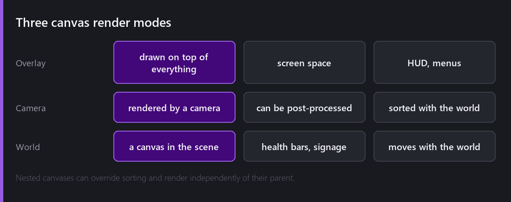
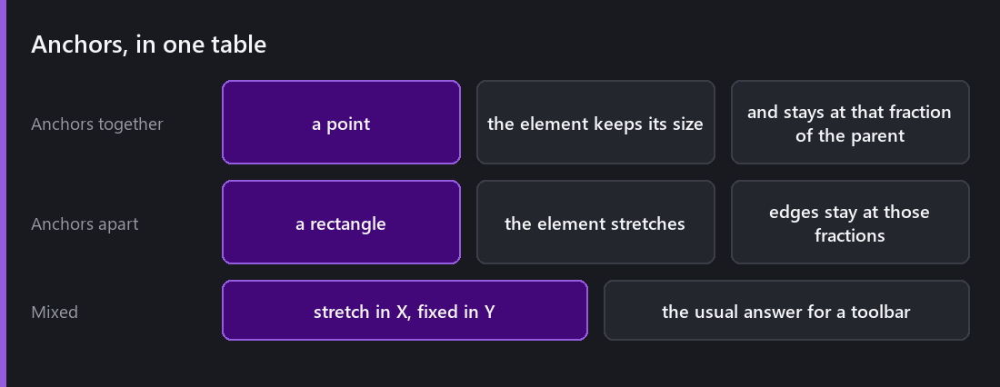
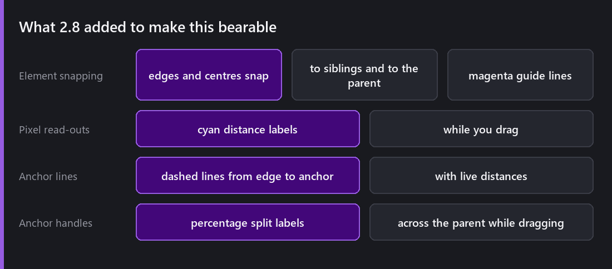

Everyone fights the anchor system once. Then it clicks, and it never bothers them again. This post is an attempt to shorten the fight.

## Canvases

Everything UI lives under a **Canvas**, and its render mode decides where "the screen" is.

**Overlay** draws on top of everything in screen space. HUD, menus, anything that should ignore the world entirely. **Camera** is rendered by a specific camera, which means it can be [post-processed]() and sorted against world objects. **World** puts the canvas in the scene as a physical thing — floating health bars, in-world signage, a screen on a machine.

From 2.0, **nested canvases can override sorting and render independently of their parent**, which is what lets a modal dialogue draw above everything without restructuring your hierarchy.

Right-clicking a UI element in the Hierarchy finds the nearest canvas or creates one. Small, and it removes a step every single time.

## Anchors, properly

Here is the whole idea, and it is simpler than the UI makes it look.

A RectTransform's anchors are **two points expressed as fractions of the parent**. The element's position and size are measured *relative to those points*, not to the parent's origin.

**Anchors together at one point:** the element keeps a fixed size and stays at that fraction of the parent. Anchor at (1,1) — top right — and a 100×40 button stays 100×40 in the top-right corner at any resolution.

**Anchors apart, forming a rectangle:** the element stretches. Its four edges are offsets *from those anchor lines*. Anchor to the full width and your toolbar spans the screen at any resolution.

**Mixed** is the common real answer: stretch in X, fixed in Y. A toolbar that is always full-width and always 48 pixels tall.

The reason this confuses people is that the numbers in the inspector *change meaning* depending on the anchor arrangement — the same fields are "position and size" in one mode and "edge offsets" in another. Once you know that, the panel stops lying to you.

**Scale With Screen Size** on the canvas is the other half. Set a reference resolution and the whole canvas scales, so text that is readable at 1080p is readable at 4K without every element needing its own rule.

## The tooling that made this bearable

2.8 added a set of scene-view aids for the Rect and Transform tools, and they changed UI work from arithmetic into direct manipulation.

**Element snapping.** Dragging or resizing snaps edges and centres to siblings and to the parent, with **magenta guide lines** showing what you snapped to and **cyan pixel-distance labels** showing the gaps. Aligning three buttons stopped being a matter of typing the same X into three inspectors.

**Anchor visualisation.** Dashed lines run from each element edge to its anchor, with live pixel distances while you move. This is the feature that makes anchors *comprehensible* — you can see the relationship you are editing instead of inferring it from four numbers.

**Live read-outs.** Width and height appear while you drag an edge. Dragging an anchor handle shows **percentage-split labels** across the parent, so you can place an anchor at exactly 30% without arithmetic.

I want to be honest about what this is: none of it adds capability. Every layout it produces was possible before by typing numbers. It is purely about making the system's model visible while you work with it — and it is one of the changes that most improved how the editor feels.

## Layout by hand or by rule

You can position everything with anchors, and for a HUD that is often right — a health bar in a corner does not need a layout system.

For lists, grids and anything whose contents change, the layout behaviours take over. That is next week, along with the rest of the widget set.

## The things that go wrong

**Text overflowing at another resolution.** Anchors fix positions, not content. A string that fits in English will not fit in German, and the fix is `autoContentSizeMode` or auto font size, which the [text post]() covered.

**Anchoring to the wrong parent.** Anchors are relative to the immediate parent. Reparenting an element changes what its anchors mean, and it will jump.

**Everything anchored to centre.** The default. It works perfectly at your resolution and falls apart everywhere else, because nothing is attached to the edges it should follow. If you only change one habit from this post: anchor things to the corner or edge they conceptually belong to, immediately, before you position them.

---

Next Wednesday: everything you actually put inside a canvas. Buttons, toggles, sliders, scroll rects, dropdowns, masks, the three layout groups, and the mouse-filter plumbing that decides who gets the click.

*Comments and questions welcome ;)*
