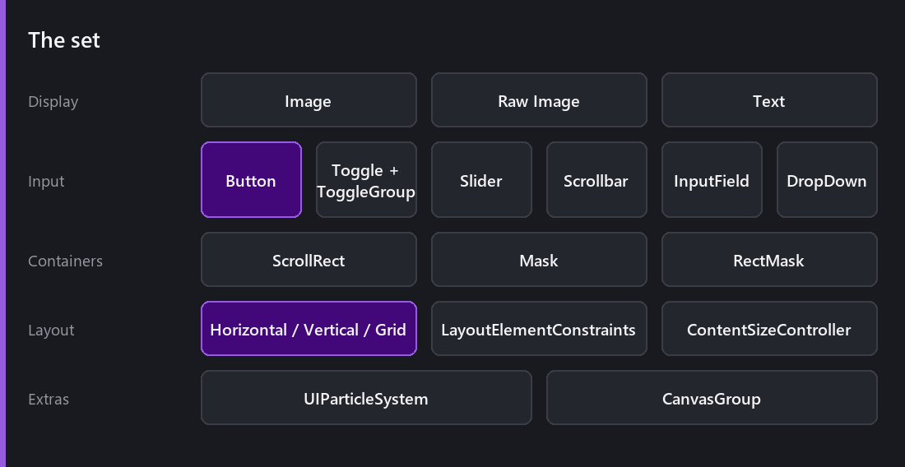
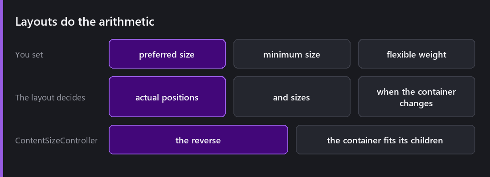
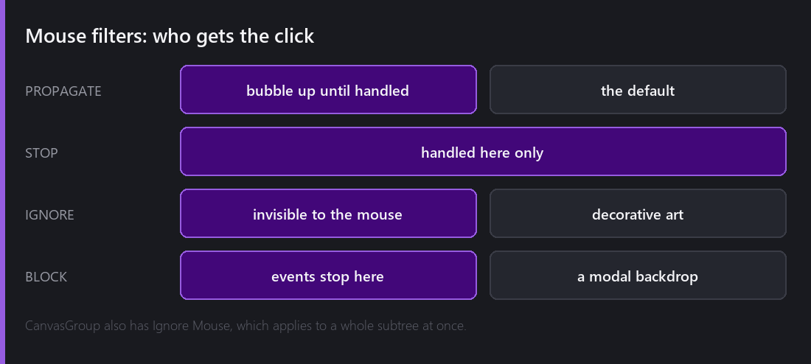

[Last Wednesday]() was about where things go. This week is about what they are.

Almost all of this arrived in 2.0, which added the entire interactable and layout set in one release. Before that Comet had images and text and you built everything else yourself.

## The display layer

**Image** draws a sprite, with the [three render modes]() — simple, sliced and tiled. 2.0 gave it a white quad by default, so a new Image is visible instead of invisible, which sounds trivial and saves a confused minute every time.

**Raw Image** draws a `RenderTexture` — a camera's output inside your UI. Minimaps, security monitors, character portraits rendered live.

**Text** is [its own post]().

## The interactables

**Button** is the obvious one. What is less obvious is the transition system underneath every interactable: colour tint, sprite swap, and a `Use Scaled Time` flag deciding whether the fade honours `timeScale` — which matters the moment you build a pause menu, because a colour fade on a paused game with scaled time never completes.

2.0 made the colour and sprite transitions default to targeting the element's own Image, and dropped the redundant "normal sprite" field since the attached image already is that.

**Toggle** and **ToggleGroup** for checkboxes and radio behaviour. **Slider** for a value between bounds. **Scrollbar** driving a **ScrollRect**. **InputField** for typed text — and on web touch devices, tapping one raises the **native on-screen keyboard**, which 2.8 added and which is the difference between a web build being playable on a phone and not.

**DropDown** opens a popup list.

## Layout

Positioning by anchors stops scaling when the contents change. The layout behaviours handle that.

**Horizontal**, **Vertical** and **Grid** layouts arrange their children. **LayoutElementConstraints** lets a child declare its preferred, minimum and flexible sizes, and the layout does the arithmetic. **ContentSizeController** works in reverse — the container resizes to fit its children, which is what a tooltip or a dialogue box wants.

The mental model worth holding: a layout group **owns** its children's positions. Do not fight it by setting positions manually; express what you want through the constraints instead.

## Masks

**Mask** clips children to the shape of the attached image — a circular avatar, an irregular frame. **RectMask** clips to a rectangle and is much cheaper. Use RectMask unless you specifically need a shape.

Every scroll view is a mask plus a moving child, and that is worth knowing because it means a scroll view costs what a mask costs.

## Who gets the click

This is the part that causes the most confusion, and 2.0 made it explicit.

Every UI graphic has a **Mouse Filter**. `PROPAGATE` bubbles the event up until something handles it — the default. `STOP` handles it here only. `IGNORE` makes the graphic invisible to the mouse entirely. `BLOCK` stops events dead.

`IGNORE` is the one you will reach for most: decorative art inside a button that was silently eating the button's clicks. `BLOCK` is how you build a modal — a full-screen transparent graphic that stops anything behind it being clickable.

`CanvasGroup` also has **Ignore Mouse**, which applies to a whole subtree at once, plus alpha and interactable flags. Fading a menu out and making it non-interactive is one behaviour, not a pass over every child.

The drag and pointer interfaces (`IPointerClickAction`, `IBeginDragAction` and the rest) all receive a `PointerEvent` with the event details, which 2.0 changed from the previous parameterless versions — a small break that made writing custom interactables genuinely possible.

## Controller navigation

Selectables form a navigation graph, and a **Show Navigation** toggle draws it in the scene view so you can see where focus will go. 2.0 made that toggle persist across editor restarts, because it is a thing you leave on while working on a menu.

Getting this right is most of what makes a game feel finished on a gamepad, and it is almost always left until last. The default auto-navigation is usually right; the exceptions are worth fixing explicitly rather than hoping.

Comet had its own bug here — default bindings for UI Left and Right on controller were **inverted**, fixed in 2.0. Which is a good reminder that the framework being wrong is as likely as your layout being wrong.

## UI particles

**UIParticleSystem** renders a [particle system]() inside a canvas, correctly sorted and masked with the rest of the UI.

Confetti on a level-complete screen, sparks off a button press, drifting dust behind a title. Worth knowing: UI particles are **always CPU-simulated** — they cannot take the GPU path, because they have to participate in UI sorting.

---

Next Wednesday: getting from one place to another. 2D pathfinding — grid A* with jump point search, weighted graphs, navmesh baking, agents, off-mesh links, obstacles that carve holes, and per-agent cost callbacks.

*Comments and questions welcome ;)*
