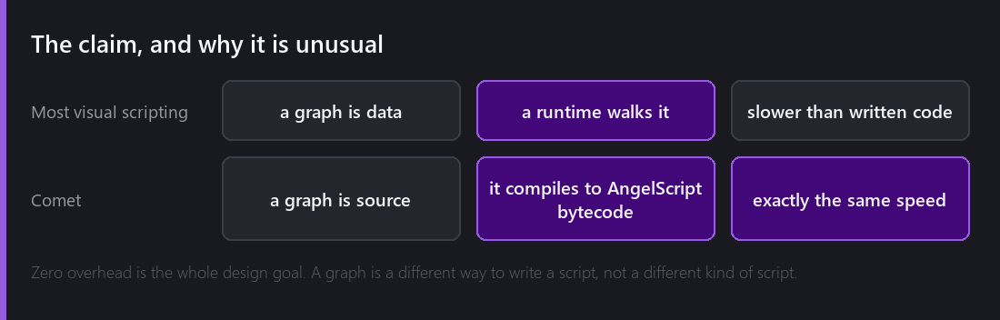
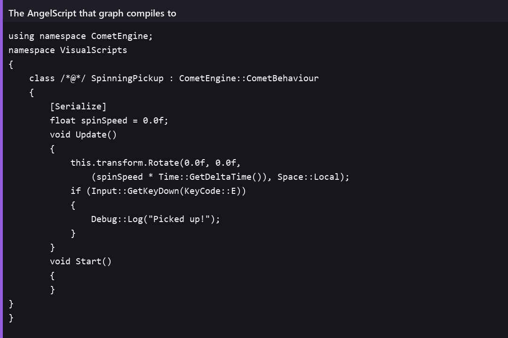
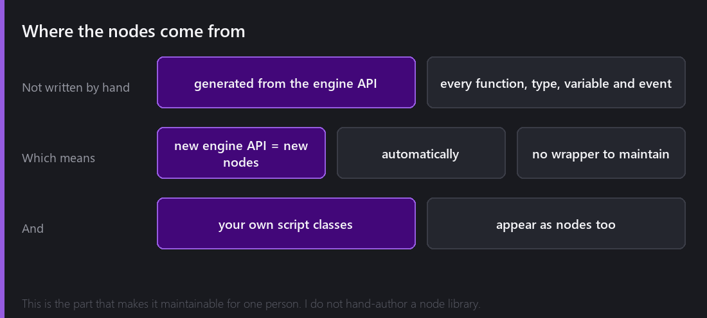
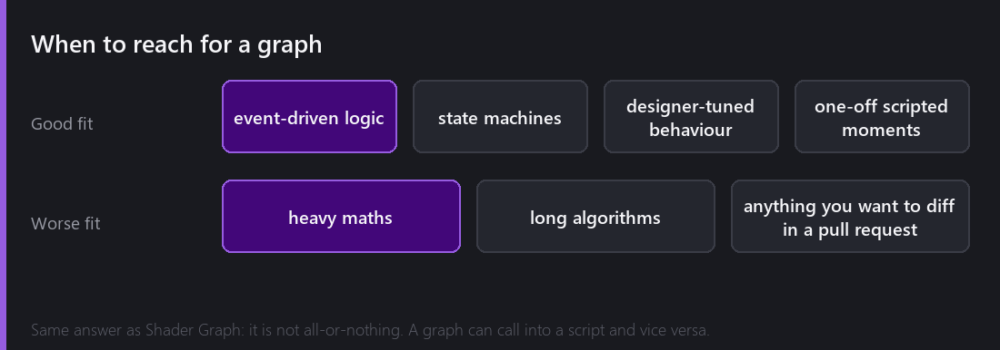

`Create → Script → Visual Script` makes an asset that looks like every other node editor you have used: boxes, wires, a canvas.

The thing that makes it worth a post is what happens when you press play.

That is a whole behaviour: spin this entity by `spinSpeed` degrees a second, and log a line when the player presses E. The `spinSpeed` variable on the left is marked **Exposed**, so it shows up in the Inspector like a field on a written script — because that is exactly what it becomes.

## The claim

Most visual scripting systems work like this: the graph is data, and a runtime walks that data at execution time, interpreting nodes one at a time. It works, and it is slower than written code — usually by enough that "use visual scripting for prototyping, then rewrite it properly" becomes standard advice.

Comet's graphs are not data. **They are source.** A visual script compiles into AngelScript bytecode — the same bytecode a hand-written `.as` file produces — and the running game cannot tell the difference, because there is no difference.

That is the file the graph above produced — readable, ordinary AngelScript, `[Serialize]` attribute and all. The header is not a joke: the file is regenerated on every save, so the graph is the source of truth and the text is a build artefact you can read.

There is no graph runtime. Nothing walks nodes. At play time, the graph does not exist; only the bytecode does.

That was the design goal before a single node was implemented, and it is the reason the feature exists at all. A visual scripting system you are advised to rewrite later is not a feature, it is a prototype tool wearing a feature's clothes.

## Where the nodes come from

The second design decision, and the one that makes it maintainable by one person.

**I do not write the node library.** Nodes are generated automatically from the engine's API — every function, every type, every variable, every event that AngelScript can see becomes a node without anybody authoring it.

The consequence is that the node library cannot fall behind the engine. When I add a method to `Rigidbody`, a node for it exists. When 2.8 added the `Assets::` namespace, the whole namespace showed up as nodes. There is no wrapper layer to maintain, no list of "supported" API, and no gap between what you can do in text and what you can do in a graph.

Your own script classes appear too. Write a `Health` behaviour in AngelScript and its public methods and fields are nodes, so text scripts and graphs interoperate in both directions rather than living in separate worlds.

## Building something small

To make it concrete — an enemy that patrols between two points and chases you when you get close.

Start with an **Update** event node, which is the entry point. Wire in a **Distance** node comparing this entity's position to the player's. Feed that into a **Compare** against a threshold. Branch.

On the near side, a node that moves toward the player's position. On the far side, the patrol logic — a stored target, a move-toward, a distance check, a flip.

That is maybe fifteen nodes and no typing beyond a couple of numbers and a name. It is not less work than writing it, and for me it is slightly more. That is worth being honest about.

## So who is it for

Three cases where I reach for a graph over a file.

**Event-driven logic.** Anything shaped like "when X happens, do these things in order" reads well as a graph, because the flow *is* the shape. A cutscene trigger, a door that needs three switches, a pickup that plays a sound and spawns particles and adds score.

**Behaviour someone else will tune.** A designer who is not going to open a code editor will happily rewire a graph. That is a real category of person even on a solo project, because six months from now you will not remember the code either, and a graph is legible at a glance in a way a file is not.

**One-off moments.** Scripted set pieces that will never be reused and do not deserve a class.

And the cases where I do not: heavy maths, long algorithms, and anything I want to review as a diff. A graph is a file, but not one you can read in a pull request — which is the same complaint I have about [Shader Graph](), and I have no good answer to it in either place.

## What was hard

**Control flow.** Data flow between nodes is straightforward — outputs connect to inputs, evaluate in dependency order. *Execution* flow is different: which node runs next, what a branch means, how a loop terminates, what happens when an event fires mid-execution. Those two graphs overlay on the same canvas and have to stay comprehensible together.

**Generating good code, not just correct code.** A naive translation of a graph produces a temporary for every wire and a function call for every node. It works and it is measurably slower, which would have broken the entire premise. Getting the emitted AngelScript into a shape the compiler optimises well took much longer than getting it to emit at all.

**Type coercion, again.** Exactly the problem [Shader Graph had](): a user drags a wire between two pins and expects it to work. Too strict and it is exhausting; too loose and graphs silently do the wrong thing. Same trade-off, same compromise, and I am still not certain it is in the right place.

**Deciding what is *not* a node.** Every engine function being a node means the palette has thousands of entries. Search carries most of that weight, and I still think the palette needs better organisation than it has.

## The honest summary

Visual scripting in Comet is not faster to write than text for someone comfortable with text. It is not a shortcut and I would not tell anyone it is.

What it is: legible at a glance, tunable by people who do not write code, impossible to fall behind the engine API, and — the part that took the work — genuinely free at runtime.

---

Next Wednesday, the part that makes graphs better than text at one specific thing: watching one think. Nodes lighting up as execution flows through them in play mode, hovering a pin to see the value passing through it right now, and breakpoints you set on a node.

*Comments and questions welcome ;)*
