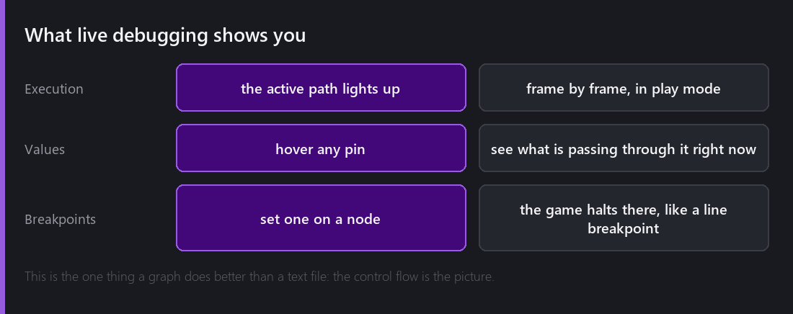
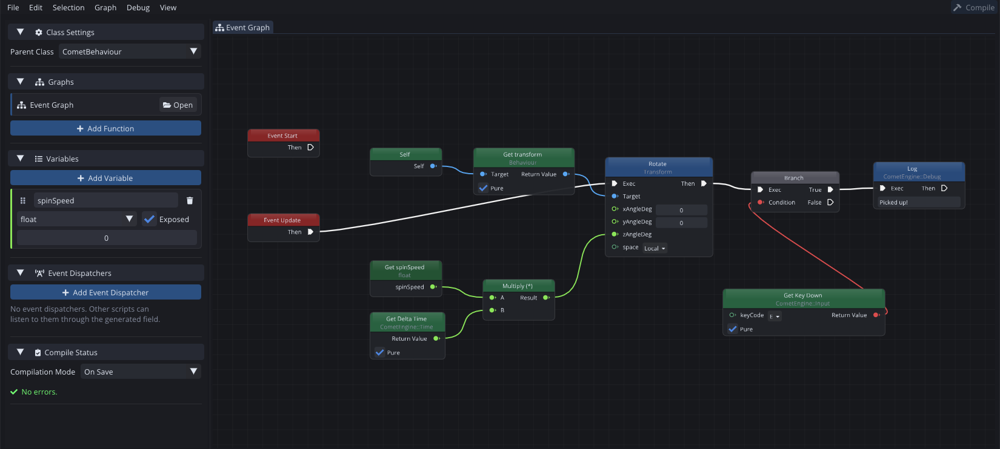
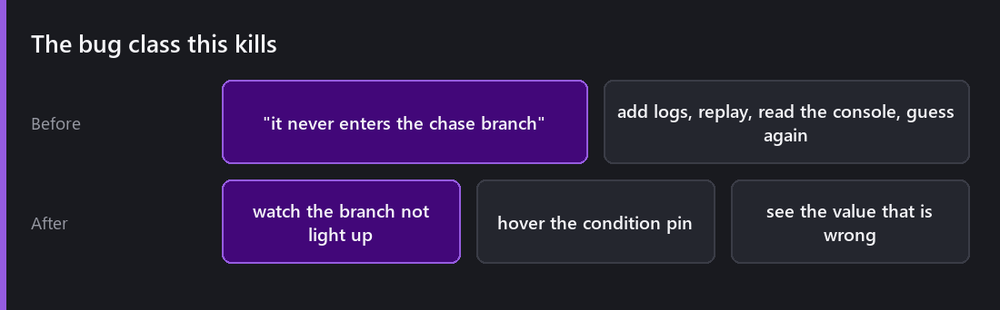
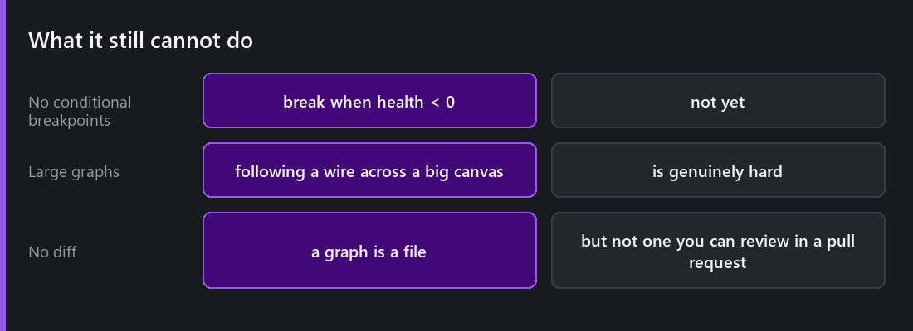

[Last Wednesday]() made the case that a Comet visual script is not slower than a written one, because it compiles to the same AngelScript bytecode.

That is the argument for *using* graphs. This post is the argument for *preferring* them in some situations, and it comes down to one thing a text file can never do.

## The graph runs in front of you

That is the graph sitting still. Everything below is about what it looks like when it is not.

Enter play mode with a graph open and it stops being a diagram. The nodes on the executing path light up as control flow reaches them. Not a replay, not a log — the actual path, this frame.

Hover any pin and you see the value passing through it *right now*. Not what you logged three frames ago. The number that is in the wire.

And you can put a **breakpoint on a node**. The game halts there exactly like a line breakpoint in the [code editor](), and it uses the same debugger underneath, because the graph compiled into the same bytecode that debugger already understands.

## The bug this kills

Here is the shape of the problem it solves, and it is worth being specific because "live debugging" is vague.

You have an enemy that should chase the player when they get close. It does not. The chase branch never runs.

Without live debugging, you start guessing. Add a log to the distance check. Replay. Read the console. The distance looks fine. Add a log to the comparison. Replay. Now the comparison looks fine too, which means the problem is somewhere you have not instrumented, so instrument more and replay again.

With it: watch the branch not light up. Hover the condition pin. See that the comparison is reading `0` because the player reference was never assigned. Total elapsed time: about four seconds, and you never touched the graph.

The difference is not that logging is slow. It is that logging only shows you what you already suspected, and the visual path shows you everything at once.

## Why this is easier in a graph than in text

A text debugger can show you a call stack and the locals in scope. That is a huge amount of information and it is presented as a list.

A graph presents the same information *as the shape you drew*. You do not have to reconstruct control flow in your head, because the control flow is the picture, and the picture is lit up.

That advantage disappears the moment the graph gets big enough that you cannot see it all at once — which is the honest limitation and it brings us to the end.

## What it still cannot do

**No conditional breakpoints.** Break-when-`health < 0` is not there, in graphs or in text. It is the single feature I would add next to both.

**Large graphs are hard.** Past about forty nodes, following a wire across the canvas is genuinely difficult, and lighting up the path helps less than you would hope because the path leaves the screen. Sub-graphs are the answer and I do not think they are a complete one.

**No diff.** A graph is a file, but not one you can read in a pull request. For a solo project that costs me nothing. For a team it is a real problem, and it is the reason I would still write shared, long-lived systems as text.

## So when do I actually use one?

Being concrete, after a year of having both:

I use graphs for **things I will tune more than I will write** — enemy behaviour, encounter pacing, anything with numbers a designer wants to fiddle with. Being able to watch it run while changing it is worth more there than anywhere else.

I use graphs for **one-off scripted moments** — the door that needs three switches, the cutscene trigger. They will never be reused, they are easier to read as a picture six months later, and they do not deserve a class.

I use text for **anything with real algorithms**, anything I want to review as a diff, and anything that will be called from a hundred places.

And because both compile to the same bytecode, a graph calling into a script and a script calling into a graph are both just function calls. That is the part I am most pleased with: the choice is per-system, not per-project.

---

Next Wednesday: the editor is scriptable in the same language as your game. Custom windows, custom inspectors, your own menu entries, settings pages that ship in the build — and the generic node-graph framework you can use to build your own visual tools.

*Comments and questions welcome ;)*
