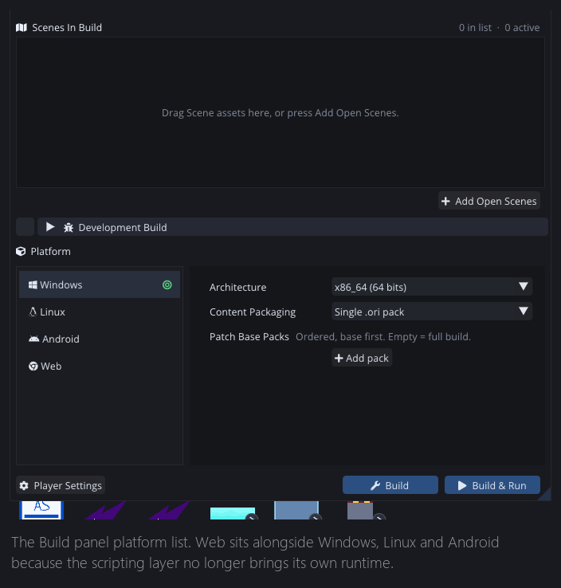
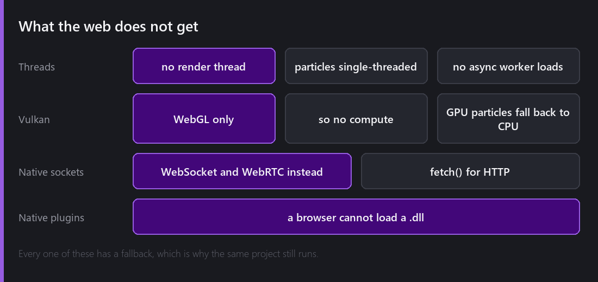
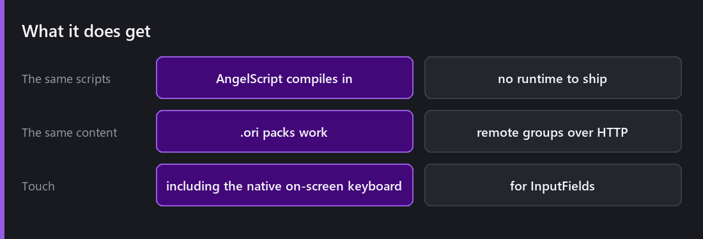

This is the platform that caused everything else in this blog's first year.

I could not export to the web with C# and Mono. That is why [2.0 removed C#](), and that is why every project broke, and why the scripting layer, the shader pipeline and the content system all look the way they do now.

Web sits in that list next to Windows, Linux and Android because the scripting layer compiles into the engine instead of shipping a runtime beside it.

## What a web build is

Comet compiles through **Emscripten** to WebAssembly. You get a `.wasm` module, a JavaScript loader, and your content packs. Serve them over HTTP and it runs.

**ASYNCIFY** is the piece that makes it possible at all. A native game loop is a `while` loop that blocks. A browser cannot have that, because if you block the main thread the tab freezes. ASYNCIFY transforms the code so it can unwind and resume around the browser's event loop, so engine code that was written as a blocking loop keeps working.

There is a cost. ASYNCIFY adds size and overhead, and I pay it instead of rewriting the entire engine around callbacks.

## What the web does not get

I would rather this list be complete than flattering.

**No threads.** This is the big one and it affects everything else. `THREADS_ENABLED` is not defined, so there is no [render thread]() and rendering happens inline. [Particles simulate single-threaded](). Async asset loading has no worker to load on.

**No Vulkan**, so no compute, so [GPU particles]() fall back to the CPU. WebGL through GLES only.

**No native sockets.** No ENet, no raw TCP or UDP.

**No native plugins.** A browser cannot load a `.dll`, so [native interop]() is not available at all.

## What it does instead

Every one of those has a fallback. That is the rule I follow across the whole engine: the same project runs everywhere, sometimes slower. I did not want to tell anyone that a feature is desktop only.

Particles that would use compute take the CPU path and produce [bit-identical results](), because the randomness is seeded per particle instead of per thread. Networking uses **WebSocket** and **WebRTC** through native browser backends. HTTP uses the browser's own `fetch()`. Content packs work unchanged, and remote content groups are probably more natural on the web than anywhere else.

And 2.8 added the small thing that makes a web build actually playable on a phone. Tapping an InputField on a touch device raises the **native on-screen keyboard**. Without it you have text fields nobody can type into, and the whole build feels broken because of one missing hook.

## Size and load time

A web build is a download, and the player is waiting while it arrives. Nobody warned me about that part.

The engine module is what it is, but content is where you have room to move, and that is exactly what the [content system]() is for. Local groups go in the main pack, everything else becomes remote groups fetched on demand. A game that starts from a small first download and streams the rest feels a lot faster than one that ships everything up front, even when the total number of bytes is the same.

Texture compression settings are per platform for the same reason. On the web, smaller matters more than pristine.

## Testing it

Two things worth knowing.

**You cannot open the HTML from disk.** Browsers block WASM over `file://`. Serve it over HTTP, even locally, or you will spend an hour debugging a security policy.

**Test in more than one browser.** WebGL and WebAudio behave differently enough that "works in Chrome" means less than you would like, particularly on Safari and particularly on iOS.

## Would I recommend it?

For jams, demos and anything you want people to try without installing, yes, without hesitation. A link that plays is worth a lot, and for me it is the best reason to have gone through the C# migration.

For a large commercial game I would think about it carefully. No threads means the CPU budget is smaller, and the download is a real barrier once the game grows.

What I wanted was for that decision to be yours instead of the engine's, and that is why the fallbacks exist instead of a compile error.

---

Next Wednesday: the other platform that the migration unlocked. Android, the NDK, four architectures, Vulkan on mobile and the GLES fallback, and what changes when the screen is a finger.

*Comments and questions welcome ;)*
