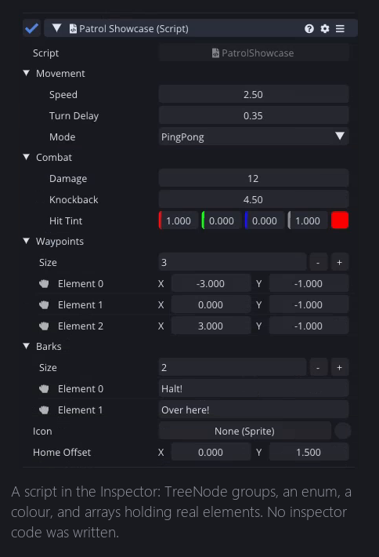
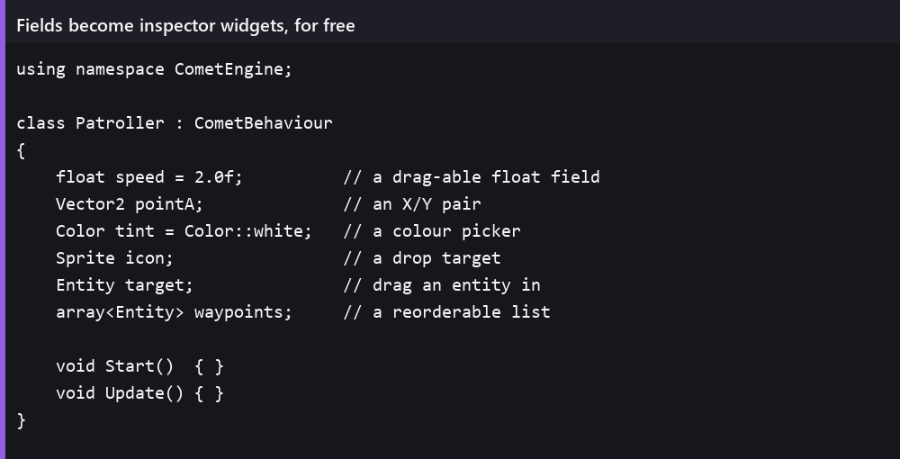
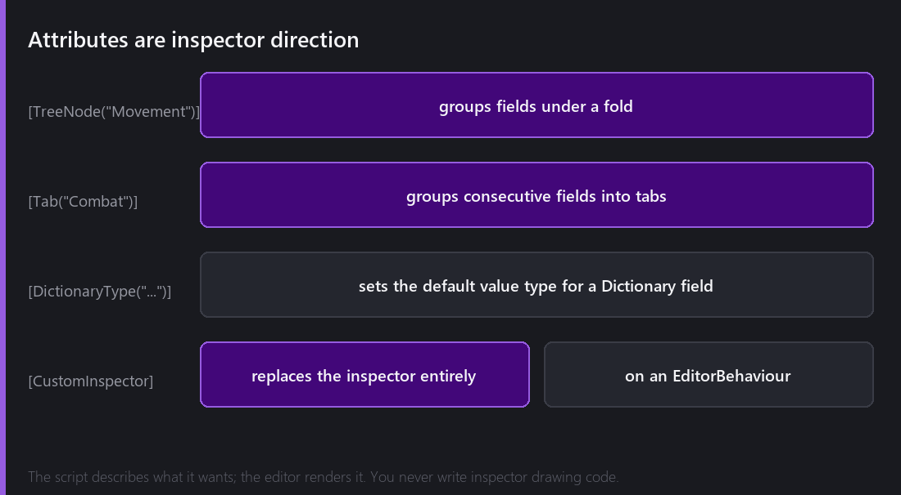
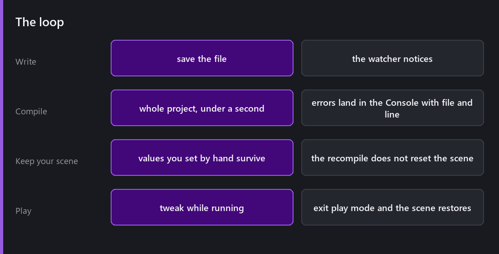

This is not a language tutorial. AngelScript looks enough like C# or Java that if you write either of those, you can read it already.

This post is about the loop, about what it actually feels like to build gameplay in Comet, day to day.

## The script that already does something

Right-click in the Project panel, `Create → Script → CometBehaviour`, name it. You get this:



```
using namespace CometEngine;

class Patroller : CometBehaviour
{
    // Called before first frame
    void Start()
    {
    }

    // Called Every Frame
    void Update()
    {
    }
}
```

Twelve lines, and it is already a real Behaviour. It appears in the Add Behaviour menu next to Sprite Renderer and Rigid Body. Attach it to an entity and its `Start` and `Update` are called with exactly the same lifecycle guarantees the built-in behaviours get.

## Fields become widgets

This is the part that makes scripting inside an engine different from programming in general.



Declare a field, and the Inspector draws it. A `float` gets a draggable number. A `Vector2` gets an X/Y pair. A `Color` gets a colour picker with an eyedropper. A `Sprite`, `Texture`, `Entity` or `Behaviour` gets a drop target you can drag things onto. An `array<T>` gets a reorderable list with add and remove.

You write no inspector code at all. The script says what it needs and the editor works out how to present it.

A few details make this pleasant to use and not only functional.

**Arrays accept multi-drop.** Select six entities in the Hierarchy, drag them onto an `array<Entity>` field, and the array resizes to fit all six. Before 2.3 that was six separate drags into six separate slots.

**`Dictionary<string, T>` is editable.** You add entries with a type picker, rename keys by right-clicking, and remove them. Value widgets are chosen by type automatically.

**Variable names get formatted.** `mMoveSpeed` displays as "Move Speed", not as "M Move Speed". That specific fix is in the 2.2 changelog. You do not see it when it is right and it irritates you forever when it is wrong.

## Attributes



Once a script has fifteen fields, a flat list stops being usable. Attributes are how the script tells the editor how to organise itself.

`[TreeNode("Movement")]` groups every field sharing that name under one collapsible fold. `[Tab("Combat")]` groups consecutive fields into tabs. `[DictionaryType("...")]` sets the default value type offered in a Dictionary field's "Add Item".

And `[CustomInspector]`, on a class deriving from `EditorBehaviour`, replaces the inspector for a type entirely, so you can draw whatever you want with the `CometEditor::GUI` API. That one deserves its own post in February.

The idea behind all of it is that the script describes intent and the editor decides presentation. You never write drawing code just to make a field look reasonable.

## The callbacks that matter

`Start` and `Update` are the obvious ones. Three others earn their place.

**`Awake`** runs on every behaviour in the scene before any `Start` does. That ordering is the guarantee that makes `Start` safe for finding other objects.

**`OnEdited`** is editor only and runs whenever inspector properties change, including after undo and redo, when the behaviour is loaded, and when it is pasted. It is how you keep derived state correct at edit time. Change a `radius` field and regenerate the preview immediately, instead of waiting for play mode.

**`OnDrawGizmos`** draws into the scene view. Anything invisible, like a patrol path, a trigger volume or a spawn point, should have one, and it takes about three lines.

## The loop



Save the file. The external file watcher notices. The whole script project recompiles, in well under a second.

Errors go to the Console with the script path, function name and line number, and double-clicking one opens that file at that line. Error messages became something you click on rather than something you read and then go hunting for.

And in play mode you can keep editing fields while the game runs. Tweak a jump height mid-jump. Exit play mode and everything restores to what it was before you pressed play, because [that is what play mode does]().

## What the compiler will not let you do

Two things from the [migration]() shape everyday code.

**No generics of your own.** `array<T>`, `list<T>`, `stack<T>`, `queue<T>`, `set<T>` and `Dictionary` exist because the engine registered them. You cannot write your own generic container.

**No reflection.** You cannot enumerate a type's fields at runtime. Anything that feels like it needs reflection is usually solved by an attribute plus editor tooling.

## The habit worth forming

Use `IsValid(obj)` rather than `obj !is null`.

It looks like pedantry, but during teardown a plain null check really does return the wrong answer, because an object can be destroyed and not yet gone. `IsValid`, `IsNull` and `Is` exist for exactly that gap. The bugs you get from ignoring them are the intermittent kind that only appear when something is being destroyed on the same frame it is being used.

---

Next Wednesday, the thing I said I had to build because nobody else was going to. Comet has a full code editor inside it, with syntax highlighting, autocomplete that understands your project, a command palette, find in project, and a markdown preview. Part one of two.

*Comments and questions welcome ;)*
