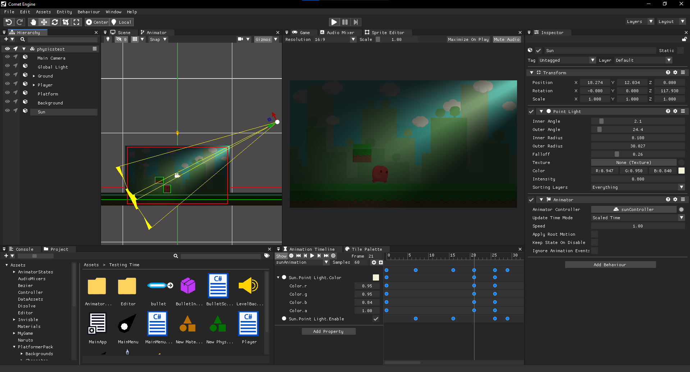

Welcome everyone to my blog about Comet Engine. In this blog I'm going to talk about the development and current features of my custom game engine, Comet Engine. 

First of all, what is Comet Engine? It is a custom game engine made from scratch with C++, SDL3 and OpenGL. It's been 4 years since I started developing it and now it looks like this:

At this point the main features are:
* 2D Rendering
* Sprite atlas subsystem
* Physics
* 2D Lighting
* 2D and 3D Audio
* Custom Shaders
* Bunch of in editor customizations
* Exporting for Windows and Linux

It is also possible to create game scripts using the C# system integrated in Comet, but now I'm working on a new system because it's been quite difficult to export the C# system to web or android. So expect a new Comet Engine major version (2.0) breaking the compatibility with C# is comming this year! This topic will have a custom post soon.

I attach a presentation trailer that I made 3 years ago in order to start understanding what is Comet and how it works!


Feel free to share comments or questions ;)